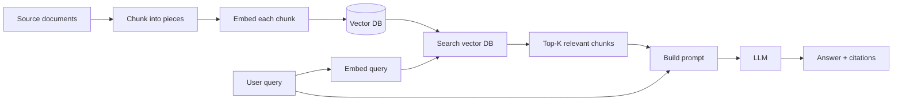

# 🤖 AI From Scratch

> **A non-cert learning path for understanding modern AI - LLMs, RAG, agents, and shipping production AI apps.**
>
> Eight phases. Plain English. Built for builders.

---

## Who this is for

- You've used ChatGPT/Claude and want to understand what's actually happening
- You want to build with LLMs, not train them from scratch
- You don't have the math background for a deep ML course - and don't need it for most AI work today

If you do want certifications, the **[NVIDIA tracks](../exams/nvidia/)** and **[Anthropic tracks](../exams/anthropic/)** are the most relevant, plus the cloud-provider AI/ML certs.

---

## The honest pitch

Most "AI for builders" content is one of two extremes:
1. **PhD-flavored** - linear algebra, backprop, derivations of attention. Way more than you need.
2. **Demo videos** - "type into ChatGPT, get magic." Way less.

This path lands in the middle: enough mental model to make sound decisions, enough code-shaped knowledge to build real systems.

You don't need to train models. You need to use them well, retrieve context for them, give them tools, and ship the result without lighting your budget on fire.

---

## Phase 1 - What is a model, really?

**What you'll learn**
- The high-level shape of machine learning: data in, model out, predictions later.
- Supervised vs unsupervised vs reinforcement learning - and which categories LLMs fall into.
- Neural networks at a "boxes and arrows" level. No calculus.
- What "training" vs "inference" mean and why they cost wildly different amounts.
- The 2017 transformer paper ("Attention Is All You Need") and why it changed everything.

**Why it matters**
You'll read terms like "fine-tuning," "weights," "checkpoint," "embeddings" daily. They make sense once you have the mental model. Otherwise it's all jargon soup.

**Try it**
Read the abstract of "Attention Is All You Need." You won't follow all of it. That's fine. Just see how the field talks.

**Pointer**
- Glossary entries: ML, Neural network, Transformer, Training, Inference, Parameter
- 3Blue1Brown's "Neural Networks" video series (YouTube). Best visual intuition you'll get.

You should now be able to explain why an LLM "predicts the next token" without it sounding like magic.

---

## Phase 2 - LLMs and tokens

**What you'll learn**
- What a token is and why "GPT-4 is good at math" is partially a tokenizer question.
- Context window: the "memory" the model has during one call. Bigger windows ≠ free.
- Sampling parameters: temperature, top-p, top-k. What they actually do.
- The major LLM families today: Claude (Anthropic), GPT (OpenAI), Gemini (Google), Llama (Meta, open weights), and emerging Chinese models.
- Pricing models: per token in, per token out, with input usually cheaper than output.

**Why it matters**
You're going to be making "which model?" calls forever. Speed/quality/cost is the eternal three-way trade-off.

**Try it**
Pick one prompt. Run it against three models on a side-by-side service like OpenRouter or each provider's playground. Same prompt, three different answers, three different prices. Notice how often "smaller and cheaper" is good enough.

**Pointer**
- Glossary entries: LLM, Token, Tokenizer, Context window, Temperature, Sampling
- [Anthropic Claude study tracks](../exams/anthropic/)

You should now be able to read a model's pricing page and translate "$3 / 1M input tokens" into "what does my use case actually cost?"

---

## Phase 3 - Prompting (the unglamorous superpower)

**What you'll learn**
- System prompts vs user messages vs assistant messages.
- How few-shot examples (showing 2-3 example outputs) often beats long instructions.
- Chain-of-thought: telling the model to think step by step, and when it actually helps.
- Structured output: getting JSON back reliably. Tool/function calling for the strict version.
- Prompt injection: what it is, why it's not really "solved," and how to mitigate it.

**Why it matters**
Most "the model is bad at this" complaints are prompt complaints in disguise. Mediocre prompting wastes 5x more money than people realize.

**Try it**
Take a prompt you wrote casually. Rewrite it with: a clear role, the actual task, the format you want, two examples. Compare outputs. The improvement will be embarrassing.

**Pointer**
- Anthropic's [Prompt Engineering documentation](https://docs.anthropic.com/claude/docs/prompt-engineering)
- [Anthropic Prompt Engineering Specialist study track](../exams/anthropic/)
- Glossary: Prompt, System prompt, Chain-of-thought, Structured output, Prompt injection

You should now be able to look at a flaky prompt and fix it.

---

## Phase 4 - APIs, SDKs, and the actual code

**What you'll learn**
- Calling LLM APIs from Python or TypeScript - the same dozen lines work for any provider.
- Streaming responses (so users see tokens appear instead of waiting 30 seconds).
- Retries, rate limits, and timeouts. The boring stuff that determines if your app stays up.
- Async vs sync calls. When to batch.
- **Prompt caching** - reusing a prefix to cut cost and latency. Anthropic and OpenAI both support it; not using it on long-system-prompt apps is just lighting money on fire.

**Why it matters**
You can prototype in a chat UI forever. Real apps are made of API calls. Get fluent here.

**Try it**
Build a 30-line script that takes a file, summarizes it with Claude or GPT, and prints the summary. Add streaming. Add a retry. You're now further along than most "AI engineers" listed on LinkedIn.

**Pointer**
- [Anthropic SDK docs](https://docs.anthropic.com/claude/reference)
- [Anthropic App Developer track](../exams/anthropic/)
- Glossary: Inference cost, Prompt caching, Streaming

You should now be comfortable building a basic LLM-powered script.

---

## Phase 5 - Embeddings and RAG

**What you'll learn**
- What an embedding is: a high-dimensional vector that represents meaning.
- Cosine similarity / nearest-neighbor search. How "similar text" is computed.
- Vector databases: Pinecone, Weaviate, pgvector, Qdrant, Milvus. Why pgvector is the right answer for most teams.
- Chunking strategies. The thing nobody talks about that determines whether your RAG works.
- Retrieval pipelines: query → embed → search → rerank → stuff into prompt → generate.
- When RAG is the wrong answer (small docs - just put them in the prompt; structured data - just query SQL).

**Why it matters**
"Chat with your docs" is the most common LLM use case in industry. RAG is how it works. Most failed RAG projects fail at chunking and retrieval, not at the model.

**The pipeline**

Two phases: indexing (left, run once or when docs change) and query (right, run on every user request). The trick to good RAG is chunking and retrieval; the LLM at the end is the easy part.

**Try it**
Build a tiny RAG over a single PDF. Use OpenAI/Anthropic for embeddings + a model, and pgvector or sqlite-vec for storage. ~100 lines. You'll learn more from this than reading 10 articles.

**Pointer**
- Glossary: Embedding, RAG, Vector database, Semantic search, Chunking, Reranker

You should now be able to build basic "talk to my data" systems.

---

## Phase 6 - Tools, agents, and MCP

**What you'll learn**
- "Tool use" / "function calling" - the model returns a request to call a function; you run it; you feed the result back.
- The agent loop: model decides what to do, tool runs, result returns, model decides next step, repeat.
- Where agents shine (researchy, multi-step, ill-defined tasks) and where they fail (predictable workflows that should be plain code).
- MCP (Model Context Protocol): Anthropic's open standard for plugging tools and data into LLMs without bespoke glue.
- Cost and latency reality of agents - they often run 10-30+ model calls per task.

**Why it matters**
Tool use turns LLMs from "smart chatbot" into "actually does work." But badly-designed agents burn cash and time. This is where senior judgment really starts to matter.

**Try it**
Give an LLM two tools (e.g., `search_web` and `read_file`). Ask it to research a topic and write a summary. Watch the loop run. Notice how much you spend.

**Pointer**
- [MCP documentation](https://modelcontextprotocol.io/)
- [Anthropic Architect Foundations track](../exams/anthropic/)
- Glossary: Agent, Tool use, MCP, Hallucination

You should now be able to architect (and cost-estimate) a basic agent system.

---

## Phase 7 - Evaluation, safety, and what you ship

**What you'll learn**
- Why eval is the hardest part of LLM engineering. ("It seems to work" is not a metric.)
- Deterministic evals (regex / unit-test style) vs model-graded evals (LLM judges output).
- Building eval datasets. Starting small, growing on real failures.
- Hallucination - what causes it, how to reduce it (grounding, retrieval, citations, lower temperature, but never zero).
- Prompt injection mitigations - input sanitization, output guardrails, principle of least authority for tools.
- Bias, fairness, and content safety. The grown-up version of these conversations.

**Why it matters**
"It worked for me" is not a release criterion. Without evals, every prompt change is a coin flip. Mature LLM teams measure things.

**Try it**
For an LLM feature you've built, write 10 representative inputs with expected outputs (or expected properties). Wire up a tiny script that runs them and prints pass/fail. You now have an eval. You're ahead of 80% of LLM teams.

**Pointer**
- Glossary: Eval, Benchmark, Hallucination, Grounding, Prompt injection
- [NVIDIA AI Operations cert](../exams/nvidia/) for the production angle

You should now think of "ship LLM features" as a measurable engineering problem.

---

## Phase 8 - Production: cost, latency, observability

**What you'll learn**
- Estimating cost from usage patterns. Per-user-per-day math.
- Caching: prompt caching, embedding caching, output caching. The three biggest cost levers.
- Routing between models: cheap model first, escalate on uncertainty.
- Latency budgets. Streaming vs blocking. Where users tolerate slowness.
- LLM observability: token usage, error rates, eval scores, drift.
- Operational tooling: Langfuse, Helicone, Phoenix, OpenTelemetry. Pick one.

**Why it matters**
The first month of an LLM feature: hype. Months 2-12: bills, regressions, prompt drift, model deprecations. This is the part vendor demos skip.

**Try it**
Take any LLM script you've built. Add a wrapper that logs: prompt, response, tokens in/out, cost, latency. Now you can debug. Now you can optimize. Now you're operating.

**Pointer**
- [Anthropic Architect Advanced track](../exams/anthropic/)
- [NVIDIA AI Operations](../exams/nvidia/)
- Glossary: Inference cost, Prompt caching, Eval, Observability

You should now be able to ship LLM features and keep them working.

---

## Where to go after this

- **Want certs?** [NVIDIA AI tracks](../exams/nvidia/), [Anthropic tracks](../exams/anthropic/), or your cloud provider's AI/ML cert.
- **Want depth on one stack?** Pick Anthropic, OpenAI, or open-weights (Llama / Qwen / DeepSeek) and ship something real.
- **Want to go lower-level?** Andrej Karpathy's "[Let's build GPT](https://www.youtube.com/watch?v=kCc8FmEb1nY)" video, or fast.ai's deep learning course.
- **Want to combine cloud + AI?** [Cloud from Scratch](./cloud-from-scratch.md), then build a deployed RAG app on AWS / Azure / GCP.

The state of the art moves every quarter. Once you have foundations, the new releases ("we released a new model with 200K context!") become news, not noise.
