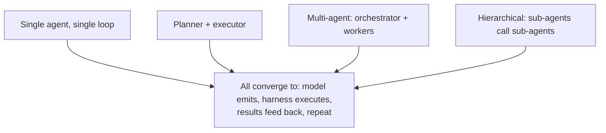

# Agentic loops

> **8-minute read. Assumes you've read [Agents explained](./agents-explained.md) and [Tool use](./tool-use-and-function-calling.md).**

## The one-line answer

An "agentic loop" is the runtime that takes the model's output, executes any tool calls, feeds the results back, and repeats - until the model says "done" or you hit a stop condition. It's where most of the practical engineering lives in production AI systems.

## The minimum viable loop

```python
def run(user_message, tools, max_steps=20):
    messages = [{"role": "user", "content": user_message}]
    for step in range(max_steps):
        response = call_model(messages, tools=tools)
        messages.append({"role": "assistant", "content": response.content})

        if response.stop_reason == "end_turn":
            return response.content  # final answer

        if response.stop_reason == "tool_use":
            tool_results = []
            for block in response.content:
                if block.type == "tool_use":
                    result = execute_tool(block.name, block.input)
                    tool_results.append({
                        "type": "tool_result",
                        "tool_use_id": block.id,
                        "content": result,
                    })
            messages.append({"role": "user", "content": tool_results})
            continue

        raise ValueError(f"Unexpected stop reason: {response.stop_reason}")
    raise ValueError("Hit max_steps without finishing")
```

That's the whole pattern. Real production systems wrap this with telemetry, persistence, error handling, parallelism, and policy - but the loop itself is 30 lines.

## Common shapes



### Single agent, single loop
One model, one tool list, one conversation. Most use cases. Examples: a code agent that reads/edits files, a customer-support agent that looks up orders.

### Planner / executor split
Two model calls in different roles. The planner sketches the plan ("first I need to look up X, then compute Y"). The executor runs the steps. Useful when planning and execution have different prompt or model needs.

### Multi-agent orchestrator + workers
A "lead" agent dispatches work to specialized "worker" agents (e.g. one per domain). The lead consolidates results. Used when subtasks are independent and you can parallelize, or when each agent needs different tools.

### Hierarchical / recursive
Sub-agents can spawn more sub-agents. Powerful, hard to control. Common in research demos, less common in production.

## ReAct: the original pattern

ReAct (Reasoning + Acting), [from Yao et al. 2022](https://arxiv.org/abs/2210.03629), introduced the modern pattern: have the model produce a "thought" before each tool call. "I need to find X. The right tool is Y. Calling Y(z)." The model thinks out loud, which improves tool selection and helps you debug.

Native tool-use APIs (Anthropic, OpenAI, Google) absorb this implicitly. You don't have to prompt for "Thought: ... Action: ..." anymore. But the underlying pattern is the same: think, act, observe, repeat.

## Stop conditions

Every loop needs at least one. Pick from:

- **Model says "done"** (`end_turn` stop reason) - the natural one
- **Max steps reached** - ceiling on cost and latency
- **No new tools called for N steps** - the model is talking to itself
- **Total tokens exceed budget** - cost guardrail
- **External signal** (user cancels, timeout) - graceful interrupt
- **Repeated identical action** - loop detection, often pathological

In production you want all of them.

## Where loops fail

### Infinite tool loop
Model calls `search`, gets nothing, calls `search` with the same query, gets nothing, repeats. Detect identical-arg repeats and break with an error message back to the model: "The previous search returned no results. Try a different query."

### Cost runaway
Each iteration adds tokens (the prior context grows). 10 iterations of a 50K-token context is expensive *fast*. Cap steps, summarize old turns, or use [prompt caching](./prompt-caching.md) for the static parts.

### Tool errors swallowed
A tool throws, you return "error" to the model, the model says "I'll try again" without changing anything. Make tool error messages actionable: "Database connection refused. The DB host is unreachable. Try a different approach."

### Lost in long context
After 30 turns the model forgets the user's original question. Add an explicit reminder near the top of the system prompt or summarize old turns.

### Privilege escalation
The model has access to `delete_record` and "helpfully" deletes the wrong one. Restrict destructive tools, or require explicit user confirmation. The harness is where this enforcement belongs.

### Hallucinated tool results
This is rare but has been observed: the model produces a `tool_result` block in its output instead of a tool-use call. Validate that tool results only enter messages from your harness, never from the model.

## Frameworks vs DIY

You can write your own loop in 30 lines (above). Frameworks add structure for nontrivial cases:

- **[Claude Agent SDK](../../resources/service-comparison-agent-frameworks.md)** - Anthropic-native, MCP-first, opinionated about persistence and trace. Strong default choice for Anthropic-first apps.
- **LangGraph** - graph-based control flow, good for multi-step pipelines with branching.
- **CrewAI** - multi-agent role-playing, fast to prototype.
- **OpenAI Agents SDK** - similar to Claude's, OpenAI-native.

Skip frameworks for: small loops, prototypes, anything where the framework adds more concepts than it saves. Add them when: you need persistence, branching, multi-agent orchestration, or trace UI.

See [Agent frameworks comparison](../../resources/service-comparison-agent-frameworks.md).

## What to instrument

If you remember nothing else: log every model call, every tool call, every tool result, with token counts and latency. You can't debug what you can't see. Every modern LLM observability tool ([LangSmith](../../resources/service-comparison-llm-observability.md), Langfuse, Phoenix, Braintrust) is built around this trace shape.

## What to look at next

- **[Tool use and function calling](./tool-use-and-function-calling.md)** - the per-step mechanism
- **[MCP explained](./mcp-explained.md)** - the standard tool interface
- **[Agent frameworks comparison](../../resources/service-comparison-agent-frameworks.md)** - what to use when DIY isn't enough
- **[Evals for LLMs](./evals-for-llms.md)** - how to know if loop changes helped
- **[Build a Claude agent with MCP](../../resources/hands-on-projects/build-claude-agent-with-mcp.md)** - hands-on
