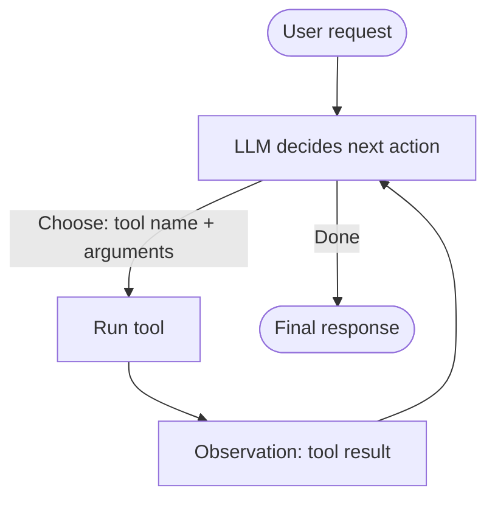

# AI Agents Explained

> **9-minute read.**

## The one-line answer

An "agent" is an LLM in a loop, calling **tools** (code your application exposes) to take actions in the world. Instead of just generating text, the model decides "I need to search the web," your code runs the search, the result feeds back into the model, and it decides what to do next.

Everything else - "agentic workflows," "multi-agent systems," "autonomous agents" - is variations on that loop.

## The shape of an agent



The model doesn't just answer - it *picks an action*, your code *runs the action*, the result feeds back, the model picks the next action. Repeat until the model emits a "done" signal or you hit a step limit.

## Tools (function calling)

A tool is a function your application exposes to the model. You describe its name, parameters, and purpose. The model can choose to call it. When it does, your code actually executes the call.

```text
Tool: search_web
  description: "Search the web for current information"
  parameters: { query: string }

Tool: send_email
  description: "Send an email to a user"
  parameters: { to: string, subject: string, body: string }

Tool: query_database
  description: "Run a read-only SQL query"
  parameters: { sql: string }
```

The model emits structured output (usually JSON) saying "I want to call `search_web` with `query='claude opus 4.7 release date'`." Your code intercepts that, runs the search, and feeds the result back to the model on the next turn.

This is also called **function calling** (OpenAI's term) or **tool use** (Anthropic's term). Same idea.

## The ReAct pattern

The dominant pattern is **ReAct** (Reasoning + Acting), from a 2022 paper. The model alternates between:

- **Thought**: reasoning about what to do
- **Action**: calling a tool
- **Observation**: the tool's result

Example trace:

```
User: What's the population of the largest city in Brazil?

Thought: I should search for the largest city in Brazil first.
Action: search_web({"query": "largest city in Brazil"})
Observation: São Paulo is the largest city in Brazil.

Thought: Now I need the population of São Paulo.
Action: search_web({"query": "São Paulo population 2026"})
Observation: São Paulo has approximately 12.4 million residents (2026 estimate).

Thought: I have what I need.
Final answer: São Paulo, the largest city in Brazil, has approximately 12.4 million residents.
```

Modern frontier models (Claude, GPT-4, Gemini) do this natively when given tool definitions. You don't typically write the ReAct prompt yourself - the model handles it.

## Plan-and-execute

A variation: instead of deciding one action at a time, the model writes out a multi-step plan upfront, then executes the steps. Better for complex tasks that need coordination, worse for tasks where the right next step depends on what was just discovered.

Most production agents are reactive (ReAct), not plan-and-execute. The world is too unpredictable for upfront plans to hold.

## Multi-agent systems

Multiple LLM instances, each playing a role, talking to each other. "Researcher agent" gathers info, "writer agent" drafts, "editor agent" reviews. Sounds elegant.

In practice, multi-agent systems are mostly hype as of 2026. Reasons:

- Each agent introduces latency and cost.
- Errors compound across agents.
- Coordination is its own engineering problem.
- A single capable model with good tools usually beats a "team" of mediocre agents.

There are real cases - parallel exploration, separation of concerns where context conflicts - but the default should be one model with good tools, not five models in a chat room.

## What agents are good at (right now)

- **Multi-step research**: gather info from several sources, synthesize.
- **Code editing across files**: read, modify, run tests, iterate. (This is what coding agents like Claude Code do.)
- **Browser automation**: navigate sites, fill forms, extract data.
- **Workflows with branches**: "if X, do Y; otherwise do Z" with real lookups.
- **Glue between APIs**: "send a Slack message when this Stripe webhook fires" with custom logic in between.

## What agents are bad at (right now)

- **Long autonomous runs without supervision.** They drift, loop, or do confidently-wrong things. The longer you let them run untouched, the more failure modes compound.
- **Tasks with high cost of mistake.** Agent that can `rm -rf` your filesystem will eventually `rm -rf` your filesystem.
- **Cost-sensitive tasks.** Each step is an LLM call. A 20-step agent run on a frontier model can cost dollars.
- **Real-time constraints.** Agent loops are slow - many seconds to minutes.
- **Tasks that don't need them.** A direct LLM call or a deterministic pipeline beats an agent for anything the agent doesn't need to *decide* during execution.

## Failure modes you'll actually hit

| Failure | What it looks like | Mitigation |
|---------|--------------------|------------|
| **Loops** | Agent calls the same tool 17 times in a row | Hard step limit (10-20); detect repeated identical calls |
| **Hallucinated tool calls** | Model invents tool names that don't exist | Strict schema validation; reject and re-prompt with the valid tool list |
| **Wrong arguments** | Calls a real tool with garbage args | Validate args; surface error back to model so it can correct |
| **Misinterpretation of tool output** | Tool returns "0 results"; model says "Found 1 result" | Stronger formatting in tool responses; explicit "if result is empty, X" instructions |
| **Drift** | After 8 steps the model has forgotten the original goal | Periodic re-injection of original request; summarize-and-restart |
| **Permission escalation** | User says "summarize my emails," agent decides to also delete some | Whitelist allowed actions; require human-in-the-loop for irreversible actions |

## Real-world agent design rules

1. **Tool surface area is the agent.** What tools you expose determines what the agent can and can't do. Be intentional. A general-purpose agent with `run_shell_command` is unbounded; an agent with `lookup_customer`, `create_ticket`, `send_email` is shaped to your problem.

2. **Make tool errors informative.** "Error: 401 Unauthorized" beats "Error." The model corrects more reliably with details.

3. **Cap iterations.** Always. Even if you trust the model.

4. **Human-in-the-loop for destructive actions.** Sending email, charging credit cards, deleting data - require explicit confirmation. Don't trust the model's confidence.

5. **Log everything.** Every tool call, every observation. You'll need it when something goes weird, and it will go weird.

6. **Eval the whole loop, not just the model.** A unit test on "given this state, does the model pick the right tool" is necessary but not sufficient. Run end-to-end traces and grade them.

## MCP (Model Context Protocol)

A standard for exposing tools to LLM clients (released by Anthropic, now widely adopted). Lets you write a tool server once and have any MCP-compatible LLM client (Claude Code, Claude Desktop, others) use it.

If you're building tools you'd reuse across LLM applications, MCP is the way.

## What to look at next

- **[LLM basics](./llm-basics.md)** - what's running the loop
- **[Prompt engineering](./prompt-engineering.md)** - how to write tool-aware prompts
- **[RAG explained](./rag-explained.md)** - retrieval as a tool inside an agent
- **[Evals for LLMs](./evals-for-llms.md)** - testing agent behavior
- **[Anthropic Application Developer track](../../exams/anthropic/claude-application-developer/)** - guided study path for building agents
