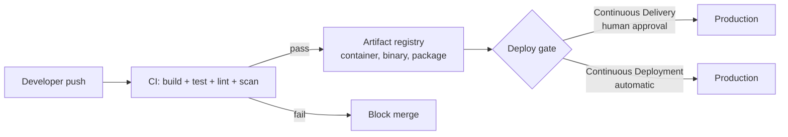

# CI/CD Explained

> **5-minute read.**

## The one-line answer

**CI** (Continuous Integration) - every code change is automatically built and tested.

**CD** (Continuous Delivery / Deployment) - every change that passes CI is automatically prepared for, or pushed to, production.

Together: every commit is built, tested, and shipped, with no manual handoffs.

## Why this exists

The old way: developers wrote code for weeks, "merged" by emailing zips around, then a release engineer spent a day building and deploying. Bugs found 3 weeks after they were introduced. "Works on my machine" rampant.

CI/CD compresses the loop:
- Test as soon as code is written → bugs found in minutes
- Same build script for every dev → no "release engineer black magic"
- Same deploy process every time → boring, predictable releases

The Stripe/Etsy/Google playbook: deploy 50+ times a day, never have an emergency "release weekend."

## The pieces



### Continuous Integration

Every push triggers:
1. Pull the code
2. Build it (compile, package, build container image)
3. Run tests (unit, integration, sometimes E2E)
4. Run linters, security scanners, code quality checks
5. Report pass/fail

If anything fails, the change is blocked from merging.

### Continuous Delivery

Every change that passes CI is:
1. Built into a deployable artifact (container image, binary, etc.)
2. Pushed to a registry
3. Made ready to deploy with one click

Production deploys are a single approval away, but a human still chooses when.

### Continuous Deployment

Like Continuous Delivery, but **automatic**. Every passing change goes to production, no human in the loop. Requires very high confidence in tests.

Most teams do CI + Continuous Delivery. Continuous Deployment is reserved for mature teams or non-critical systems.

## A typical pipeline

For a TypeScript web app:

```yaml
# .github/workflows/ci.yml (GitHub Actions example)
name: CI
on: [push, pull_request]
jobs:
  test:
    runs-on: ubuntu-latest
    steps:
      - uses: actions/checkout@v4
      - uses: actions/setup-node@v4
        with: { node-version: '20' }
      - run: npm ci
      - run: npm run lint
      - run: npm run typecheck
      - run: npm test
      - run: npm run build
```

Push code → 2 minutes later you know if it's healthy.

For deployment, a separate workflow runs on merges to `main`:

```yaml
name: Deploy
on:
  push:
    branches: [main]
jobs:
  deploy:
    runs-on: ubuntu-latest
    steps:
      - uses: actions/checkout@v4
      - run: docker build -t myapp:${{ github.sha }} .
      - run: docker push myregistry/myapp:${{ github.sha }}
      - run: kubectl set image deployment/myapp app=myregistry/myapp:${{ github.sha }}
```

## Deploy strategies

How do you actually push new code without breaking things?

### Recreate
Stop old version, start new version. Simple. Causes downtime. OK for non-critical internal tools.

### Rolling update
Replace pods/instances one at a time. The default in Kubernetes. No downtime. New code goes live gradually.

### Blue/Green
Run two identical environments. Send all traffic to "blue." Deploy to "green." Switch DNS or load balancer. Instant rollback.

### Canary
Deploy new version to small % of traffic (5%). Watch metrics. Gradually increase. Roll back at any point if errors spike.

### Feature flags
Deploy new code paths but keep them dark. Enable for specific users (beta cohort) before everyone. Decouples deploy from release.

## Common tools

| Category | Examples |
|----------|----------|
| CI/CD platform | GitHub Actions, GitLab CI, CircleCI, Jenkins, Buildkite |
| Container builds | Docker, Kaniko, Buildkit |
| Image registries | Docker Hub, ECR, ACR, GAR, GitHub Packages |
| Deploy tools | Kubernetes, ArgoCD, Flux, Spinnaker, Octopus, AWS CodeDeploy |
| IaC apply | Terraform Cloud, Atlantis, GitHub Actions |
| Secret management | AWS Secrets Manager, Vault, GitHub Secrets, Doppler |
| Feature flags | LaunchDarkly, GrowthBook, Flagsmith, Unleash |

GitHub Actions is now the default for most projects on GitHub. Fast, integrated, generous free tier for open source.

## What "good" looks like

For a healthy CI/CD setup:

- Every push to a PR triggers CI
- CI completes in <10 minutes (ideally <5)
- A green PR can be merged and deployed in <30 minutes
- Deploys happen many times a day, not weekly
- Rollback is one click or one command, takes <5 minutes
- No human runs commands in production directly - everything goes through the pipeline

## Common pitfalls

- **Slow CI** - 30-min CI = developers context-switch and lose momentum. Aim for <10 min.
- **Flaky tests** - tests that fail randomly destroy trust. Fix or quarantine immediately.
- **Manual deploy steps** - "remember to run the migration script first" = will be forgotten. Automate it.
- **No rollback plan** - if you deploy without thinking through rollback, you'll regret it.
- **Secrets in CI logs** - mask them, don't `echo $TOKEN`.

## What to look at next

- **[Terraform explained](./terraform-explained.md)** - infrastructure changes go through CI too
- **[Glossary: CI, CD, GitOps, Blue/Green](../glossary.md#devops--infrastructure-as-code)**
- **[Service comparison: DevOps & CI/CD](../../resources/service-comparison-devops-cicd.md)**
