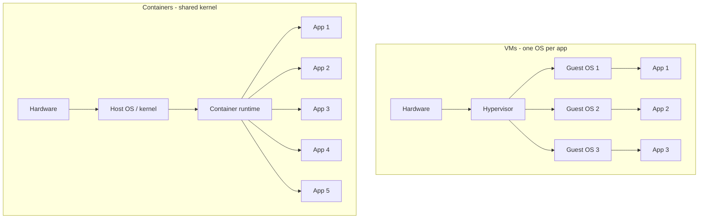

# Containers vs VMs

> **5-minute read.**

## The one-line answer

A **VM** virtualizes hardware. Each VM gets its own full operating system. Heavy, isolated, slow to start (minutes).

A **container** virtualizes the operating system. Containers share the host kernel but get their own filesystem, processes, and network. Light, less isolated, fast to start (milliseconds).

## Why containers won

VMs were the foundation of modern cloud (everything runs on a hypervisor). But VMs have problems:

- A full OS per VM = gigabytes of RAM/disk per app
- Boot times in minutes
- "Works on my machine" still happens (different OS versions, libraries)

Containers solved this by:

- Packaging your app + its exact dependencies + a thin user-space slice of Linux into an image
- Sharing the host kernel (no guest OS overhead)
- Starting in milliseconds
- Producing identical behavior anywhere the container runtime exists

## The mental model

VMs = each tenant gets their own apartment building (with foundations, plumbing, electricity duplicated).

Containers = each tenant gets a unit in a shared building. Same plumbing/electricity/foundation, isolated rooms.



You can run more containers per host than VMs. Way more. A single mid-size VM can comfortably run dozens of containers.

## How containers actually work

Two Linux kernel features do the heavy lifting:

- **Namespaces** - isolate what a process can see (filesystem, network, processes, users)
- **cgroups** - limit what a process can use (CPU, memory, I/O)

A "container" is just a process running with namespaces + cgroups configured for isolation. There's no special kernel - any modern Linux can run them.

Docker is the most popular tool for building/running containers. The image format Docker uses (OCI image) is now an open standard supported by many runtimes.

## A small concrete example

Run nginx in a container:

```bash
docker run -p 8080:80 nginx
```

What happens:
1. Docker pulls the `nginx` image from Docker Hub (~150 MB)
2. Creates a new namespace + cgroups
3. Starts the nginx process inside it
4. Maps host port 8080 to container port 80
5. Total time: 1-2 seconds

You now have nginx running, isolated from the rest of your system, identical to how it'd run on any other machine with Docker.

## Container images

An image is built from a `Dockerfile`:

```dockerfile
FROM node:20-alpine
WORKDIR /app
COPY package*.json ./
RUN npm ci --only=production
COPY . .
CMD ["node", "server.js"]
```

Each line creates a layer. Layers are cached and shared between images, so a 500MB image might only download 50MB if the rest is cached.

Images are stored in **registries**:
- Docker Hub (public, free)
- AWS ECR, Azure ACR, GCP Artifact Registry (private)
- GitHub Container Registry

## Why VMs still exist

Containers don't replace VMs in every scenario:

- **Stronger isolation** - a kernel bug could let one container escape and affect others. VMs are isolated by the hypervisor, much harder to escape.
- **Different OS** - need to run Windows on Linux hardware? VM. Containers share the host kernel.
- **Long-running stateful apps** - databases, message brokers historically ran on VMs. Now increasingly fine in containers if done carefully.
- **Untrusted code** - if you're running customer code (CI runners, code sandboxes), VM-level isolation is safer.

In practice: cloud providers run **containers on top of VMs**. Each VM runs many containers. You get container density + VM isolation between tenants.

## Where Kubernetes fits

A single container is fine on one host. Once you have:

- Many containers
- Many hosts
- Need to schedule, restart, scale, network them

…you need an orchestrator. Kubernetes is the dominant one. See [Kubernetes in 10 minutes](./kubernetes-in-10-minutes.md).

## Lightweight VM alternatives

Modern serverless platforms use "micro-VMs" - the security of VMs with the speed of containers:

- **Firecracker** (powers AWS Lambda, Fargate) - boot in <125ms
- **gVisor** (Google) - intercepts syscalls for an extra isolation layer
- **Kata Containers** - VMs that look like containers

Most users never touch these directly; they're cloud provider plumbing.

## What to look at next

- **[Kubernetes in 10 minutes](./kubernetes-in-10-minutes.md)** - orchestrating many containers
- **[Serverless explained](./serverless-explained.md)** - serverless platforms run containers under the hood
- **[Glossary: Container, Image, Pod, Hypervisor](../glossary.md#containers--kubernetes)**
