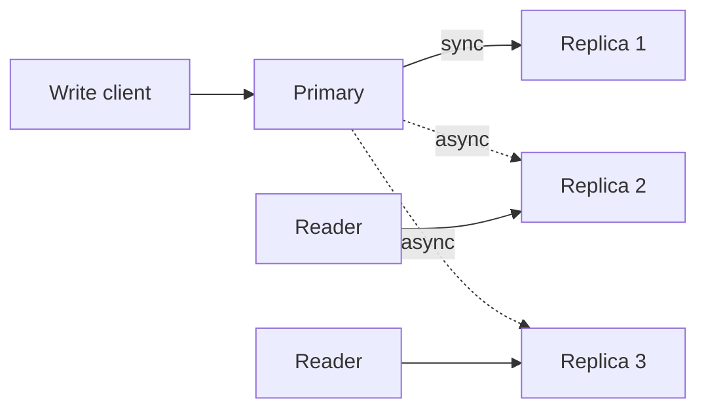

# Eventual consistency

> **7-minute read. No prerequisites.**

## The one-line answer

Eventual consistency means: after a write, *eventually* every reader will see the new value, but for some short window after, some readers may still see the old value. Many cloud systems (S3 cross-region, DynamoDB GSI, replicated databases, CDN caches) are eventually consistent by default. Understanding when this is fine and when it bites is core to cloud engineering.

## The CAP theorem in one sentence

Brewer's CAP theorem: in a distributed system, you can pick at most two of **C**onsistency, **A**vailability, and **P**artition tolerance. Network partitions happen, so P is non-negotiable. Real systems trade C for A or A for C - the choice is rarely binary in practice (both can be tuned per operation), but the underlying tension is real.

Most cloud-native data services pick A (always available) and accept some C (you might read stale data for a few hundred ms after a write). That's eventual consistency.

## Where you'll meet it

A write hits the primary. The primary asynchronously propagates to replicas. A reader hitting a behind-replica sees stale data for a moment.

Common occurrences:

- **DynamoDB Global Secondary Indexes (GSIs)** - eventually consistent by default. The base table is strongly consistent on item reads via primary key.
- **S3 cross-region replication** - replicated bucket lags by seconds.
- **Read replicas in RDS / Cloud SQL / Azure SQL** - replication lag is normal.
- **ElastiCache / Memorystore** - cluster modes have replication lag.
- **CloudFront / CDN caches** - serve old content until the TTL expires.
- [**DNS**](../glossary.md#term-dns-domain-name-system) - the original eventually-consistent system; record changes propagate over hours.
- **GCS Object metadata after delete/recreate** - has historically had subtle eventual consistency.

## When EC is fine

For many use cases, "the user might see a 30-second-old number" is invisible:

- Counters and aggregates - "12,345 users online" being slightly off is fine.
- Catalogs - product description updates can lag for users currently on the page.
- Read-mostly workloads where the workflow naturally waits.
- Anything where downstream reconciliation handles staleness (event sourcing).

## When EC bites

Three classic patterns:

### Read-your-writes
A user updates their profile photo. The next page load hits a stale replica and shows the old photo. Confusing.

Fix: route the immediate read to the primary, or to the same replica that handled the write (sticky session). Or: use a session token that expires after replication catches up.

### Monotonic reads
The user sees the new state, then on a refresh sees the old state, then the new again. "Did the system just lose my change?"

Fix: route the user's reads to the same replica for the duration of the session.

### Causal consistency
Alice posts a photo. Bob comments. A third user fetches Bob's comment first (it replicated faster) and then the photo it refers to (still propagating). The third user sees a comment about a photo that "doesn't exist."

Fix: vector clocks, causal-consistency-aware databases (Spanner, Cosmos DB strong consistency), or application-level ordering.

## Strong consistency: when it's required

Some operations cannot tolerate any staleness:

- **Inventory and seat allocation** - selling the last item to two people is a billing disaster.
- **Authentication state** - a revoked session token must be revoked everywhere immediately.
- **Financial transactions** - balance reads and writes must agree.
- **Locking and leadership** - "I am the leader" cannot be true for two nodes simultaneously.

Strong consistency is available in:

- DynamoDB consistent reads on the base table (uses 2x the read capacity).
- Aurora primary, RDS primary (single-writer).
- Spanner (globally strong, with TrueTime).
- Cosmos DB strong consistency (slower, region-bounded).
- Single-instance databases (no replication = no inconsistency).

The tradeoff is latency, throughput ceiling, or both. Use it where you need it; default to eventual elsewhere.

## Tunable consistency

Many modern systems let you pick per-operation:

- [**DynamoDB**](../glossary.md#term-dynamodb): pass `ConsistentRead=true` for strong reads. 2x read units cost.
- [**Cosmos DB**](../glossary.md#term-cosmos-db): 5 levels (Strong, Bounded Staleness, Session, Consistent Prefix, Eventual). Configure per workload.
- **Cassandra / Scylla**: read/write quorum levels (ONE, QUORUM, ALL) per query.

Knowing which level you need per call is part of design. Cassandra's defaults aren't AWS RDS's defaults; don't assume.

## Idempotency: EC's best friend

Eventual consistency mixes badly with non-idempotent operations under retry. A retry might land on a replica that already has the write; the operation runs again. Make consumers idempotent so duplicate processing is safe. See [Idempotency explained](./idempotency-explained.md).

## Common pitfalls

### Assuming the primary is "the truth"
A reader may not be hitting the primary. If your test code reads from the primary and your prod code reads from a replica, you'll have inconsistency you can't reproduce.

### Mixing read paths
Some reads go to primary (post-write), others go to replicas. Now your latency is bimodal and the user experience varies. Be deliberate.

### Cache invalidation
Cache + database = two sources of truth. Stale cache after a write is the canonical case. Use TTLs, write-through caches, or event-driven invalidation.

### Multi-region writes assumed to be strongly consistent
DynamoDB Global Tables, Cosmos DB multi-region writes - both default to last-write-wins eventual consistency across regions. Conflicts happen. Read the docs.

### Trusting wall-clock timestamps for ordering
Different machines have different clocks. NTP is good but not perfect. Use logical clocks (vector, Lamport) for ordering across nodes.

### Forgetting that the user *experiences* consistency
Even if your data store is strongly consistent, the user's browser cache, your CDN, the mobile app's local store - all introduce their own staleness. End-to-end consistency requires end-to-end thinking.

## When designing new systems

Start with these questions:

1. What's my workload's tolerance for stale reads? (Quantify: 100ms? 1 second? Never?)
2. Can I make consumers idempotent? (Almost always yes.)
3. Where do I need *strong* consistency, specifically? (Usually fewer places than you think.)
4. Where am I caching and how am I invalidating?

Default to eventual; opt into strong where needed; design for retries and duplicates everywhere.

## What to look at next

- **[Idempotency explained](./idempotency-explained.md)** - the partner concept
- **[Queues vs streams](./queues-vs-streams.md)** - delivery semantics under retry
- **[Topic: databases](../../topics/databases.md)** - where consistency models live
- **[Service comparison: Databases](../../resources/service-comparison-databases.md)** - per-store consistency models
