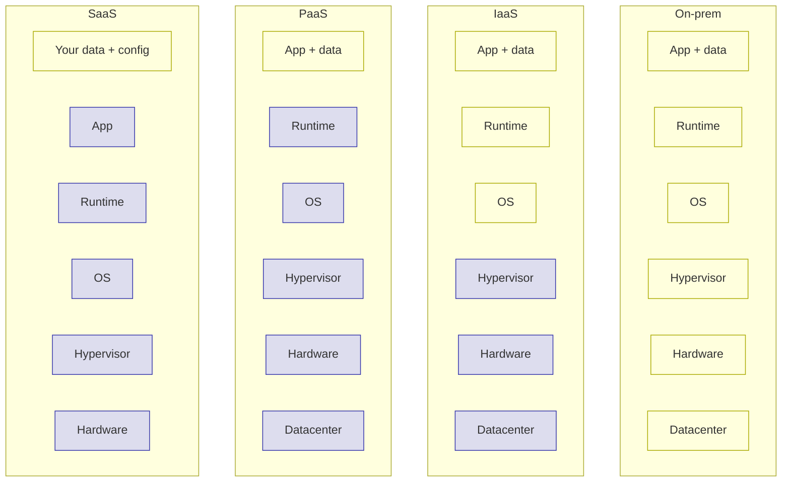

# IaaS vs PaaS vs SaaS

> **5-minute read.**

## The one-line answer

Three flavors of cloud service, sorted by how much the provider does for you:

- [**IaaS**](../glossary.md#term-iaas-infrastructure-as-a-service) - rent the building blocks (servers, disks, networks). You set everything up.
- [**PaaS**](../glossary.md#term-paas-platform-as-a-service) - rent the platform. You bring code; the provider runs it.
- [**SaaS**](../glossary.md#term-saas-software-as-a-service) - rent the finished software. You just log in and use it.

## The pizza analogy

The classic visualization:

| You eat... | Make from scratch | Take and bake | Delivery | Dine in |
|-----------|-------------------|---------------|----------|---------|
| Dough     | You               | Provider      | Provider | Provider |
| Sauce     | You               | Provider      | Provider | Provider |
| Toppings  | You               | Provider      | Provider | Provider |
| Oven      | You               | You           | Provider | Provider |
| Plates    | You               | You           | You      | Provider |
| Table     | You               | You           | You      | Provider |
|           | **On-prem**       | [**IaaS**](../glossary.md#term-iaas-infrastructure-as-a-service)      | [**PaaS**](../glossary.md#term-paas-platform-as-a-service) | [**SaaS**](../glossary.md#term-saas-software-as-a-service) |

Yellow = your responsibility. Blue = provider's. The further right you go, the less you manage - but the less you control.

## IaaS - Infrastructure as a Service

**You get:** virtual machines, virtual disks, virtual networks. Raw building blocks.

**You manage:** OS patches, the runtime, your application, scaling, monitoring.

**Provider manages:** the physical hardware, hypervisor, datacenter, networking fabric.

**Examples:**
- AWS EC2, EBS, VPC
- Azure VMs, Managed Disks, Virtual Networks
- GCP Compute Engine, Persistent Disks, VPC

**Use when:**
- You want maximum control
- You're lifting-and-shifting an existing app
- You have specific OS / kernel / driver requirements
- You're running something the PaaS layer doesn't support

## PaaS - Platform as a Service

**You get:** a platform that runs your code. You hand it a container, a Java app, a Node.js project, etc., and it figures out the rest.

**You manage:** your code and configuration.

**Provider manages:** OS patching, runtime upgrades, scaling, load balancing, sometimes the database.

**Examples:**
- AWS App Runner, Elastic Beanstalk, Lambda (also serverless)
- Azure App Service, Container Apps
- GCP App Engine, Cloud Run
- Heroku (the OG PaaS)
- Vercel, Netlify, Render, Railway

**Use when:**
- You want to ship fast, not manage servers
- Your app fits a standard runtime (web app, API, function)
- You're a small team without ops bandwidth

## SaaS - Software as a Service

**You get:** finished software, accessed through a browser or API.

**You manage:** your own data and users inside it.

**Provider manages:** literally everything else.

**Examples:**
- Gmail, Slack, Notion, Salesforce, GitHub, Figma
- DataDog (monitoring), Auth0 (authentication), Stripe (payments)

**Use when:**
- The problem is already solved by software someone built
- You'd rather pay $X/month than build and maintain it
- (i.e. 99% of business software needs)

## Where serverless fits

"Serverless" is fuzzy - it's marketing-speak that overlaps PaaS. The defining traits:

- You don't think about servers (the platform handles compute capacity)
- You pay per request or per millisecond, not per hour
- It scales to zero when idle (no idle cost)

Serverless examples: AWS Lambda, Azure Functions, GCP Cloud Run, Cloudflare Workers.

It's basically "PaaS with very fine-grained billing." Some people call it FaaS (Function as a Service) when it's specifically functions.

## A real-world stack

A typical modern startup:

| Layer | Choice | Type |
|-------|--------|------|
| User-facing app | Vercel hosting Next.js | PaaS |
| Backend API | AWS Lambda | Serverless / PaaS |
| Database | Supabase or Neon Postgres | SaaS / DBaaS |
| Auth | Clerk or Auth0 | SaaS |
| Email | Postmark or Resend | SaaS |
| Payments | Stripe | SaaS |
| Analytics | PostHog or Mixpanel | SaaS |
| Errors | Sentry | SaaS |
| ML | OpenAI or Anthropic API | SaaS |

Notice: barely any IaaS. A modern small team can build serious products without ever provisioning a VM.

When does IaaS still come up?
- Specialized workloads (GPU training, custom networking, regulated environments)
- Very high scale where managed services are too expensive
- Self-hosting because you want control of data / cost / latency

## What to look at next

- **[Serverless explained](./serverless-explained.md)** - the most common modern PaaS pattern
- **[Containers vs VMs](./containers-vs-vms.md)** - the unit IaaS and PaaS run
- **[Shared responsibility model](./shared-responsibility-model.md)** - whose job is security at each layer
- **[Glossary: IaaS, PaaS, SaaS](../glossary.md#cloud-fundamentals)**
