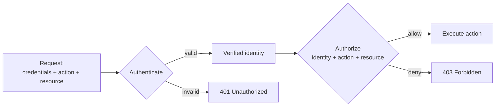

# IAM explained

> **8-minute read. No prerequisites.**

## The one-line answer

IAM (Identity and Access Management) is how you answer two questions for every request your system handles: **who is asking** (authentication) and **what are they allowed to do** (authorization). It is the foundation of cloud security, the source of most production breaches, and the topic that costs more time on certification exams than any other.

## Authentication vs authorization

Two different things. People mix them up. They're separate.

- [**Authentication (authn)**](../glossary.md#security-identity): prove you are who you say you are. Username/password, MFA, OAuth, certificates, IAM roles. Result: a verified identity.
- [**Authorization (authz)**](../glossary.md#security-identity): given a verified identity, decide what it's allowed to do. Result: yes / no for a specific action on a specific resource.



You can be authenticated and not authorized. You can also be unauthenticated for actions that allow anonymous access. Build for both states.

## Identities

An identity is who or what is making the request. Cloud platforms typically distinguish:

- **Users / human identities** - a real person logging in. Often federated from a corporate IdP (Okta, Azure AD, Google Workspace) rather than a standalone IAM user.
- **Service accounts / machine identities** - workloads (a Lambda, a VM, a pod) acting on their own. Authenticate via short-lived tokens, instance roles, or service-account JSON keys.
- **Groups** - collections of identities for grouping policies. "Everyone in engineering."
- **Roles** - a set of permissions you can *assume*. Different from a user; a user assumes a role to get its permissions for a session.

Best practice: humans use their own user accounts (federated when possible). Workloads use service accounts or roles. Never put long-lived credentials inside code or commit them to git.

## Authorization models

Two main models you'll see:

### RBAC (Role-Based Access Control)
Permissions are assigned to **roles**. Identities are assigned to roles. "Admins can do X. Alice is an admin. Therefore Alice can do X."

- Pros: simple, intuitive, scales for medium org sizes.
- Cons: role explosion. "Admin who can manage AWS but not GCP, who can view billing but not modify it" - you end up with hundreds of fine-grained roles.

Used by: AWS IAM (with policies), Kubernetes (RBAC API), most enterprise apps.

### ABAC (Attribute-Based Access Control)
Permissions are evaluated based on **attributes** of the identity, the resource, and the request context. "Allow if `user.department == resource.department` and `request.time` is during business hours."

- Pros: highly expressive, scales without role explosion, good for multi-tenant.
- Cons: harder to reason about. Hard to answer "what can Alice do?" by inspection.

Used by: AWS via IAM policy conditions, GCP via IAM Conditions, Azure via ABAC role assignments, all major OPA/Cedar deployments.

Most real systems blend both: RBAC for the broad strokes, ABAC for fine-grained conditions.

## Policies and roles

A **policy** is a document that says what a permission grants. In AWS:

```json
{
  "Version": "2012-10-17",
  "Statement": [{
    "Effect": "Allow",
    "Action": ["s3:GetObject"],
    "Resource": ["arn:aws:s3:::my-bucket/*"]
  }]
}
```

This policy allows reading objects from `my-bucket`. Attach it to a role; identities that assume the role get this permission.

Other clouds use similar constructs:
- Azure: role definitions + role assignments
- GCP: IAM bindings (member + role + resource)

The shape varies; the mental model is the same: **subject** (who) + **verb** (action) + **object** (resource), evaluated to allow or deny.

## Federation

Most enterprises don't want a separate user list per cloud. Federation lets your corporate IdP (Okta, Azure AD, Google Workspace, Auth0) be the source of truth.

The pattern:

1. User logs into corporate IdP (single sign-on).
2. IdP issues a SAML/OIDC token asserting "this is Alice, in Engineering."
3. The cloud trusts the IdP and maps the assertion to a cloud role (e.g. "Engineering folks assume the EngineeringDeveloper role").
4. The cloud issues short-lived credentials for that role.

Benefits: one source of truth for who works there, one place to revoke access (deactivate in IdP), no per-cloud user accounts to manage. Plus MFA enforcement happens at the IdP and applies everywhere.

## Least privilege

The default principle: grant the minimum permissions required, not the maximum convenient. "Give the deploy bot `*:*`" is a vulnerability waiting to happen. Tools that help:

- **AWS IAM Access Analyzer** - flags policies broader than usage justifies.
- **GCP Recommender (IAM)** - suggests removing unused permissions.
- **Azure PIM (Privileged Identity Management)** - just-in-time elevation instead of standing admin.

Iteratively: start with too narrow, watch for `AccessDenied`, add only the specific permission needed.

## Common pitfalls

### Long-lived credentials in code
A `.env` file in git with an AWS access key. Found by a bot in seconds. Leak. Use IAM roles, instance profiles, workload identity federation - never bake keys into images.

### `*` resource patterns
`"Resource": "*"` allowed for an action like `s3:DeleteObject`. Now any user with this permission can delete *any* bucket. Scope to the resource ARN.

### Wide groups
"All engineers can read all secrets." Then a single compromised account leaks every secret. Per-team or per-app secrets, with explicit grants.

### Dangling permissions
A role used to need permission X, doesn't anymore. Nobody removes it. Combined with another role's permissions, X enables privilege escalation. Audit periodically.

### Confused deputy
Service A is allowed to act on behalf of users. An attacker tricks A into acting on resources that the attacker shouldn't reach. Prevent with explicit external IDs (AWS), audience checks (OIDC), or sub-claim checks.

### IAM is just one layer
Network ACLs, security groups, resource-level encryption, organization-level guardrails (SCPs, Org Policies) all stack on IAM. A perfect IAM policy doesn't help if the storage bucket is publicly readable.

### Production accidents from "test" accounts
A test account with broad access ends up with production data piped through it. Treat every account as production unless data and credentials are truly synthetic.

## Where IAM appears on certs

This topic is on essentially every cloud certification:

- **Foundational**: AWS CLF-C02, Azure AZ-900, GCP Cloud Digital Leader.
- **Associate**: AWS SAA / DVA / SOA, Azure AZ-104, GCP Cloud Engineer.
- **Specialty**: AWS Security (SCS-C02), Azure AZ-500.
- **Vendor-neutral capstones**: CISSP, CCSP, CCSK.

For all of them, expect 15-30% of your study time on IAM. See the **[IAM topic page](../../topics/iam.md)** for cross-pillar links.

## What to look at next

- **[Shared responsibility model](./shared-responsibility-model.md)** - what the cloud secures vs what you secure
- **[TLS and HTTPS](./tls-and-https.md)** - the encryption layer often paired with IAM
- **[Topic: IAM](../../topics/iam.md)** - cross-pillar index
- **[Service comparison: Identity and IAM](../../resources/service-comparison-identity-iam.md)** - AWS IAM vs Azure Entra vs Google IAM
