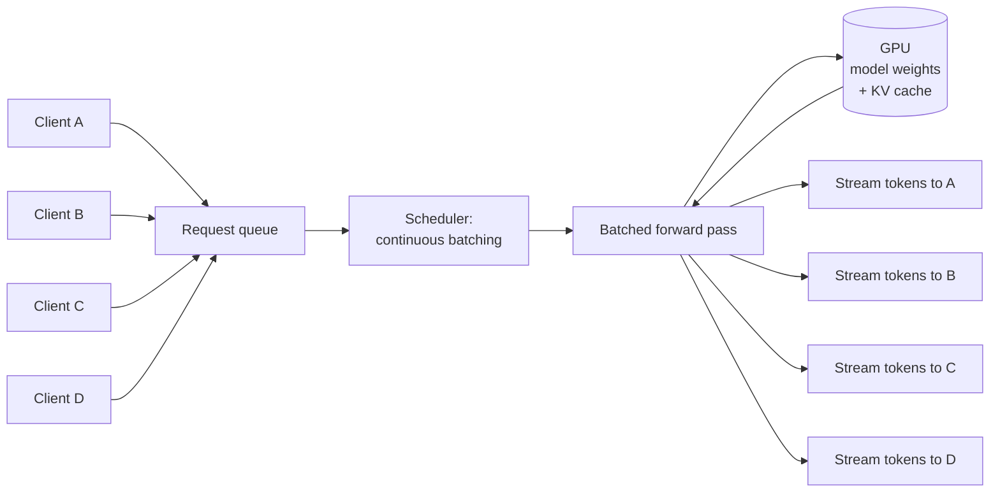

# Inference servers

> **8-minute read. Assumes you've read [LLM basics](./llm-basics.md) and ideally [Quantization and distillation](./quantization-and-distillation.md).**

## The one-line answer

An inference server is the process that loads a model into GPU memory and serves API calls against it. For open-weights LLMs, the right inference server can mean the difference between 5 tokens/sec on one user and 5,000 tokens/sec across hundreds of users on the same hardware.

If you're using hosted APIs (Anthropic, OpenAI, Bedrock), the inference server is someone else's problem. The moment you decide to host an open-weights model yourself, this becomes the most important decision after picking the model.

## Why this isn't trivial

Naive inference (the kind you write in PyTorch in 20 lines) does one request at a time, sequentially. A single A100 running a 7B model that way might serve 30 tokens/sec to one user.

Real inference servers do three things:

1. **Continuous batching** - take multiple incoming requests, run them through the model in the same forward pass. The model is the bottleneck; you might as well be serving 100 users instead of 1.
2. **KV cache management** - intelligently store and reuse the attention key/value tensors that get computed during generation, so the model doesn't redo work for the prefix it's already seen.
3. **Optimized kernels** - use FlashAttention, PagedAttention, and other tricks to wring throughput out of the hardware.



Done well, the same A100 + 7B model can serve thousands of tokens/sec across many concurrent users.

## The major options

### vLLM
The current default for most production self-hosted serving on Nvidia. Features PagedAttention (treats KV cache like virtual memory pages), continuous batching, OpenAI-compatible API. Strong on Nvidia, growing AMD support.

```bash
pip install vllm
vllm serve meta-llama/Llama-3.2-3B-Instruct
# Now you have an OpenAI-compatible /v1/chat/completions endpoint.
```

Pros: fast, broadly supported, OpenAI-compatible API makes drop-in replacement easy. Cons: opinionated, occasional rough edges with newer model architectures.

### TGI (Text Generation Inference)
Hugging Face's server. Continuous batching, FP16/BF16/quantized weights, gRPC and HTTP. Used heavily in HuggingFace's own Inference Endpoints product.

Pros: HF-native, good observability, decent performance. Cons: licence considerations for commercial deployment of some versions; tracks newer model architectures slightly slower than vLLM.

### SGLang
Newer but rising fast. Optimized for *structured* generation (constrained decoding, tool use, multi-turn conversation). Often wins on workloads with lots of structured output or repeated prefixes.

Pros: best-in-class for structured workloads, agent-style use cases. Cons: smaller ecosystem, fewer integrations than vLLM.

### llama.cpp
The CPU/edge story. Pure C++, runs on CPUs, GPUs, Apple Silicon, even phones. GGUF format. Not as fast at scale as vLLM, but the only realistic option for many environments.

Pros: runs anywhere, tiny dependencies, GGUF makes models easy to swap. Cons: lower throughput at scale, fewer optimizations for very large GPUs.

### TensorRT-LLM
Nvidia's own. Compiles models down to TRT engines. Highest performance on Nvidia hardware *if* you're willing to deal with the build complexity.

Pros: peak Nvidia performance. Cons: build pipeline is fragile, model support lags, harder to operate.

### Triton Inference Server (Nvidia)
General-purpose model serving from Nvidia. Hosts TRT-LLM, vLLM, and other backends. Operational tool, not an inference engine itself.

## The numbers that matter

When evaluating an inference server, four metrics:

- **Time to first token (TTFT)** - how long after the request before the user sees the first character. Dominated by prefill time, which scales with input length.
- **Inter-token latency (ITL)** - how long between subsequent tokens. Should be smooth and small (e.g. 30-80ms).
- **Throughput (tokens/sec, aggregate)** - across all concurrent requests. The metric your wallet cares about.
- **Concurrency** - how many requests can be in-flight at once before quality degrades.

Don't optimize one in isolation. A server with great throughput and 30-second TTFT is useless for a chat product. A server with 50ms TTFT and 5 tok/sec throughput won't scale.

## Knobs to know

### Batch size
More concurrent requests = better throughput, until the GPU saturates. Servers handle this automatically (continuous batching) but you can tune the cap.

### KV cache size
Pre-allocated memory for attention state. Bigger = more concurrent users, less memory for the model itself. Default usually fine.

### Tensor parallelism
For models bigger than one GPU. Splits the model across devices. Adds inter-GPU latency; only worth it for big models.

### Pipeline parallelism
Splits the model layers across devices, each device running a stage. Useful for *very* big models across multiple machines.

### Quantization
INT8 / INT4 weights to fit bigger models or run faster. See [Quantization and distillation](./quantization-and-distillation.md). Most servers support multiple quantization formats; vLLM is strong on AWQ and GPTQ, llama.cpp on GGUF.

## Common pitfalls

### Serving from a notebook for "real" load
Notebooks aren't production. They don't recover from OOM, don't auto-restart, don't expose health endpoints. Wrap in a real server.

### Loading the wrong precision
You wanted INT8, you got FP16, your model OOMs at scale. Read the load logs.

### Forgetting prefix caching
If your system prompt is 2000 tokens and rarely changes, you should be reusing the KV cache for it across requests. Most servers support this; some require config.

### Cold starts
First request after server restart takes much longer (model load + JIT compile). Pre-warm.

### Cost shock
A single A100 hour is $2-4 hosted. A 70B FP16 model needs ~3 of them. Idle GPUs eat money fast. For low-volume self-hosting, check if hosted APIs are actually cheaper.

## When to self-host vs use a hosted API

| Reason | Self-host | Hosted |
|--------|-----------|--------|
| Privacy / data sovereignty | ✅ | ❌ unless dedicated tenancy |
| Latency from EU/Asia where API regions are limited | ✅ | depends |
| Custom or fine-tuned models | ✅ | only via vendor's fine-tune product |
| Volume in tens-of-billions of tokens/month | ✅ | expensive |
| Volume in millions of tokens/month | ❌ | cheaper, no ops |
| Need frontier-model quality | ❌ | ✅ |
| Want zero ops | ❌ | ✅ |
| Latency-sensitive (sub-200ms TTFT) | depends | varies by provider |

Most teams should default to hosted and switch only when one of the privacy/volume/customization triggers fires.

## What to look at next

- **[Quantization and distillation](./quantization-and-distillation.md)** - how to fit bigger models on smaller hardware
- **[GenAI platforms comparison](../../resources/service-comparison-genai-platforms.md)** - hosted alternatives
- **[Context windows and management](./context-windows-and-management.md)** - what eats throughput
- **[Run Llama on a single GPU](../../resources/hands-on-projects/run-llama-on-single-gpu.md)** - hands-on with vLLM
