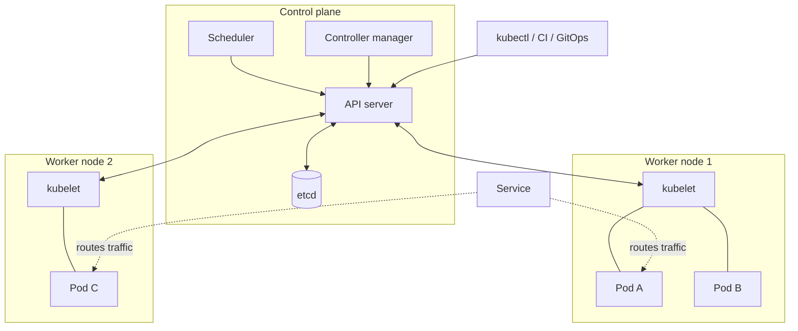

# Kubernetes in 10 Minutes

> **8-minute read.**

## The one-line answer

Kubernetes (K8s) is a system that takes containers from many machines and treats them like one big pool of compute. You tell it "I want 5 copies of this app running with these limits," and it figures out where to put them, restarts crashes, and scales as needed.

## Why it exists

Once you have:
- Multiple machines
- Many containers per machine
- Containers that need to talk to each other
- Containers that fail and need to be restarted
- Need to deploy without downtime

…you can't run `docker run` 50 times by hand. You need orchestration.

Kubernetes does that, with config-as-code, automated recovery, scaling, networking, secrets, and a giant ecosystem of tools.

It came out of Google (loosely based on their internal Borg system). Now CNCF-governed and the de facto standard.

## The mental model

You don't tell Kubernetes "run this container on machine 3." You tell it "I want this state - 5 replicas, this image, this CPU limit." Kubernetes figures out the rest and constantly reconciles reality with what you declared.

This is the **declarative** model: describe the desired state, not the steps to get there.

## The pieces



The control plane is the brain. Worker nodes run your pods. `kubectl` talks to the API server; everything else flows through it.

### Cluster
A collection of machines (called **nodes**) that run your containers. A cluster has a **control plane** (the brain) and **worker nodes** (where containers actually run).

### Node
One machine in the cluster. Could be a VM or bare metal.

### Pod
The smallest unit Kubernetes schedules. A pod = 1 or more containers that always run together on the same node, sharing network and storage.

99% of pods have one container. Multi-container pods are for "sidecars" - helper containers that augment the main one (logging agents, service mesh proxies).

### Deployment
Tells Kubernetes "I want N replicas of this pod." Handles rolling updates (deploy v2 by gradually replacing v1 pods).

### Service
A stable network address for a set of pods. Pods come and go; the service stays. Load-balances across pod IPs.

### Ingress / Gateway
How external traffic reaches your services. Typically backed by a cloud load balancer.

### ConfigMap / Secret
Configuration and credentials, mounted into pods as files or env vars.

### Namespace
Logical grouping of resources within a cluster. Used for separating environments or teams.

## A small concrete example

Deploy a 3-replica nginx web server:

```yaml
apiVersion: apps/v1
kind: Deployment
metadata:
  name: web
spec:
  replicas: 3
  selector:
    matchLabels: { app: web }
  template:
    metadata:
      labels: { app: web }
    spec:
      containers:
      - name: nginx
        image: nginx:1.27
        ports: [{ containerPort: 80 }]
---
apiVersion: v1
kind: Service
metadata:
  name: web
spec:
  selector: { app: web }
  ports: [{ port: 80, targetPort: 80 }]
  type: LoadBalancer
```

Apply with `kubectl apply -f web.yaml`. Kubernetes:
1. Schedules 3 nginx pods across nodes
2. Creates a load balancer (using your cloud provider) pointing to them
3. Restarts any that crash
4. Replaces any whose node dies

Update to nginx 1.28: change `image:` and re-apply. Kubernetes does a rolling update, replacing pods one at a time without downtime.

## How a request flows

```
User → Cloud LB → Kubernetes Service → Pod (one of N)
                                      → Pod
                                      → Pod
```

Each pod has an internal IP. Service has a virtual IP (or DNS name). Load balancer distributes across all healthy pods.

## What Kubernetes is good at

- **Self-healing** - crashed containers come back, dead nodes' workloads reschedule elsewhere
- **Rolling updates** - zero-downtime deploys
- **Horizontal scaling** - HorizontalPodAutoscaler watches metrics, adds/removes replicas
- **Resource sharing** - many apps on shared infrastructure with limits
- **Standardization** - same `kubectl` commands on AWS, Azure, GCP, on-prem

## What Kubernetes is NOT

- **Not a PaaS** - it's a platform you build a PaaS on. You still manage upgrades, networking, observability, secrets.
- **Not for tiny apps** - if you have one app and one server, K8s is overkill. Use ECS, Cloud Run, App Service, or Heroku.
- **Not magic** - misconfigured pods crash. Misconfigured networking won't route. Limits matter.

## Managed Kubernetes

You almost certainly want managed K8s, not self-hosted:

- **AWS EKS** (or EKS Auto Mode for fully managed)
- **Azure AKS**
- **GCP GKE** (Standard or Autopilot)

The cloud provider runs the control plane. You bring nodes (or use serverless node modes). Way less operational pain than self-hosted.

## Tooling you'll meet

- **kubectl** - the CLI for talking to a cluster
- [**Helm**](../glossary.md#term-helm) - package manager for K8s YAML ("charts")
- [**Kustomize**](../glossary.md#term-kustomize) - templating for K8s YAML, built into kubectl
- **ArgoCD / Flux** - GitOps continuous deployment
- **Istio / Linkerd** - service mesh (mTLS, traffic management, observability)
- **Prometheus + Grafana** - metrics and dashboards
- **k9s** - terminal UI for clusters

## When K8s makes sense vs not

**Reach for K8s when:**
- You have many services that need to coordinate
- You need portability across clouds
- Your team has K8s expertise
- You're at a scale where the operational work pays off

**Skip K8s when:**
- You have <5 services
- You're a small team without K8s expertise
- A managed serverless platform (Cloud Run, App Service, Lambda) covers your needs

## What to look at next

- **[Containers vs VMs](./containers-vs-vms.md)** - the unit K8s schedules
- **[Glossary: Containers & Kubernetes](../glossary.md#containers--kubernetes)**
- **[Service comparison: Containers & Kubernetes](../../resources/service-comparison-containers-kubernetes.md)** - EKS vs AKS vs GKE
- **[Kubernetes troubleshooting guide](../../resources/troubleshooting/kubernetes-troubleshooting.md)**
