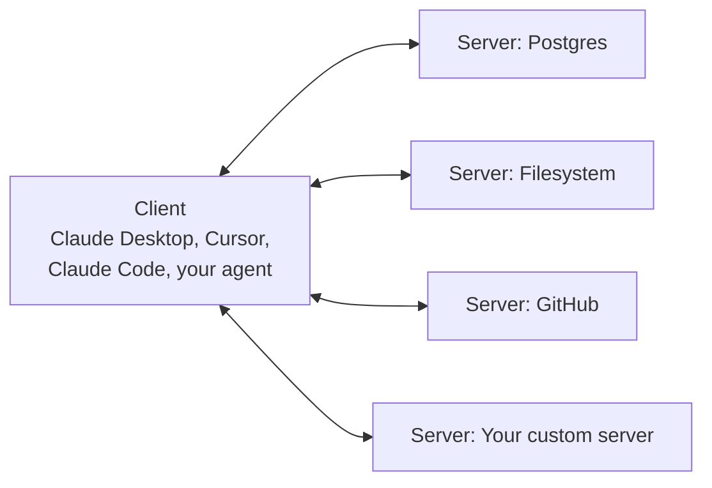

# MCP explained

> **7-minute read. Assumes you've read [Tool use and function calling](./tool-use-and-function-calling.md).**

## The one-line answer

MCP - Model Context Protocol - is an open standard for how an AI app talks to the tools, data sources, and prompts it uses. Instead of every app reinventing its own tool definitions, MCP lets you write a server once and plug it into any MCP-compatible client (Claude Desktop, Claude Code, Cursor, custom agents).

Think of it as USB for AI tools. Anthropic released it in late 2024; it's been adopted broadly since.

## Why it exists

Before MCP, every AI app had its own glue code:

- Claude Desktop had one way to load tools
- Cursor had another
- Your custom agent had a third
- Anthropic's SDK had a fourth

If you wrote a "search Postgres" tool, you'd need a different wrapper for each. MCP standardizes the wrapper.

It also separates **the tool author** from **the app author**. The Postgres team can publish a Postgres MCP server. You add it to Claude Desktop with one line of config. Same server, every client.

## The shape



Each MCP server exposes some combination of:

- **Tools** - functions the model can call (`query_database`, `read_file`)
- **Resources** - read-only data the model can attach to context (a doc, a database schema, today's logs)
- **Prompts** - reusable prompt templates the user can invoke

A client (the app you use) connects to one or more servers. The client mediates between the model and the servers.

## A minimal server

In Python:

```python
from mcp.server.fastmcp import FastMCP

mcp = FastMCP("my-server")

@mcp.tool()
def get_account_balance(customer_id: int) -> str:
    """Look up the current account balance in USD for a given customer ID."""
    # your real lookup here
    return f"$1,247.50"

if __name__ == "__main__":
    mcp.run()
```

That's it. The decorator generates the JSON schema from the type hints, registers the tool, and handles the protocol.

In TypeScript the shape is similar.

## Transport

MCP servers can run over:

- **stdio** - the client spawns the server as a subprocess, talks to it over stdin/stdout. Simplest. Used by most local servers.
- **SSE / streamable HTTP** - the server runs as an HTTP service, the client connects over the network. Used for remote / shared servers.

Stdio is right for "I want to give Claude Desktop access to my local Postgres." HTTP is right for "I want a fleet of agents to share a tool."

## What's already out there

The ecosystem moved fast. Common servers:

- **Filesystem** - read/write files in a sandboxed directory
- **GitHub** - search, read, and modify repos
- **Postgres / SQLite** - run queries
- **Slack** - read/post messages
- **Brave Search / Tavily** - web search
- **Memory** - persistent KV store across sessions
- **Sequential thinking** - structured reasoning helper

Most are open source on GitHub under `modelcontextprotocol/servers` or third-party orgs. Many are 50-200 lines of glue code over an existing API.

## Why this matters more than it looks

Three reasons MCP changes how you build AI apps:

### 1. Composition
You can stack servers. Need an agent that can read your codebase, query Postgres, and post to Slack? Three off-the-shelf servers, one config file. No custom integration code.

### 2. Portability
Switch from Claude Desktop to a custom agent built with the [Claude Agent SDK](../../resources/service-comparison-agent-frameworks.md). Same servers, same tools. The model's "hands" stay the same.

### 3. Permission and audit at the boundary
The client can mediate which tools the model is allowed to call, log every call, and require user confirmation for destructive operations. The server doesn't have to handle this; the client does. Cleaner security model.

## What MCP is not

- **Not RAG.** MCP can include a "resources" capability that exposes documents, but the standard retrieval pipeline (embed-store-search) is orthogonal. You can use both together. See [RAG explained](./rag-explained.md).
- **Not an agent framework.** MCP defines the protocol between an agent and its tools. The loop, the planning, the multi-agent orchestration - all separate concerns. See [Agentic loops](./agentic-loops.md) and [Agent frameworks comparison](../../resources/service-comparison-agent-frameworks.md).
- **Not Anthropic-only.** Anthropic created it but it's an open standard. OpenAI's Agents SDK supports it. So do others. The momentum is broad.

## Common pitfalls

### Server runs forever in stdio mode
You spawn the server, run a tool, then leave the process alive eating memory. Make sure your client cleans up.

### Tool descriptions are still load-bearing
MCP standardizes the protocol but not the prompt engineering. A poorly-described tool is just as useless under MCP as it was before. Spend time on descriptions. See [Tool use](./tool-use-and-function-calling.md).

### Permission drift
You add a "read filesystem" server for one task and forget it's still loaded for another. Audit your enabled servers per project.

### Versioning
Servers evolve. A server you wrote six months ago against an early MCP spec may not work with a current client. Pin versions.

## What to look at next

- **[Tool use and function calling](./tool-use-and-function-calling.md)** - the underlying mechanism MCP standardizes
- **[Agentic loops](./agentic-loops.md)** - what you build with MCP servers
- **[Agent frameworks comparison](../../resources/service-comparison-agent-frameworks.md)** - clients that consume MCP servers
- **[Build a Claude agent with MCP](../../resources/hands-on-projects/build-claude-agent-with-mcp.md)** - hands-on
- **[Anthropic Architect tracks](../../exams/anthropic/claude-certified-architect-foundations/)** - cert-style coverage
