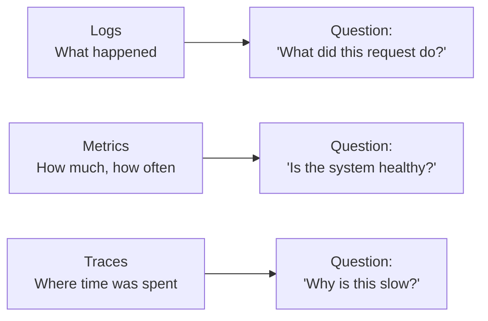

# Observability basics

> **8-minute read. No prerequisites.**

## The one-line answer

Observability is the property of a running system that lets you understand what it's doing, especially when it isn't doing what you wanted. The three primary signals - **logs**, **metrics**, and **traces** - each answer different questions, and you need all three to debug real problems.

## Monitoring vs observability

Monitoring is "alert me when known-bad things happen": disk above 90%, error rate above 1%. You need a hypothesis and a threshold.

Observability is "let me ask any question about my system after the fact and get an answer." It's the prerequisite for debugging things you didn't anticipate. Modern monitoring is built on observability; the two terms blur in casual usage.

## The three pillars



### Logs: events, structured

A log line is a record of a discrete event with structured fields:

```json
{
  "timestamp": "2026-05-03T14:23:01Z",
  "level": "ERROR",
  "service": "checkout-api",
  "request_id": "req_abc123",
  "user_id": 42,
  "error": "PaymentDeclined",
  "stripe_code": "card_declined"
}
```

Strengths: rich context per event, full freedom to attach whatever fields matter.

Weaknesses: high volume, expensive at scale, slow to query if you don't index aggressively.

Tools: CloudWatch Logs, Azure Monitor Logs, Cloud Logging, Loki, Splunk, Datadog Logs.

### Metrics: numerical, aggregated, time-series

A metric is a numeric measurement, sampled at intervals:

```
http.request.duration{service=checkout-api, status=200}: histogram
  count: 12_345
  p50:   45ms
  p95:  180ms
  p99:  320ms
```

Strengths: cheap to store and query; great for dashboards and alerts; designed for "is this number too high right now?"

Weaknesses: pre-aggregated. You see "p95 latency is 180ms" but you don't see *which* request was slow, or why.

Tools: CloudWatch Metrics, Azure Monitor Metrics, Cloud Monitoring, Prometheus, Datadog, New Relic.

### Traces: per-request, span-tree

A trace follows a single request through every service it touches:

```
checkout-api  /charge        320ms
├── auth-svc        /verify        12ms
├── inventory-svc   /reserve       45ms
├── payment-svc     /process      240ms
│   └── stripe-api  /charges      230ms
└── notif-svc       /confirm       18ms
```

Strengths: shows you exactly where time was spent and what called what. Essential for distributed systems.

Weaknesses: high volume; usually sampled (you don't store every trace).

Tools: AWS X-Ray, Application Insights, Cloud Trace, Jaeger, Tempo, Honeycomb, Datadog APM.

## OpenTelemetry

The vendor-neutral standard for emitting all three signals. Library bindings for most languages. The thing to instrument with - your app emits OTel signals; the back end (Datadog, Honeycomb, Tempo, etc.) ingests them. Switch back ends without changing app code.

If you're starting fresh, default to OTel.

## The four golden signals

From the [Google SRE book](https://sre.google/sre-book/monitoring-distributed-systems/), the metrics that matter for any user-facing service:

1. [**Latency**](../glossary.md#term-latency) - how long requests take. Watch p50/p95/p99, not just average.
2. **Traffic** - how many requests per second. Or per minute, or any sensible time unit.
3. **Errors** - rate of failed requests. Includes anything that gives the user a worse experience than success.
4. **Saturation** - how full the system is. CPU, memory, disk, queue depth, connection pool utilization. Usually tracked toward a known limit.

Almost every dashboard you build should answer "how are these four doing?" before drilling deeper.

## RED and USE

Two complementary frames:

### RED (for services)
- **R**ate (requests/second)
- **E**rrors (failed requests/second)
- **D**uration (latency distribution)

Watch these per service. Spikes signal incidents.

### USE (for resources)
- **U**tilization (% busy)
- **S**aturation (queue depth)
- **E**rrors (failure count)

Watch these per resource (CPU, disk, network). Saturation is the leading indicator.

Use both. RED at the service edge, USE at every layer underneath.

## SLIs, SLOs, error budgets

When ad-hoc monitoring isn't enough:

- **SLI (Service Level Indicator)** - a measurable property: "% of requests served < 200ms."
- [**SLO (Service Level Objective)**](../glossary.md#term-slo-service-level-objective) - a target: "99.5% of requests should be under 200ms over 30 days."
- [**Error budget**](../glossary.md#term-error-budget) - the gap. If your SLO is 99.5%, you have 0.5% to spend (downtime, slow responses) per period.

Operationalize: when you've burned 50% of your budget, slow risky deploys. When you've burned 100%, freeze non-critical changes. This converts vague "reliability matters" into actionable policy.

## Common pitfalls

### Logging everything
Verbose logging eats budget and slows queries. Log at INFO for happy path, DEBUG behind a flag.

### Logging unstructured strings
"User 42 charged $50.50 for product 7" is unparseable. Use structured fields: `{user_id, amount, product_id}`. Future-you will thank present-you.

### Cardinality explosion in metrics
You added a `request_id` tag to a metric. Now every metric series is unique. The metrics back end falls over. Tag with low-cardinality fields (service, region, status); attach high-cardinality stuff to logs or traces.

### Average latency
Averages hide tail latency. If 99 requests take 50ms and 1 takes 5000ms, the average is 99.5ms - sounds great, but 1% of users are timing out. Always watch p95 and p99.

### Alert fatigue
Every metric has an alert. The alerts fire constantly. Engineers ignore them. Real problems get missed. Alert only on conditions that *require* human action *now*. Everything else is a dashboard or a low-priority ticket.

### No correlation across signals
Logs in one tool, metrics in another, traces in a third. Debugging means switching tabs and copy-pasting timestamps. Tools that integrate (or OTel-emitted signals into a single back end like Datadog or Honeycomb) save real time.

### Forgetting cost
Logs are the most expensive of the three. A noisy app at scale can run thousands of dollars a month in log ingest. Sample, drop redundant fields, set retention policies.

## What to look at next

- **[Topic: observability](../../topics/observability.md)** - cross-pillar links
- **[Service comparison: Observability and monitoring](../../resources/service-comparison-observability-monitoring.md)** - per-cloud tools
- **[Troubleshooting: Kubernetes](../../resources/troubleshooting/kubernetes-troubleshooting.md)** - applied
- **[Set up a monitoring stack](../../resources/hands-on-projects/setup-monitoring-stack.md)** - hands-on Prometheus + Grafana
