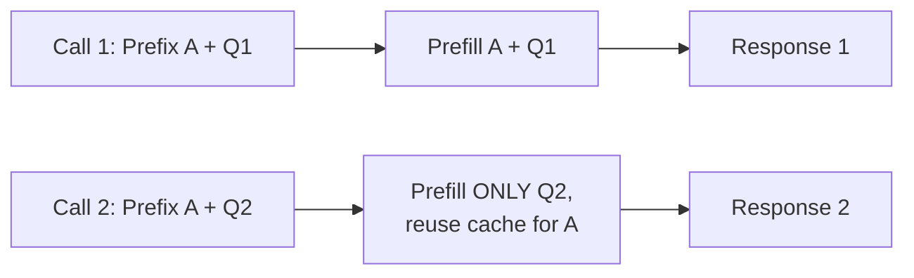

# Prompt caching

> **6-minute read. Assumes you've read [Context windows and management](./context-windows-and-management.md).**

## The one-line answer

Prompt caching lets you mark a stable prefix of your prompt so the model provider can reuse the work of processing it across calls. You pay full price the first time, then a small fraction of the price (and get faster responses) for subsequent calls that share the prefix.

For most production LLM apps, turning on prompt caching is the highest-leverage cost optimization available, often cutting input cost by 50-90%.

## Why it works

Generating a response from an LLM has two phases:

1. **Prefill** - the model processes every token of your prompt and computes attention key/value tensors for them. This is roughly O(N²) in prompt length.
2. **Decode** - the model generates new tokens one at a time, attending to the prefilled context.

Prefill is most of the input cost and most of the time-to-first-token. If your prompt has a stable prefix (the system prompt, tool definitions, a long doc, the start of a conversation), prefill is doing the *same work* every call. Cache the result.

## What "stable" means

Cache works at the prefix level. If you're caching the first 5,000 tokens, those exact 5,000 tokens must be identical across calls. Any change earlier in the prompt invalidates everything after it.

Practical implications:

- **System prompt at the start** - cacheable.
- **Tool definitions next** - cacheable.
- **A user message that varies** - not cacheable as part of the prefix, but doesn't break the prefix cache before it.
- **Putting timestamps in the system prompt** - kills your cache. Move them to the user message.

## Vendor implementations

The mechanics differ slightly per provider:

### Anthropic prompt caching
You explicitly mark cache breakpoints in the prompt: `cache_control: { "type": "ephemeral" }`. Up to 4 breakpoints. Cached writes cost more than ordinary input (~25% premium); cached reads cost ~10% of input. TTL is ~5 minutes (refreshed on hit; "extended" caches are 1 hour with appropriate flag).

### OpenAI prompt caching
Automatic for prompts >1024 tokens. No marker required. Cached input is ~50% off. Works on the longest matching prefix.

### Google Gemini context caching
Explicit, billed for the cache lifetime (you "create a cache" with a TTL). Useful for very long stable contexts (e.g. a 100K-token document) reused many times.

### AWS Bedrock
Per-model, varies. Anthropic models on Bedrock support Anthropic-style caching with similar economics.

The exact knobs change. Check current vendor docs.

## When caching pays off

Cache is win when:

- **The cacheable prefix is large** - the larger the prefix, the bigger the savings.
- **The prefix is reused frequently** - within the cache TTL.
- **The total volume is high enough** that the write premium amortizes.

Quick math: if your stable prefix is 2,000 tokens and you call ~10x within 5 minutes (Anthropic) or just hit the threshold often (OpenAI), caching is a clear win. If you call once per hour, the cache TTL expired and you're paying the write premium for nothing.

## Where caching shines

### Customer-support chatbot with a long system prompt
System prompt is identical for every user. Caches once per server instance per ~5 minutes. Massive win.

### Doc Q&A with a fixed knowledge corpus
Put the corpus in the cached prefix. Each user question reuses the cache. (You're trading off context cost for not having to do RAG retrieval. Often worth it for small-to-medium corpora.)

### Agents with stable tool definitions
The tool list is the same for every call in a session. Cache it.

### Few-shot prompts
The 5 examples at the top of your prompt are stable. Cache them.

### Multi-turn conversations
The growing chat history *is* a growing prefix. Each turn extends the cacheable region. The provider handles this automatically (mostly) - subsequent turns benefit from cached prior turns.

## When caching does NOT help

### Highly variable prompts
If every prompt is different from byte 1, there's no prefix to cache.

### Low-volume apps
The write premium can outweigh savings if you don't hit the cache frequently within the TTL.

### Prompts that change order
Some apps interleave the user message between system prompt segments. Don't. Stable stuff first, variable stuff last.

### Tiny prompts
Most providers have a minimum prompt size below which caching doesn't apply.

## Common pitfalls

### Cache busted by a timestamp
A "Today's date is..." line in the system prompt. Move it.

### Cache busted by a user ID in the system prompt
"You are an assistant for user 42." Either put the user ID after the cache breakpoint, or accept that you can't cache cross-user.

### Forgetting to enable
Many APIs default to no caching. You set a flag.

### Mismatch between expected and observed cost
Some providers show you the cache-hit ratio in the response metadata. Track it. A "cached" prompt with a 0% hit rate is paying you the write premium for no benefit.

### Mixing cached and uncached calls indiscriminately
Multiple model versions, multiple system prompt variants - each defines its own cache. Stay disciplined.

## A worked example

Doc Q&A app with 50K tokens of fixed docs in the system prompt, ~500 tokens per user question, ~500 tokens response. Anthropic Claude 3.5 Sonnet pricing.

Without caching:
- Input: 50,500 tokens × $3/M = $0.1515
- Output: 500 tokens × $15/M = $0.0075
- **Per call: $0.159**

With caching (assume 5+ calls per 5 minutes):
- First call (write): 50,500 tokens × $3.75/M = $0.189 (slight premium)
- Subsequent calls (read): 50,000 tokens × $0.30/M = $0.015 + 500 tokens × $3/M = $0.0015
- Output: $0.0075
- **Per cached call: $0.024**

That's 6.6x cheaper per cached call. At 1,000 calls/day, you save ~$140/day. Pays for the engineering time in a week.

## What to look at next

- **[Context windows and management](./context-windows-and-management.md)** - the broader picture
- **[GenAI platforms comparison](../../resources/service-comparison-genai-platforms.md)** - vendor caching specifics
- **[RAG explained](./rag-explained.md)** - alternative way to manage large knowledge bases
- **[Build a RAG pipeline](../../resources/hands-on-projects/build-rag-pipeline.md)** - hands-on
