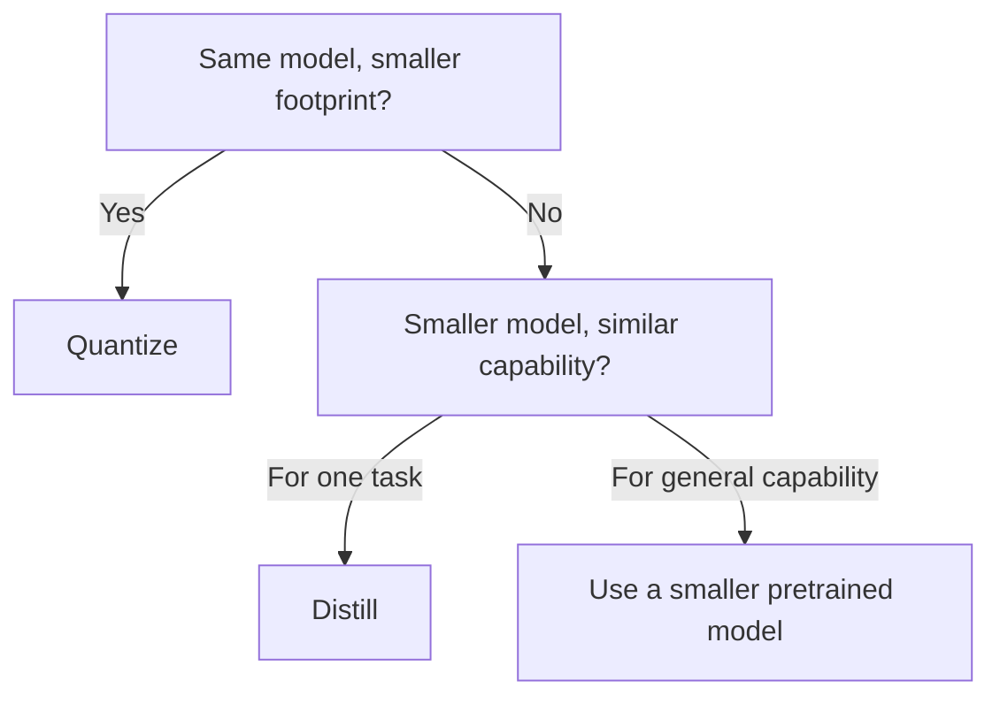

# Quantization and distillation

> **8-minute read. Assumes you've read [LLM basics](./llm-basics.md).**

## The one-line answer

Quantization and distillation are two ways to make a model smaller and faster, with two different mechanisms. **Quantization** keeps the same model but stores its weights at lower precision. **Distillation** trains a smaller "student" model to mimic a larger "teacher" model. Both trade some quality for less memory, lower cost, and faster inference.

You'll meet both in three contexts: open-source local inference, edge deployment, and production cost-cutting on hosted models.

## Quantization

Most LLM weights are originally trained in FP16 or BF16 (2 bytes per parameter). A 70B-parameter model at FP16 needs 140GB of memory. That's 2x A100s minimum to even load, before any inference.

Quantization stores those weights in fewer bits:

| Precision | Bytes per param | 70B model size | Quality loss |
|-----------|-----------------|----------------|--------------|
| FP16 / BF16 | 2 | 140 GB | baseline |
| INT8 | 1 | 70 GB | tiny |
| INT4 | 0.5 | 35 GB | small to moderate |
| INT3 | 0.375 | ~26 GB | noticeable |
| INT2 | 0.25 | 17 GB | significant |

Same model, less memory. INT8 is usually indistinguishable from FP16 in user-facing quality. INT4 is the sweet spot for local inference - the model fits on consumer GPUs (a 70B INT4 fits on a single RTX 4090 with offloading, or two with full GPU).

### Quantization formats you'll see

- **GGUF** - the format used by `llama.cpp`. Single-file, easy to download, runs on CPU, GPU, or both. The standard for local LLM tinkerers.
- **AWQ (Activation-aware Weight Quantization)** - a quantization scheme that protects the most important weights from precision loss. Better quality than naive INT4. Common in vLLM.
- **GPTQ** - older but still common. Calibrates per layer using a calibration dataset.
- **EXL2** - format used by ExLlamaV2, fast on Nvidia GPUs.
- **bitsandbytes** - dynamic 8-bit and 4-bit quantization, common in HuggingFace Transformers.

You don't need to memorize these. Pick the one your inference server supports.

### Static vs dynamic

- **Static (post-training quantization)**: convert a pre-trained model once, save the quantized weights. What you do with GGUF/AWQ/GPTQ.
- **Dynamic (quantization-aware training)**: train the model with quantization in the loop. Higher quality but requires retraining.

Most users do static. The labs that release base models sometimes do quantization-aware fine-tunes.

### When quantization breaks things

- **Tiny models hurt more.** A 1B model at INT4 loses more relative quality than a 70B at INT4.
- **Long-context performance degrades faster.** A model that holds up at 8K context may struggle at 100K when quantized aggressively.
- **Math and code can degrade visibly** even when general chat seems fine. Test on your actual tasks.

## Distillation

Distillation trains a smaller "student" model on the outputs of a larger "teacher" model. The student learns to match the teacher's predictions, including the *distribution* over next tokens, not just the top choice. The student ends up smaller, faster, and cheaper, while preserving most of the teacher's capability on the tasks distilled.

Three flavors:

### Response distillation (the simple one)
Generate a dataset by querying the teacher model with thousands of prompts. Fine-tune the student on `(prompt, teacher_response)` pairs. Easy to do; works well for narrow tasks.

### Logit distillation
Train the student to match the teacher's full output distribution (not just the chosen token). Higher fidelity, requires teacher logit access.

### Knowledge distillation with task data
Combine teacher outputs with real labeled data. The teacher acts as a soft-label generator that augments your real data.

### Why labs do this

- "Haiku" / "Flash" / "mini" tier models are typically distilled (or trained with distillation as part of the recipe) from larger siblings. You get most of the capability at much lower cost and latency.
- For specialized domains - "this customer-support task" - you can distill a 70B teacher into a 7B student that beats the 70B on *that task* despite being smaller, because the student concentrates capacity where it matters.

### When distillation breaks

- Out-of-distribution tasks the teacher wasn't queried on. The student doesn't generalize beyond the distribution it saw.
- Long, multi-step reasoning. Smaller models struggle to chain.
- New tasks added later. You'll need to re-distill.

## Quantization vs distillation: when to reach for which

- **Pick quantization** when you have a model you like and need it cheaper or fittable on smaller hardware. INT4 with AWQ is the modern default.
- **Pick distillation** when you need a much smaller model for one task and you can generate enough teacher outputs.
- **Pick a smaller pretrained model** (e.g. Llama 3.2 8B vs Llama 3.1 70B) when you need general capability at smaller scale - don't reinvent what already exists.
- **Combine them.** Distill into an INT4-quantized student. Common for edge deployment.

## A common gotcha: "quantized" benchmarks

Vendors and Hugging Face cards often quote benchmarks "with INT4 quantization" without saying what scheme. INT4 with AWQ vs INT4 with naive truncation can differ by 5-10 points on MMLU. Check the recipe.

## Where this matters in production

### Cost
Quantized open-weights inference can be 10x cheaper than equivalent hosted-model usage. The break-even depends on volume and quality tolerance. Most teams should default to hosted; switch when volume justifies it.

### Latency
Smaller models = faster tokens-per-second. For latency-sensitive apps (voice, real-time agents), a distilled 7B can beat a hosted 70B on user-perceived speed.

### Privacy / sovereignty
Some workloads can't leave your infra. Open-weights with quantization is the path. See [Inference servers](./inference-servers.md).

### Edge
On-device LLMs (phone, laptop, embedded) require aggressive quantization (INT4 or even INT2) and often distilled models. This is moving fast.

## What to look at next

- **[Inference servers](./inference-servers.md)** - how to actually serve a quantized model
- **[LLM basics](./llm-basics.md)** - the foundation
- **[GenAI platforms comparison](../../resources/service-comparison-genai-platforms.md)** - hosted alternatives
- **[Run Llama on a single GPU](../../resources/hands-on-projects/run-llama-on-single-gpu.md)** - hands-on
