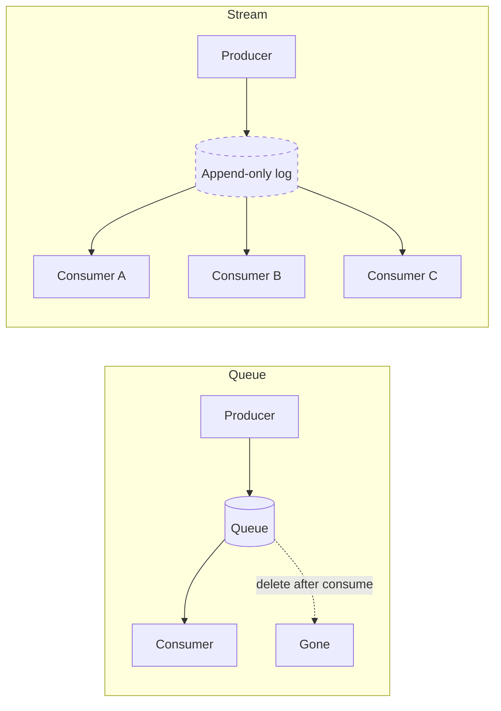

# Queues vs streams

> **7-minute read. No prerequisites.**

## The one-line answer

A **queue** delivers each message to one consumer and deletes it when consumed. A **stream** keeps every message in an ordered log that many consumers can read independently, often re-reading from the past. Confusing the two is one of the most common architectural mistakes; they solve different problems.

## The mental model

In a queue, a message has a single home and a single destination. Once delivered, it's gone.

In a stream, a message is appended to an immutable log. Anyone can read from any position, including positions they read before. Retention is time- or size-bounded but not consumption-bounded.

## When to use a queue

Queues fit naturally for "do this work, exactly once":

- **Task processing** - submitted forms, image-resize jobs, PDF generation.
- **Decoupling producers from consumers** - the producer doesn't wait for the consumer.
- **Smoothing bursts** - 10K requests in a second; the queue holds them, the consumers drain steadily.
- **Retry and DLQ semantics** - if a consumer fails, the message returns to the queue or to a dead-letter queue.

Common services:
- **AWS SQS** (Standard or FIFO), **Azure Service Bus** queues, **GCP Cloud Tasks** / **Pub/Sub** in queue mode.
- For ordered, exactly-once: SQS FIFO, Service Bus with sessions.

## When to use a stream

Streams fit "publish facts about what happened, let many systems react":

- **Event sourcing** - every state change is an append to the log; replay to rebuild state.
- **Fan-out to many consumers** - billing, analytics, search-index updater, audit log all read the same orders stream.
- **Replay** - bug in the analytics pipeline a week ago? Reset its read position and replay.
- **High-throughput ingestion** - many writers, ordered within partition.
- **Time-window analytics** - rolling counts over the last 5 minutes.

Common services:
- **Apache Kafka** (managed: AWS MSK, Azure Event Hubs Kafka mode, Confluent Cloud).
- **AWS Kinesis Data Streams** (Kinesis Firehose is the buffered-load variant).
- **Azure Event Hubs**, **GCP Pub/Sub Lite**.

## The cross-cloud equivalents

| Shape | AWS | Azure | GCP |
|-------|-----|-------|-----|
| Queue (one-consumer, delete-after-read) | SQS | Service Bus queues | Cloud Tasks |
| Stream (log, many readers, replay) | Kinesis Data Streams, MSK | Event Hubs, Service Bus topics | Pub/Sub Lite, Pub/Sub |
| Pub/sub (broadcast, often non-replayable) | SNS | Service Bus topics, Event Grid | Pub/Sub |

GCP Pub/Sub blurs the line. It's a managed pub/sub that can give you replay (Pub/Sub) but doesn't have the strict log-shape guarantees of Kafka. For Kafka semantics on GCP, use Confluent Cloud or Pub/Sub Lite.

## Ordering

A subtle topic.

**Queues**: FIFO queues guarantee in-order delivery within a "group key" (e.g. all messages with the same `OrderId`). Standard queues do not guarantee order.

**Streams**: order is guaranteed within a partition (Kafka) or shard (Kinesis). Across partitions, no order guarantee. To preserve order for related events, ensure they hash to the same partition key.

If you need strict global order across all messages, you need a single-partition stream or a single-consumer queue. Both limit throughput.

## Delivery guarantees

Three flavors, in increasing strength:

- **At-most-once** - message may be lost; never duplicated. Rare in practice.
- **At-least-once** - message will be delivered; may be duplicated under retry. The default for SQS Standard, Kafka with default settings.
- **Exactly-once** - the holy grail. Available with constraints: SQS FIFO with deduplication, Kafka with idempotent producers + transactional consumers, Pub/Sub with `enable_exactly_once_delivery`.

Default to **at-least-once** semantics in your design and make consumers idempotent. See [Idempotency explained](./idempotency-explained.md). Trying to guarantee exactly-once across system boundaries is hard and rarely worth it.

## Common pitfalls

### Picking a stream when a queue is right
"We need to fan out to multiple consumers" - except actually only one of them needs the messages, and the others are just curious. You're paying stream cost (retention, partitioning, complexity) for a queue workload.

### Picking a queue when a stream is right
Six months in, someone wants to add an analytics consumer. With a queue, the messages are gone. With a stream, you reset and read from any historical point. Streams future-proof.

### Not thinking about the partition key for streams
You partitioned on `userId`. Now hot users (whales) overwhelm one partition while others idle. Choose partition keys to spread load.

### Treating a queue as durable storage
Queues are designed to drain. Some have long retention (SQS up to 14 days) but they're not databases. Don't store data there; archive it.

### Reading from the start of a stream every time
For new consumers this is correct. For an existing consumer that crashed and restarted, you want to resume from the last commit, not start over. Pay attention to consumer group offsets.

### Pub/Sub at-least-once + non-idempotent handler
"It worked in dev." In prod under retries, you double-charged customers. Make handlers idempotent.

### Not setting up DLQs
A poison message (malformed payload) keeps failing. Without a dead-letter queue, the consumer chokes forever. Always set a max retry count and a DLQ.

## A worked decision

**Use case**: e-commerce orders need to update inventory, send confirmation email, push to fulfillment, update analytics dashboard, feed a fraud-detection ML pipeline.

- One consumer (inventory) needs strict consistency. Use a queue or a stream with ordered partitioning by `OrderId`.
- Multiple downstream consumers want the same events. Stream wins.
- Replay matters: if analytics breaks for a day, you want to replay yesterday's orders. Stream wins.

→ Use a stream (Kafka, Kinesis, Event Hubs). Each downstream system is its own consumer group. New systems plug in without affecting existing consumers.

**Use case**: image upload triggers a resize job.

- One consumer (the resize worker).
- No replay needed; once the image is resized, the work is done.
- Failures should retry, then dead-letter.

→ Use a queue (SQS, Service Bus, Cloud Tasks).

## What to look at next

- **[Idempotency explained](./idempotency-explained.md)** - why every consumer should be idempotent
- **[Eventual consistency](./eventual-consistency.md)** - the world streams produce
- **[Topic: databases](../../topics/databases.md)** - cross-pillar
- **[Architecture pattern: Event-driven](../../resources/architecture-patterns/event-driven-architecture.md)**
- **[Service comparison: Messaging and queues](../../resources/service-comparison-messaging-queues.md)**
