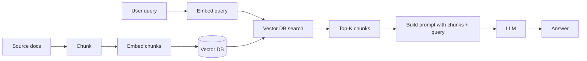

# RAG Explained

> **8-minute read. Assumes you've read [Embeddings and vector search](./embeddings-and-vector-search.md).**

## The one-line answer

RAG (Retrieval-Augmented Generation) means: when a user asks the LLM something, you first **retrieve** relevant snippets from your own data, paste them into the prompt as context, then ask the LLM to answer using that context.

It's how you give an LLM access to information it wasn't trained on - your docs, your customer data, your codebase, last week's events - without retraining the model.

## Why RAG instead of fine-tuning

The instinct on first hearing "I want the model to know about my company" is "fine-tune the model." That's almost always the wrong move. RAG is usually right because:

- **Updateable**: change the source docs, the answers update instantly. Fine-tuned knowledge is frozen at training time.
- **Cited**: you can show the user *which document* the answer came from. Fine-tunes blend everything together.
- **Cheap**: embeddings are pennies. Fine-tuning a real model is hundreds to thousands of dollars and ongoing pain.
- **Safer**: hallucinations drop because the model is grounded in retrieved text. Fine-tuned models still hallucinate plausibly.
- **Multi-tenant friendly**: one model, per-tenant retrieval. Fine-tunes generally need per-tenant models.

Fine-tune to change *behavior* (tone, format adherence, refusal patterns). RAG to change *knowledge*. See [Fine-tuning vs RAG](./fine-tuning-vs-rag.md).

## The pipeline



Two phases:

### Indexing (once, or when docs change)
1. Collect source documents.
2. Chunk them into smaller pieces (typically 200-1000 tokens).
3. Embed each chunk.
4. Store `(chunk_id, chunk_text, vector, metadata)` in a vector DB.

### Query (every user request)
1. Embed the user's query.
2. Search the vector DB for the K nearest chunks (typically K=3-10).
3. Stitch the chunks into a prompt with the user's question and instructions.
4. Send to the LLM.
5. Return the answer (often with citation links back to the source chunks).

## A minimal prompt template

```text
You are a helpful assistant. Answer the user's question using ONLY
the context below. If the answer isn't in the context, say
"I don't have that information."

<context>
[chunk 1 text]

---

[chunk 2 text]

---

[chunk 3 text]
</context>

Question: {user_question}
```

The "ONLY" and the "I don't have that information" escape hatch are both load-bearing. Without them the model will fall back to its training knowledge and you'll get a confident answer that didn't come from your docs.

## Chunking is the hard part

This is the make-or-break of any RAG system. Bad chunking = bad retrieval = bad answers, no matter how good the LLM is.

### Chunk too small (e.g. 50 tokens)
Each chunk lacks context. "Click the blue button" - which page? Retrieval finds the right *string* but the model can't ground itself.

### Chunk too big (e.g. 4000 tokens)
Vectors get muddied (the embedding tries to represent too many ideas at once). Retrieval starts returning chunks that are "kind of relevant" rather than exactly relevant.

### Chunking that ignores structure
Splitting mid-sentence, mid-table, mid-code-block destroys semantics. Always split on logical boundaries: paragraph, section, function definition.

### Reasonable defaults
- 300-800 tokens per chunk
- Split on paragraph or section boundaries
- 50-100 token overlap between adjacent chunks (catches information that straddles a boundary)
- Include metadata: source doc title, section header, URL

If you're indexing structured docs (markdown, code), use a structure-aware chunker. LangChain's MarkdownHeaderTextSplitter, llama-index's hierarchical chunkers, or write your own - it's not hard.

## When RAG fails

Cases where naive RAG breaks:

### The answer requires aggregation across many docs
"How many customers signed up last month?" requires counting, not retrieval. The right top-5 chunks won't get you there. You need SQL, function calling, or a tool.

### The right chunk has different wording from the query
User asks about "logging in" but the doc says "authentication." Embedding similarity helps but isn't perfect. Add **hybrid search** (semantic + keyword/BM25) and the recall jumps.

### The answer needs reasoning across multiple chunks
"What changed between v2 and v3?" requires comparing chunks. RAG retrieves them; you also need a prompt that explicitly tells the model to compare.

### Lost-in-the-middle
LLMs attend more to the start and end of long contexts. Bury the relevant chunk in the middle of 20 retrieved chunks and the model can miss it. Solution: rerank to put best chunks at the start, or limit K.

### Stale index
You added new docs yesterday but the index ran last week. Retrieval can't find them. Schedule re-indexing on doc changes.

## Beyond naive RAG

A vanilla "embed + retrieve top-K + answer" gets you 70% of the way. Real production systems often add:

- **Hybrid search**: combine embedding similarity with BM25 keyword matching.
- **Reranking**: after initial retrieval of K=20, run a slower cross-encoder to rerank to the best K=5. Big quality win.
- **Query expansion / rewriting**: have an LLM paraphrase the user's query into 2-3 search queries, retrieve for each, merge results.
- **HyDE (Hypothetical Document Embeddings)**: ask the LLM to *write a hypothetical answer* to the query, embed that, search with it. Often beats embedding the raw query.
- **Multi-step retrieval / agentic RAG**: the LLM decides what to search for next based on what it already retrieved.
- **Metadata filtering**: tenant-scoped, time-scoped, doc-type-scoped retrieval.
- **Citations**: track which chunk every claim came from, surface to user.

Each adds latency and complexity. Don't add them until you've measured the failure they fix.

## Evaluation matters more than usual

It's tempting to build a RAG system, ask it 5 questions, see good answers, and ship. Don't.

You need an eval set: 50-200 (question, ideal answer, ideal source chunks) tuples. Measure two things:

- **Retrieval quality**: did the right chunks make it into top-K? (recall@K)
- **Answer quality**: was the final answer correct? (LLM-as-judge or human eval)

Without these you can't tell if a change to chunking, embedding model, or prompt helped or hurt. See [Evals for LLMs](./evals-for-llms.md).

## What to look at next

- **[Embeddings and vector search](./embeddings-and-vector-search.md)** - the retrieval layer
- **[Fine-tuning vs RAG](./fine-tuning-vs-rag.md)** - when to use which
- **[LLM basics](./llm-basics.md)** - the generation layer
- **[Evals for LLMs](./evals-for-llms.md)** - measuring whether RAG works
- **[Architecture pattern: AI/ML pipeline](../../resources/architecture-patterns/ai-ml-pipeline.md)** - production deployment
