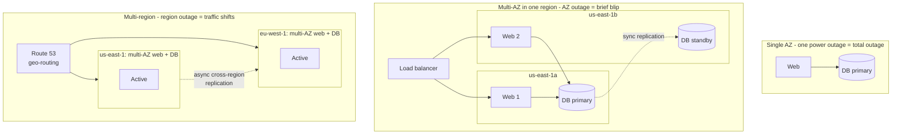

# Regions and Availability Zones

> **5-minute read.**

## The one-line answer

A **region** is a city-sized geographic area. An **availability zone (AZ)** is one or more datacenters inside that region. You spread workloads across AZs to survive a single datacenter failure, and across regions to survive a city-sized one.

## Why this exists

Servers fail. Datacenters lose power, catch fire, or get hit by hurricanes. If your app runs in one building, you have one point of failure.

Cloud providers solved this by:

1. Building **multiple datacenters** in each metro area (so a fire in one doesn't kill the others).
2. Connecting them with **fast, redundant fiber** (so your app can span them).
3. Calling each cluster of redundant datacenters an **AZ**, and the whole metro area a **region**.
4. Building **regions** in different cities globally (so a hurricane in Virginia doesn't kill your app).

## What a region looks like

A region is geographic. Examples:

- AWS `us-east-1` = Northern Virginia
- AWS `eu-west-2` = London
- Azure `westus2` = Washington state
- GCP `asia-southeast1` = Singapore

Each region has multiple AZs (typically 3-6), each AZ has 1+ datacenters. AZs in the same region are typically <2ms apart by network latency. Regions are 10-100+ ms apart.

## Why you care

**To make your app resilient:**
- One AZ failure = some customers might see errors briefly, but a multi-AZ deployment keeps serving.
- One region failure = if your app is single-region, it's down. Multi-region apps survive.

**To minimize latency:**
- Deploy your app in a region near your users. US users → US region. EU users → EU region. Otherwise every request adds 100-200ms.

**For data residency / compliance:**
- GDPR, HIPAA, certain government contracts require data stay in specific regions.

**For cost:**
- Region pricing varies. `us-east-1` is usually the cheapest for AWS. Specialized regions (GovCloud, China) cost more.

## A small concrete example

You're running a 3-tier web app in AWS `us-east-1`. Three architectures, in order of resilience:

Don't reach for multi-region until you have a business reason - it adds significant complexity (replication lag, cross-region transfer fees, ops in 2x places).

## The cost of multi-region

Don't reach for multi-region until you need it. It introduces:

- **Replication complexity** - eventually-consistent data, conflict resolution, replication lag
- **Cost** - duplicated infra + cross-region data transfer fees
- **Operational overhead** - deploys, monitoring, alarms in 2x places

For most early-stage apps: multi-AZ in one region is plenty. Move to multi-region when you have a business reason (global users, regulatory, contractual SLA).

## Region naming weirdness

Each provider has its own naming convention:

- **AWS** - `us-east-1`, `eu-west-2`, `ap-southeast-1`. Numbers are arbitrary, not "best to worst."
- **Azure** - `eastus`, `westus2`, `centralus`. Also: `southcentralus`, `northeurope`. No standard.
- **GCP** - `us-central1`, `europe-west2`, `asia-southeast1`. More consistent.

You'll memorize the ones you use.

## What to look at next

- **[Shared responsibility model](./shared-responsibility-model.md)** - region-level disaster recovery is mostly your job
- **[VPC explained](./vpc-explained.md)** - VPCs are typically scoped to one region
- **[Glossary: Availability Zone, Region, Edge Location](../glossary.md#cloud-fundamentals)**
