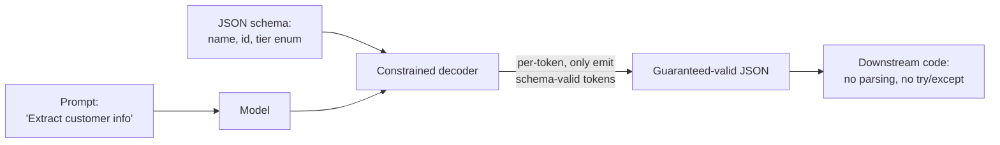

# Structured outputs

> **6-minute read. Assumes you've read [LLM basics](./llm-basics.md).**

## The one-line answer

Structured outputs let you force a model to emit JSON (or another structured format) that conforms exactly to a schema you define - no parsing failures, no extra prose, no hallucinated fields. It turns "free-form text the model probably formatted right" into "guaranteed-valid data".

## Why this matters

If you want the model's output to feed downstream code, you need parseable, predictable shapes. Without structured outputs:

```
"Sure! Here's the customer info:
{ \"name\": \"Alice\", \"id\": 42, ...}
Let me know if you need anything else!"
```

You parse this with a regex and pray. Five out of a hundred times the model adds an extra field, drops a quote, or leads with conversational fluff that breaks your regex. With structured outputs, you get:

```json
{ "name": "Alice", "id": 42 }
```

Every time.

## The mechanism



Three approaches, in increasing strength:

### 1. Prompt-based ("please return JSON")
Just ask. Works most of the time with modern frontier models, fails enough that you can't rely on it for production. Don't.

### 2. JSON mode
The model is constrained to emit syntactically valid JSON. Doesn't enforce a schema - the model could return `{}` or invent fields. Available on most major model APIs.

### 3. Schema-constrained output (the strong form)
You provide a JSON schema; the model is constrained to emit JSON that validates against it. The decoder is restricted, token by token, to only emit tokens that keep the output schema-valid.

The strong form is what to reach for. Available as:

- **OpenAI**: `response_format: { type: "json_schema", json_schema: {...}, strict: true }`
- **Anthropic**: tool-use with a single tool whose input matches your desired schema
- **Google**: structured output via `responseSchema` in Gemini

## Tool use is structured output

A subtle point: when you ask the model to call a tool, you've already given it a JSON schema (the tool's input). The model returns JSON-conformant arguments. So tool use *is* structured output - just framed as "function call" instead of "raw JSON".

This is why on Anthropic, the canonical way to get structured output is to define a tool you don't actually plan to execute, and treat the model's tool-call arguments as the structured response.

```python
extraction_tool = {
    "name": "extract_customer",
    "description": "Extract a customer record from text.",
    "input_schema": {
        "type": "object",
        "properties": {
            "name": {"type": "string"},
            "id": {"type": "integer"},
            "tier": {"type": "string", "enum": ["free", "pro", "enterprise"]}
        },
        "required": ["name", "id"]
    }
}

# the model's tool-call arguments ARE your extracted record
```

See [Tool use and function calling](./tool-use-and-function-calling.md).

## What schemas can do

A modest JSON schema can express a lot:

- **Required vs optional fields** - `required: [...]`
- **Enums** - `enum: ["red", "green", "blue"]`
- **Number ranges** - `minimum: 0, maximum: 100`
- **String patterns** - `pattern: "^[A-Z]{2}-\\d{4}$"`
- **Nested objects and arrays** with their own schemas
- **Discriminated unions** - `oneOf` with a `type` discriminator

You will be tempted to make every field required. Don't. The model performs better when it has the option to omit fields it can't confidently fill, rather than hallucinating values to satisfy a `required` constraint.

## Where structured outputs shine

### Extraction
"Pull the order details out of this support email." Schema: `{ order_id, items[], shipping_address, ... }`. The model fills the schema. You skip the regex.

### Classification
"Tag this ticket with one of {bug, feature_request, billing, other}." Schema: `{ category: enum(...) }`. Single-token answer, deterministic.

### Function calling
The whole tool-use mechanism. See above.

### Form filling
Multi-field UI forms backed by AI. The schema mirrors your form's data shape; the model fills it from a free-text description.

### Agent state machines
Each agent step emits a structured "next action" object: `{ action: "search" | "answer" | "ask_user", details: ... }`. The harness dispatches based on the field. Cleaner than parsing free-text "I'll search for X."

## When NOT to use it

- **Open-ended creative output** - poetry, summaries, explanations. The schema adds nothing and constrains expressivity.
- **When the schema is uncertain** - if you don't know what fields you need, prompt for narrative first, then add structure when the shape stabilizes.
- **For very large outputs** with deeply nested schemas - some implementations get slow or fragile past a certain complexity.

## Common pitfalls

### Schema too strict
You require `phone_number` and the model invents a number when none is available. Make optional fields optional.

### Implicit ordering
Some clients return JSON keys in declaration order, some don't. Don't depend on key order in downstream code.

### Description per field is load-bearing
Just like tool descriptions, the schema's `description` strings tell the model what each field means. "Customer ID" vs "Customer's primary identifier in our internal CRM (numeric, 6-9 digits)" produces different fill quality.

### Strict mode silently fails on malformed schemas
If your schema has a typo (`requried` instead of `required`), some APIs accept it but the strict guarantee no longer applies. Validate your schemas before deployment.

### Pretending the model can do arbitrary regex
Even with strict mode, the model still can't *generate* a value matching `pattern: "^([0-9]{4}-){4}[0-9]{4}$"` if it doesn't know one. Schemas constrain shape, not creativity.

## What to look at next

- **[Tool use and function calling](./tool-use-and-function-calling.md)** - the foundation
- **[Prompt engineering](./prompt-engineering.md)** - getting the model to fill schemas correctly
- **[Agentic loops](./agentic-loops.md)** - where structured outputs become control flow
- **[Evals for LLMs](./evals-for-llms.md)** - measuring schema-fill quality
