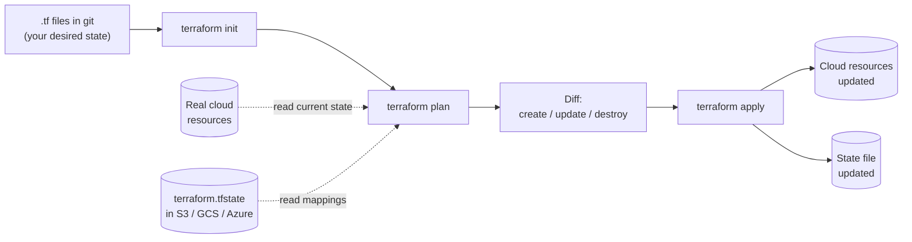

# Terraform Explained

> **6-minute read.**

## The one-line answer

Terraform is a tool that lets you define cloud infrastructure in text files (instead of clicking around a console), then provisions it for you. It's "infrastructure as code."

## Why this exists

Cloud consoles are great for exploring. They are terrible for building production systems. Specifically:

- **Not reproducible** - "click these 47 things in this order" is not a deployable artifact
- **No history** - who changed the security group rule? Why?
- **No environments** - clicking everything 3x for dev/staging/prod is error-prone
- **No code review** - changes happen invisibly

Infrastructure as code (IaC) treats your infrastructure the same as your application: it's text in git, reviewed in pull requests, deployed by automation, with full history.

Terraform is the most popular IaC tool. It works across nearly every cloud and SaaS API.

## How it works



You write `.tf` files like:

```hcl
provider "aws" {
  region = "us-east-1"
}

resource "aws_s3_bucket" "logs" {
  bucket = "my-app-logs-prod"

  tags = {
    Project     = "my-app"
    Environment = "prod"
    ManagedBy   = "terraform"
  }
}

resource "aws_s3_bucket_versioning" "logs" {
  bucket = aws_s3_bucket.logs.id
  versioning_configuration {
    status = "Enabled"
  }
}
```

Then:

```bash
terraform init      # download providers
terraform plan      # show what will change
terraform apply     # actually do it
```

`plan` is the killer feature: it diffs your code against reality and shows exactly what will be created, modified, or destroyed before you commit.

## The state file

Terraform tracks reality in a JSON file called `terraform.tfstate`. This is the bridge between "what you wrote" and "what exists."

The state file:
- Maps your code (`aws_s3_bucket.logs`) to real resources (S3 ARN)
- Tracks attributes that aren't in your code (auto-generated IDs, etc.)
- Lets `plan` know "this exists already, no need to recreate"

**State is sacred.** Never edit it by hand. Lose it and Terraform doesn't know what it created.

In production, store state remotely:

- **AWS** - S3 bucket + DynamoDB table for locking
- **Azure** - Blob Storage container
- **GCP** - GCS bucket
- **Terraform Cloud / HCP Terraform** - hosted state

The lock prevents two engineers from running `apply` simultaneously and corrupting state.

## A small concrete example

A complete VPC + EC2 instance:

```hcl
resource "aws_vpc" "main" {
  cidr_block = "10.0.0.0/16"
}

resource "aws_subnet" "main" {
  vpc_id     = aws_vpc.main.id
  cidr_block = "10.0.1.0/24"
}

resource "aws_instance" "web" {
  ami           = "ami-0abcdef1234567890"
  instance_type = "t3.micro"
  subnet_id     = aws_subnet.main.id

  tags = { Name = "web" }
}

output "instance_ip" {
  value = aws_instance.web.private_ip
}
```

`terraform apply` creates a VPC, subnet, and EC2 instance, in the right order (VPC first, since the subnet depends on it). Terraform builds a dependency graph automatically.

## Variables and modules

Hardcoding values is bad. Use variables:

```hcl
variable "environment" {
  type    = string
  default = "dev"
}

resource "aws_s3_bucket" "logs" {
  bucket = "my-app-logs-${var.environment}"
}
```

Reusable infrastructure goes in modules:

```hcl
module "vpc" {
  source = "./modules/vpc"

  cidr_block  = "10.0.0.0/16"
  environment = "prod"
}
```

Modules can be local directories, git repos, or pulled from the public Terraform Registry.

## Workspaces / environments

Two common patterns for dev/staging/prod:

1. **One codebase, multiple state files** - separate `.tfvars` files and state buckets per environment.
2. **Branching the codebase** - each env has its own directory tree (more verbose but clearer).

Don't use the same state for prod and dev. Don't.

## Common pitfalls

- **Drift** - someone clicked something in the console. Now reality doesn't match state. Run `terraform plan` regularly to detect.
- **Manual edits to state** - eventually destroys you. Use `terraform import` to bring existing resources under management.
- **Storing secrets in `.tf` files** - they end up in git. Use a secret manager or `sensitive` variables sourced from elsewhere.
- **Massive monolithic state** - one apply takes 10 minutes, blast radius is huge. Split into smaller stacks.
- **No locking** - two `apply`s at once = corrupted state. Always use a remote backend with locking.

## Terraform vs the alternatives

- **CloudFormation** (AWS-only) - native, JSON/YAML, slower iteration than Terraform.
- **Pulumi** - Terraform-like but in real programming languages (TypeScript, Python, Go). Same state model.
- **CDK** (AWS Cloud Development Kit) - write CloudFormation in TypeScript/Python. AWS-native.
- **Ansible** - configuration management. Sometimes used for infra; not its sweet spot.
- **Terragrunt** - thin wrapper over Terraform that helps with DRY across many environments and stacks.

For multi-cloud or vendor-neutral: Terraform.
For AWS-only with a developer-first team: CDK is great.
For very large orgs with many stacks: Terragrunt or Terraform Cloud workspaces.

## Workflow in practice

1. Write/change `.tf` files
2. `terraform fmt` (auto-format)
3. `terraform validate` (syntax check)
4. `terraform plan -out=tfplan` (review diff)
5. Code review (git PR)
6. `terraform apply tfplan` (after merge, often via CI)

Production: `apply` runs in CI (GitHub Actions, Atlantis, Terraform Cloud) so a human can't accidentally apply unreviewed changes.

## What to look at next

- **[CI/CD explained](./cicd-explained.md)** - apply runs in CI in production
- **[Glossary: Terraform, IaC, State, Module](../glossary.md#devops--infrastructure-as-code)**
- **[CLI cheat sheet: Terraform](../../resources/cli-cheat-sheet-terraform.md)**
- **[HashiCorp certifications](../../exams/hashicorp/)** - Terraform Associate is the gateway cert
