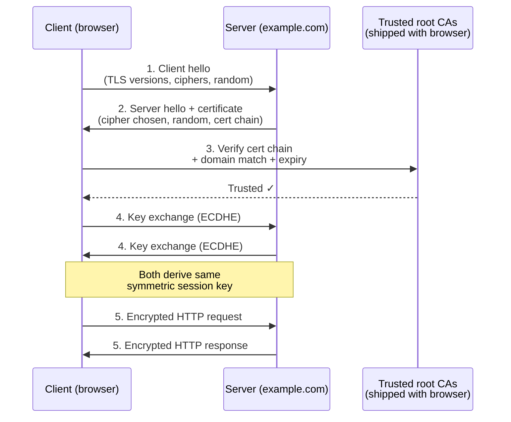

# TLS and HTTPS

> **6-minute read.**

## The one-line answer

[**TLS**](../glossary.md#term-tls-transport-layer-security) (Transport Layer Security) is a cryptographic protocol that gives you three things: confidentiality (no eavesdropping), integrity (no tampering), and authenticity (you really are talking to the right server).

**HTTPS** is just HTTP running inside TLS. The lock icon in your browser means TLS handled the connection successfully.

## Why this exists

Plain HTTP traffic is readable by anyone on the network path: your ISP, the coffee shop wifi, the router in the hotel, every backbone carrier in between. If you log into a site over HTTP, your password is visible in plaintext.

TLS encrypts the connection so the network sees only ciphertext. Plus, certificates prove "the server I'm talking to is really `bank.com`, not someone pretending to be."

In 2026, basically everything is HTTPS. Browsers warn you about HTTP sites. Search engines penalize them. Modern APIs refuse plain HTTP.

## What happens during a TLS handshake



Simplified flow when you visit `https://example.com`:

1. **Client hello** - browser sends supported TLS versions, cipher suites, a random number.
2. **Server hello** - server picks a TLS version + cipher suite, sends its certificate, a random number.
3. **Certificate verification** - client checks the cert is signed by a trusted Certificate Authority and matches `example.com`.
4. **Key exchange** - both sides derive a shared symmetric key (using ECDHE or similar).
5. **Encrypted communication** - HTTP requests/responses now flow inside TLS.

TLS 1.3 (the modern version) does this in 1 round-trip. TLS 1.2 needs 2.

## Certificates - the trust model

A TLS certificate is a file that says:
- "This public key belongs to `example.com`"
- "Signed by `Let's Encrypt`" (or another Certificate Authority)
- "Valid from X to Y"

Your browser ships with a list of ~150 trusted root CAs. If a CA in that list signed the cert (directly or through a chain), it's trusted.

Each cert has:

- **Subject** - the domain (or SAN list of domains)
- **Issuer** - the CA that signed it
- **Public key** - the server's public key
- **Validity period** - from/until dates
- **Serial number, fingerprint** - for identification/revocation

## Getting certificates

You don't generate certs yourself - you ask a CA to sign one for your domain. The CA verifies you control the domain, then issues a cert.

### Free, automated (modern default)

**Let's Encrypt** - free certs, valid 90 days, renewed automatically. Almost everyone uses Let's Encrypt now (or its equivalents):

- **AWS Certificate Manager** (ACM) - free certs for AWS resources
- **Azure App Service / Azure Front Door** - free managed certs
- **GCP managed certificates** - same
- **Cloudflare** - free certs when proxying through them
- **Caddy** - web server that gets and renews certs automatically

You almost never have to think about certs anymore. Stand up a service, certs appear.

### Paid (rare today)

EV (Extended Validation) and OV (Organization Validated) certs cost money and require business verification. They used to show a green address bar; browsers no longer differentiate. Mostly legacy.

Wildcard certs (`*.example.com`) are also free with Let's Encrypt.

## What "the lock icon" actually means

It means:
- ✅ TLS handshake succeeded
- ✅ The cert is valid (signed by a trusted CA, not expired, matches the domain)
- ✅ Communication is encrypted

It does **NOT** mean:
- ❌ The site is safe
- ❌ The site is who you think it is (a phishing site can have a valid cert for `arnazon.com`)
- ❌ The server is securely configured

## A small concrete example

To put TLS on your site:

**Easy mode (Cloudflare):**
1. Add domain to Cloudflare
2. Point nameservers
3. Done. Cloudflare handles the cert at the edge.

**Easy mode (AWS):**
1. Request a cert in ACM (free)
2. Validate it (DNS or email)
3. Attach to your ALB or CloudFront
4. Done.

**Old-school (Let's Encrypt manually):**
```bash
sudo certbot --nginx -d example.com
```
Certbot asks Let's Encrypt to verify domain control, gets the cert, configures nginx, sets up renewal. 90-day cert auto-renews via cron.

## Key concepts to know

### TLS 1.3
Current standard. Mandatory for new deployments. TLS 1.0 and 1.1 are deprecated and disabled in modern browsers. TLS 1.2 still common but TLS 1.3 should be the default.

### Cipher suites
The combination of algorithms used (key exchange + signature + bulk encryption + MAC). Modern config: prefer ECDHE for key exchange, AES-GCM or ChaCha20 for bulk, AEAD for integrity.

You don't need to micromanage these unless you're tuning. Mozilla SSL Configuration Generator gives you sane defaults: https://ssl-config.mozilla.org/

### HSTS
HTTP Strict Transport Security. A header that tells browsers "always use HTTPS for this domain, never HTTP." Set it once your site is fully HTTPS-ready.

### mTLS (mutual TLS)
Both client and server present certs. Used for service-to-service auth in zero-trust architectures (e.g., service mesh).

### Certificate transparency
All public certs are logged to public CT logs. You can query them (e.g., crt.sh) to see all certs ever issued for your domain - useful for catching unauthorized issuance.

## Common pitfalls

### Expired certs
The classic outage. Let's Encrypt renews automatically; many enterprises still have manual certs that expire on a Friday at 5pm. Monitor expiry.

### Mixed content
HTTPS page loading HTTP resources. Browsers block this. Common during migrations.

### Wrong hostname
Cert for `www.example.com` doesn't validate `example.com`. Use SANs (Subject Alternative Names) to cover both.

### Clock skew
TLS depends on accurate time. Servers with badly wrong clocks fail handshakes. Always run NTP.

### Self-signed certs in dev
Fine for `localhost`. Don't ship them. And don't make users click "proceed anyway" - they'll click it on phishing sites later.

## What to look at next

- **[DNS explained](./dns-explained.md)** - DNS validates domain control for cert issuance
- **[CDN explained](./cdn-explained.md)** - CDNs typically terminate TLS at the edge
- **[Glossary: TLS, HTTPS, Certificate, mTLS](../glossary.md#security--identity)**
