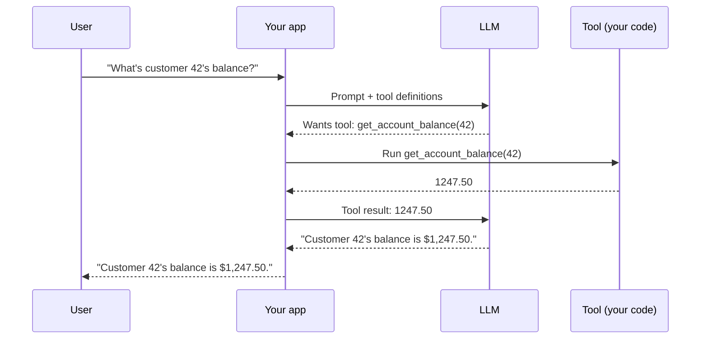

# Tool use and function calling

> **8-minute read. Assumes you've read [LLM basics](./llm-basics.md).**

## The one-line answer

"Tool use" (also called "function calling") is the mechanism that lets an LLM ask your code to run a function on its behalf - look something up, send an email, query a database, do math - and incorporate the result into its answer. The LLM doesn't run the function. Your code does. The LLM tells you which function and which arguments.

## Why it exists

LLMs are great at language and bad at:

- Math beyond a few digits
- Anything that depends on real-time information (today's date, current stock price, your customer's account balance)
- Anything that requires *doing* something (sending a message, creating a record, calling an API)
- Anything that requires precise computation (sums over arrays, exact lookups)

Tool use solves this by giving the model a structured way to say "I need help. Please call `get_account_balance(customer_id=42)` and tell me the result."

## The flow



Two round trips, sometimes more. The model decides; your code executes.

## What you give the model

A list of **tool definitions**. Each tool has:

- A **name** (`get_account_balance`)
- A **description** in natural language (this is what the model uses to decide *whether* to call it)
- A **JSON schema** of the input parameters

```json
{
  "name": "get_account_balance",
  "description": "Look up the current account balance in USD for a given customer ID.",
  "input_schema": {
    "type": "object",
    "properties": {
      "customer_id": {
        "type": "integer",
        "description": "Numeric customer ID"
      }
    },
    "required": ["customer_id"]
  }
}
```

The description does the heavy lifting. "Look up the current balance" tells the model when to use this. "Numeric customer ID" tells it what to put in the argument.

If the description is bad, the model picks the wrong tool or makes up arguments.

## What the model returns

When the model decides to call a tool, the response contains a structured tool-use block instead of (or alongside) text:

```json
{
  "stop_reason": "tool_use",
  "content": [
    {
      "type": "tool_use",
      "id": "toolu_abc123",
      "name": "get_account_balance",
      "input": { "customer_id": 42 }
    }
  ]
}
```

You execute the tool, then send the result back as a tool-result message:

```json
{
  "role": "user",
  "content": [
    {
      "type": "tool_result",
      "tool_use_id": "toolu_abc123",
      "content": "1247.50"
    }
  ]
}
```

The model continues from there.

## Common patterns

### Lookup
The model needs information it doesn't have. `get_account_balance`, `search_knowledge_base`, `get_weather`. Read-only.

### Action
The model performs an effect. `send_email`, `create_ticket`, `transfer_funds`. Read-write. Add confirmations and audit logs.

### Calculator
The model does math. `evaluate(expression)`. Use this any time the model would otherwise add or multiply numbers.

### Code execution
The model writes Python or SQL, you run it. Anthropic's "code execution tool", OpenAI's "code interpreter". Powerful but requires sandboxing.

### Composite tools
A single tool that wraps a multi-step process. `book_flight(origin, destination, date)` might internally search, hold seats, charge a card. Often easier for the model than calling three separate tools.

## When tool use fails

### Bad descriptions
"Get balance" instead of "Look up the current account balance in USD for a given customer ID." The model can't tell when to call the tool.

### Overlapping tools
You have `search_users` and `lookup_user`. The model can't tell them apart and picks randomly. Either merge them or differentiate the descriptions clearly.

### Hallucinated arguments
The model invents a customer_id of 999 because the user didn't supply one and you didn't tell the model what to do in that case. Add this to the description: "If the customer_id is unknown, ask the user instead of guessing."

### Loop without progress
The model calls a tool, gets the result, and immediately calls the same tool again with the same arguments. This is usually a prompt or schema issue. Cap the loop length and surface the error.

### Tool timing out or failing
The model treats the result as ground truth, even if it's an error. Wrap your tool returns: on success return the data, on failure return `{"error": "X failed because Y"}`. The model handles errors gracefully if you tell it about them.

## Parallel tool calls

Most modern models can request multiple tool calls in a single turn. If a user asks "What's the weather in NYC and SF?", the model returns *two* tool-use blocks. Run them in parallel, return both results, the model assembles the answer.

This is the foundation of [agentic loops](./agentic-loops.md): the model in a loop, calling tools (sometimes many in parallel) until it has what it needs.

## Tool use is not retrieval

A common confusion: people add a `search_docs` tool and call it RAG. It's not. RAG embeds the user's query, retrieves chunks deterministically, and prepends them to the prompt - the model never decides whether to retrieve. Tool-based search lets the model decide *when* and *how often* to search, which is more flexible but slower and harder to debug. Both approaches are valid; pick deliberately. See [RAG explained](./rag-explained.md).

## What to look at next

- **[MCP explained](./mcp-explained.md)** - the standard protocol for tools, instead of redefining them per app
- **[Agents explained](./agents-explained.md)** - tool use in a loop
- **[Agentic loops](./agentic-loops.md)** - the patterns and failure modes
- **[Structured outputs](./structured-outputs.md)** - the underlying mechanism, generalized
- **[Build a Claude agent with MCP](../../resources/hands-on-projects/build-claude-agent-with-mcp.md)** - hands-on
