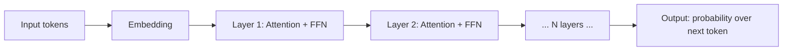
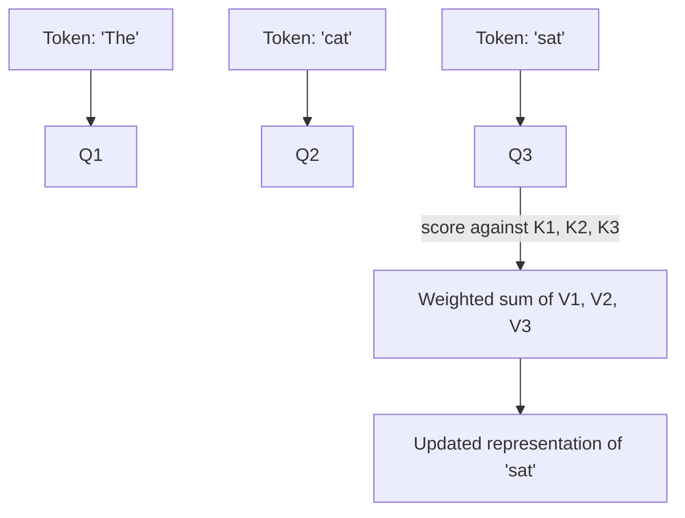

# Transformer Architecture

> **10-minute read. Assumes you've read [LLM basics](./llm-basics.md).**

## The one-line answer

A transformer is a neural network that processes a sequence of tokens by letting each token "look at" every other token in the sequence and decide which ones matter for predicting what comes next. The mechanism that does the looking is called **attention**.

That's the architecture behind GPT, Claude, Gemini, Llama, and basically every modern LLM. It came from a 2017 paper from Google called "Attention Is All You Need."

## Why it mattered

Before transformers, sequence models (RNNs, LSTMs) processed text one token at a time, left to right. Two problems:

1. **They forgot.** The signal from token 1 had to survive being passed through 100+ layers of computation to influence token 100. It got muddied.
2. **They couldn't parallelize.** You had to compute token 5 before token 6, before token 7. Slow.

Transformers fixed both. Every token gets to attend to every other token *directly*, in parallel. Training stopped being throughput-bound and the models could remember context across thousands of tokens.

That's why everything got better and bigger fast after 2017.

## The mental model

A transformer is a stack of identical **layers**. Each layer does two things to the sequence flowing through it:

Each layer:

1. **Self-attention**: every token re-computes itself as a weighted sum of all other tokens in the sequence. Tokens that are relevant get high weight; irrelevant ones get near-zero weight.
2. **Feed-forward network (FFN)**: a small neural network applied to each token independently. This is where most of the model's "knowledge" lives.

Stack 12-100+ of these layers, and you get a model. Bigger models = more layers + wider layers + more attention heads.

## Attention, in plain English

The big idea. For each token in the sequence, attention answers: *"Which other tokens should I pay attention to right now, and how much?"*

Three vectors per token:
- **Query (Q)**: "Here's what I'm looking for."
- **Key (K)**: "Here's what I am."
- **Value (V)**: "Here's what I'll contribute if you attend to me."

For each token's query, you compute a score against every other token's key (dot product). High score = "you're relevant to me." Soft-max the scores into weights, then take the weighted sum of all the values.

In English: "When I'm processing the word 'sat,' I should mostly look at 'cat' (the subject) and a little at 'The.'"

The model learns Q, K, and V projections during training. They're not hand-coded.

## Multi-head attention

In practice, each layer doesn't do attention once - it does it 8 to 64 times in parallel, with different learned Q/K/V projections. Each is called a **head**. Different heads learn different relationships:

- One head might learn syntax (subject-verb agreement)
- Another might learn coreference (which "it" refers to which noun)
- Another might track entities across long distances

The outputs of all heads get concatenated and passed forward.

## Encoder vs decoder vs decoder-only

The original 2017 paper had two halves:

- **Encoder**: reads the input bidirectionally (each token sees both past and future tokens). Good for understanding tasks (BERT is encoder-only).
- **Decoder**: generates output one token at a time, only looking at past tokens (causal mask). Good for generation (GPT is decoder-only).

Modern chat LLMs - GPT-4, Claude, Llama, Gemini - are **decoder-only**. They predict the next token given everything before it. The encoder half got left behind for generative tasks because decoder-only scales better and works fine.

## Where the "knowledge" lives

It's tempting to think attention is where the model "knows things." It's not.

Most of the parameters in a transformer are in the **feed-forward networks**, not attention. The FFN in each layer is essentially a giant lookup table compressed into weights - "if the input pattern looks like X, output pattern Y." That's where facts, syntax, and learned associations are stored.

Attention is the routing layer. FFN is the storage layer. Stack them deep and you get something that can both remember and reason about what it's seen.

## What changed since 2017

The basic transformer is still the foundation, but the field has been busy:

- **Position encodings**: rotary (RoPE), ALiBi - replaced the original absolute encodings, helped with longer contexts.
- **Faster attention**: FlashAttention rewrote attention to fit in GPU memory better, big speed wins.
- **Mixture of Experts (MoE)**: instead of running the whole FFN, route each token through only a few "expert" sub-networks. Lets you scale parameters massively without scaling compute proportionally. GPT-4 and Claude are widely believed to use MoE.
- **Long context tricks**: sliding window attention, sparse attention, state-space hybrids (Mamba). Goal: scale past the quadratic cost of vanilla attention.
- **Better training data and recipes**: instruction tuning, RLHF, constitutional AI, DPO.

The architecture keeps evolving but "stack of attention + FFN layers" is still the spine.

## The quadratic cost problem

Attention compares every token to every other token. That's an O(n²) operation in sequence length. Double the context, quadruple the compute.

This is why:
- 1M-token contexts are expensive even when technically supported
- Models with very long context use approximations under the hood
- "Streaming" inference still spends most of its time on the prefill, not the per-token decode

If someone tells you "we just made the context 10x bigger," ask what they did to the math.

## Common misconceptions

| Myth | Reality |
|------|---------|
| "The model thinks step by step internally." | It generates one token at a time. Any 'thinking' you see in the output is text it produced - useful but not internal reasoning. |
| "More layers always = smarter." | Past a point, you need more data and better training, not just more layers. |
| "Attention is the magic." | Attention is the routing. The feed-forward layers are where the knowledge actually sits. |
| "Transformers understand language." | They model statistical patterns of text. Powerful, but not the same as understanding. |

## What to look at next

- **[LLM basics](./llm-basics.md)** - prerequisite if you skipped it
- **[Embeddings and vector search](./embeddings-and-vector-search.md)** - related: representing text as vectors
- **[Prompt engineering](./prompt-engineering.md)** - how to actually use these things
- **["Attention Is All You Need" (2017)](https://arxiv.org/abs/1706.03762)** - the original paper, very readable
- **[The Illustrated Transformer (Jay Alammar)](https://jalammar.github.io/illustrated-transformer/)** - best free visual explanation on the internet
