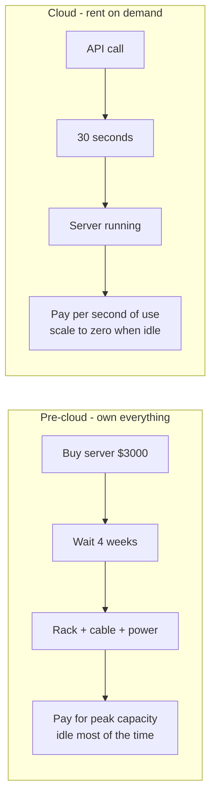

# What is Cloud Computing?

> **5-minute read. Plain English.**

## The one-line answer

Cloud computing is renting computers from someone else over the internet, paying for what you use, and getting them in seconds instead of months.

## Why this exists

Before cloud (~2006), if you wanted to run a website or an app, you had to:

1. Buy physical servers (expensive, weeks of lead time)
2. Put them somewhere with power, cooling, and internet (a colocation facility, or your own room)
3. Hire someone to keep them running
4. Buy enough capacity for your peak load - and let it sit idle the rest of the year

Cloud changed three things:

- **Capex → opex.** No upfront capital purchase. You pay monthly for what you used.
- **Months → minutes.** You can spin up a new server in 30 seconds with an API call.
- **Peak provisioning → elastic scaling.** Need 100 servers for Black Friday and 5 for Tuesday at 3am? Fine.

This sounds obvious now, but in 2006 it was a fundamental shift. AWS launched, Azure followed in 2010, GCP in 2008.

## What "cloud" actually means

A "cloud provider" is a company that:

1. Owns thousands of servers in datacenters around the world.
2. Lets you rent compute, storage, networking, and managed services through an API or web console.
3. Charges by the hour, second, or per request.

The big three:
- [**AWS**](../glossary.md#aws) (Amazon Web Services) - largest, oldest, widest service catalog
- **Microsoft Azure** - strong with enterprises, Office 365 / Active Directory tie-ins
- **Google Cloud (GCP)** - strong in data, AI/ML, Kubernetes

Other major ones: Oracle Cloud, IBM Cloud, Alibaba Cloud, Tencent Cloud, DigitalOcean, Linode (now Akamai), Cloudflare.

## A small concrete example

Pre-cloud, hosting a basic web app:

1. Buy a $3,000 server.
2. Wait 4 weeks for delivery.
3. Drive it to a colocation facility, rack it, run cables.
4. Install Linux, your web server, your app.
5. If traffic spikes 10x, it crashes. If it never spikes, you wasted $2,700 worth of capacity.

Cloud, hosting the same web app:

1. Click "Launch Instance" in AWS console (or run `aws ec2 run-instances`).
2. 30 seconds later, you have an Ubuntu server with a public IP.
3. SSH in, install your app, point DNS at the IP.
4. Pay ~$0.01/hour (~$8/month) for a small server.
5. If traffic spikes, add more instances behind a load balancer with one API call.

## The shift this enabled

Cloud isn't just "cheaper servers." It's the substrate that made:

- **Startups affordable** - you can launch a SaaS for <$50/month
- **Modern dev practices possible** - CI/CD, ephemeral environments, infrastructure as code
- **Global apps trivial** - deploy to 30 regions with config changes, not 30 colocation contracts
- **Managed services explode** - databases, queues, ML APIs, all rented by the hour

## What "cloud" is NOT

- **Not just "someone else's computer"** - that joke is half-true but misses the point. The value is the API + elastic billing + global reach + managed services, not the hardware.
- **Not always cheaper than on-prem** - at scale, owning hardware is sometimes cheaper. (Dropbox famously moved off AWS to save money.)
- **Not magic** - the same physics apply. Network has latency, disks fail, regions go down.

## Try it (30 minutes)

Sign up for AWS, Azure, or GCP free tier. Spin up a single VM. SSH in. Stop it. Delete it.

You will learn more from this than from 5 hours of reading.

[Free Tier Guide](../../resources/free-tier-guide.md)

## What to look at next

- **[IaaS vs PaaS vs SaaS](./iaas-paas-saas.md)** - the three service models
- **[Regions and availability zones](./regions-and-availability-zones.md)** - where your code actually runs
- **[Shared responsibility model](./shared-responsibility-model.md)** - what's the provider's job vs yours
- **[Glossary: Cloud Fundamentals](../glossary.md#cloud-fundamentals)**
