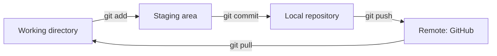

# Git Basics

> **15-minute read. The version control system every cloud and AI tool assumes you know.**

## What git is, in plain English

Git is a system for tracking changes to files. Imagine "Track Changes" in a Word doc, but for an entire folder full of code, with full history, branching, and the ability to share between people.

Three properties make it useful:

1. **Every version is preserved.** You can go back to any previous state.
2. **Many people can work on the same project at once** without overwriting each other.
3. **Everything is local first.** You can do all the work without an internet connection, then sync up later.

It's *the* universal tool for code, infrastructure-as-code, configuration, and increasingly even documentation. Every cloud and AI tutorial you'll do will start with `git clone`.

## Git vs GitHub - they're not the same thing

This trips up everyone at first.

- **Git** is the program. Free, open source, runs on your computer. Tracks changes.
- **GitHub** is a website (owned by Microsoft) that hosts git repositories online and adds collaboration features. There are alternatives (GitLab, Bitbucket, Gitea) but GitHub is dominant.

You can use git without GitHub. You can't use GitHub without git.

When someone says "push to GitHub," they mean: use git to upload your local changes to a repository hosted on GitHub.

## Install it

- **Mac**: comes with Xcode Command Line Tools. Run `git --version` - if it prompts to install, say yes.
- **Linux**: `sudo apt install git` (Debian/Ubuntu) or `sudo dnf install git` (Fedora).
- **Windows (WSL)**: same as Linux from inside WSL.

Verify:

```
$ git --version
git version 2.43.0
```

Set your identity once:

```
$ git config --global user.name "Your Name"
$ git config --global user.email "you@example.com"
```

## The mental model: three places

Every file you're tracking lives in one of three states:



- **Working directory**: the actual files on your computer that you edit.
- **Staging area**: files you've marked "I want this to be part of my next save."
- **Repository**: the saved snapshots (commits) and their history.

A **remote** is a copy of the repository on another machine - usually GitHub. You sync your local repo with the remote.

## The five commands you'll use 90% of the time

### `git clone <url>` - copy a repo from somewhere
```
$ git clone https://github.com/torvalds/linux.git
```

Downloads the entire repo (full history) into a folder.

### `git status` - what's going on?
Shows what's changed since the last commit, what's staged, what's untracked. Run this constantly. It's the safety net.

```
$ git status
On branch main
Changes not staged for commit:
  modified:   README.md

Untracked files:
  new-file.txt
```

### `git add <files>` - stage changes
```
$ git add README.md             # one file
$ git add .                     # everything in current directory
$ git add file1.txt file2.md    # specific files
```

This puts changes into the staging area. Nothing is saved permanently yet.

### `git commit -m "message"` - save a snapshot
```
$ git commit -m "Update README with install instructions"
```

Takes everything currently staged and creates a permanent commit. The message is required and important - it's how you (and others) understand what changed and why later.

A commit is a save point. You can return to any commit forever.

### `git push` - upload to the remote
```
$ git push
```

Sends your new commits to GitHub (or wherever the remote lives). Until you push, your work only exists on your machine.

If someone else has pushed since you last pulled, you'll get a "rejected" error. Fix:

```
$ git pull --rebase
$ git push
```

## A complete first session

```
$ git clone https://github.com/yourusername/notes.git
$ cd notes
$ echo "# My notes" > notes.md
$ git status
# On branch main
# Untracked files:
#   notes.md

$ git add notes.md
$ git commit -m "Add initial notes"
$ git push
```

Done. The file is on GitHub.

## Branches - working without breaking things

Branches let you make changes without affecting the main version. Two reasons this matters:

1. You can experiment freely.
2. Multiple people can work on different things in parallel.

```
$ git branch                    # list branches; * marks current
$ git checkout -b new-feature   # create and switch to new branch
$ # ... edit files, commit ...
$ git push -u origin new-feature
```

When the work is done, you **merge** the branch back into `main` - usually by opening a **pull request (PR)** on GitHub, where someone reviews and approves it.

The `main` branch is the canonical version. Some old repos call it `master`.

## .gitignore - what NOT to track

A file named `.gitignore` tells git "ignore these patterns." Standard things to ignore:

```
# Secrets
.env
.env.local
credentials.json

# Build artifacts
node_modules/
dist/
*.pyc
__pycache__/

# IDE
.vscode/
.idea/

# OS
.DS_Store
```

Anything matching a `.gitignore` pattern won't show up in `git status` and can't be accidentally committed. Critical for not leaking secrets.

## Things that will go wrong, and the fix

### "I committed something I shouldn't have"
**Not pushed yet:**
```
$ git reset HEAD~1     # undo last commit, keep changes in working dir
```

**Already pushed:** revert it (creates a new commit that undoes the old one):
```
$ git revert <commit-hash>
$ git push
```

### "Help, I committed a secret"
Rotate the secret IMMEDIATELY (assume it's compromised). Then `git revert` and force-push if you must, but the secret is in history forever - rotation is what actually protects you.

### "I have unstaged changes I want to throw away"
```
$ git checkout -- file.txt    # one file
$ git checkout -- .           # all files in current dir
```

### "Merge conflict"
You and someone else changed the same lines. Git can't decide. It puts markers in the file:

```
<<<<<<< HEAD
your version
=======
their version
>>>>>>> branch-name
```

Open the file, edit it to be what you want (delete the markers), `git add`, `git commit`. Done.

### "Detached HEAD"
You're on a specific old commit, not on a branch. Don't commit here unless you mean to. Get back:
```
$ git checkout main
```

## SSH vs HTTPS

When cloning, you'll see two URL formats:
- **HTTPS**: `https://github.com/user/repo.git` - asks for username/password (or token).
- **SSH**: `git@github.com:user/repo.git` - uses an SSH key, no password each time.

Set up SSH keys once and life is easier. [GitHub's SSH guide](https://docs.github.com/en/authentication/connecting-to-github-with-ssh) walks through it.

## What you don't need yet

- `git rebase` (until you're comfortable with the basics; it's powerful and rewriting history can lose work)
- `git stash`
- `git cherry-pick`
- Submodules
- Worktrees
- Hooks

You'll meet these eventually. Not today.

## What to look at next

- **[HTTP and APIs](./http-and-apis.md)** - the next prerequisite
- **[GitHub Foundations cert](../../exams/github/foundations/)** - structured deeper learning if you want it
- **[CONTRIBUTING.md](../../CONTRIBUTING.md)** - actually contribute to this repo as practice
- **[Pro Git book (free)](https://git-scm.com/book/en/v2)** - the canonical reference once you're past basics
