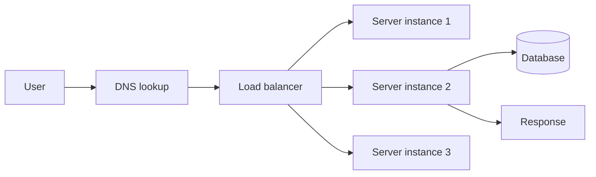

# What Is a Server?

> **10-minute read. The thing your code "runs on" when it's not running on your laptop.**

## The one-line answer

A server is just a computer that's always on, connected to the internet, running a program that listens for incoming requests and responds to them.

The hardware isn't special. The role is. Your laptop could be a server right now if you wanted - and people do exactly that, for hobby projects.

## Server as a building, server as a program

Confusingly, "server" means two different things depending on context.

1. **Hardware**: a physical machine in a data center. A cloud provider has hundreds of thousands of these.
2. **Program**: a running piece of software that listens for requests. A "web server" is a program. A "database server" is a program.

A single hardware server can run many server programs at once. When someone says "I deployed my server," they almost always mean the program, not the box.

## What "always on" actually means

Your laptop sleeps when you close it. Your phone is on a battery. Servers sit in data centers with:

- Always-on power (with backup generators)
- Always-on internet (with multiple redundant uplinks)
- Climate control (servers run hot)
- Physical security (badge access, cameras)
- Hardware redundancy (RAID storage, hot-swap parts)

The cloud is just a really big data center (lots of really big data centers, actually) that you rent slices of by the hour.

## The listener loop

A server program does one thing in a loop:

1. Wait for a request.
2. Handle the request.
3. Send a response.
4. Go back to waiting.

A toy version in pseudocode:

```python
while True:
    request = wait_for_incoming_request()
    response = handle(request)
    send(response)
```

The "wait for request" part means **listening on a port**.

## Ports

A port is just a number, 0 to 65535. It lets a single computer run many server programs that don't conflict.

When a request comes in for `https://example.com`, the request actually goes to `example.com:443`. Port 443 is where HTTPS lives. The web server is the program "listening on port 443."

Some standard ports you'll see:
- **80** - HTTP
- **443** - HTTPS
- **22** - SSH (logging into a server)
- **5432** - PostgreSQL
- **3306** - MySQL
- **6379** - Redis
- **27017** - MongoDB

When you run a local dev server (`npm run dev`, `python -m http.server`), it usually picks a high-numbered port like 3000, 5173, or 8080. You access it via `localhost:3000` - "localhost" means "this computer" and 3000 is the port.

## Process, port, listening

The full sentence: "A **process** (a running program) is **listening** on a specific **port**, ready to accept **connections**."

```
$ lsof -i :3000
COMMAND   PID  USER  ... NAME
node    12345  pat   ... TCP *:3000 (LISTEN)
```

The command above asks "who's listening on port 3000?" - in this case a Node process. If you can't start a server because "port already in use," you find what's using it and either kill that process or pick a different port.

## "Hosting" something

Putting your server program on a machine connected to the internet so anyone can reach it. Lots of ways to do this, increasing in abstraction:

### 1. Bare metal (you own the box)
Buy a server. Plug it into your home internet. Run your code. Pray your power doesn't go out.

People did this. Some still do. Don't, unless you're learning.

### 2. Virtual machines (rent a slice of a box)
A VM is a virtualized computer running on real hardware. The cloud provider owns the box. You rent a chunk of it. You install your OS, your runtime, your code. You're responsible for everything *inside* the OS.

- AWS EC2
- Azure Virtual Machines
- GCP Compute Engine
- DigitalOcean Droplets

This is **IaaS** (Infrastructure as a Service).

### 3. Managed platforms (provider runs the OS for you)
You give them your code or a container. They run it. They handle the OS, scaling, restarts, monitoring. You handle the code.

- AWS Elastic Beanstalk, App Runner
- Heroku
- Vercel, Netlify (especially for web frontends)
- Render, Fly.io, Railway

This is **PaaS** (Platform as a Service).

### 4. Containers (your code in a portable box)
You package your code + its dependencies into a **container** (Docker is the format). The container runs the same way anywhere. You then ship it to a service that runs containers.

- AWS ECS, Fargate
- GCP Cloud Run
- Azure Container Apps
- Kubernetes (K8s) for fancier orchestration

### 5. Serverless (no server in your head)
You write a function. The cloud provider runs it on demand. You don't think about servers, OS, scaling, or even being-up-when-no-one's-using-it. Pay per invocation.

- AWS Lambda
- Azure Functions
- GCP Cloud Functions
- Cloudflare Workers

There are still servers running your code. You just don't manage them. See [Serverless explained](../concepts/serverless-explained.md).

## "Deploy"

When you "deploy," you take your code from your laptop and get it running on a server somewhere reachable on the internet. The mechanics depend on what you're deploying to:

- VM: SSH in, copy files, restart the service.
- PaaS: `git push` and the platform redeploys.
- Container: build image, push to a registry, the platform pulls and runs it.
- Serverless: upload the function code or container, the platform routes traffic to it.

Modern deployment is mostly automated by **CI/CD** (continuous integration / continuous deployment) pipelines: you push to git, automated tests run, and on green builds the new code is deployed automatically.

## The lifecycle of a request

This is what "running on a server" actually does behind every HTTP request:



1. User types `example.com`.
2. DNS converts that to an IP address.
3. The IP belongs to a **load balancer** that distributes traffic.
4. The load balancer picks one of N server instances and forwards the request.
5. The server runs your code, possibly hits a database or other service.
6. Response goes back the same way.

For a small app, you can collapse this to one server with no load balancer. For anything serious, you spread across multiple instances for reliability and capacity.

## "The cloud" demystified

The cloud is just rented servers (and other rented infrastructure: storage, databases, networking, etc.) that you can spin up and tear down quickly via an API instead of ordering hardware.

The pitch:
- No upfront cost (pay as you go).
- Scale up in minutes, not weeks.
- Geographic distribution out of the box.
- Many higher-level managed services so you write less infrastructure code.

The catch:
- It's expensive at scale if not managed.
- Vendor lock-in is real.
- You still need to understand what's happening underneath.

## What to look at next

- **[Serverless explained](../concepts/serverless-explained.md)** - one of the modern hosting models in detail
- **[Containers vs VMs](../concepts/containers-vs-vms.md)** - the next abstraction
- **[Cloud from Scratch](../cloud-from-scratch.md)** - now everything in there has context
- **[What is cloud computing?](../concepts/what-is-cloud-computing.md)** - companion piece
