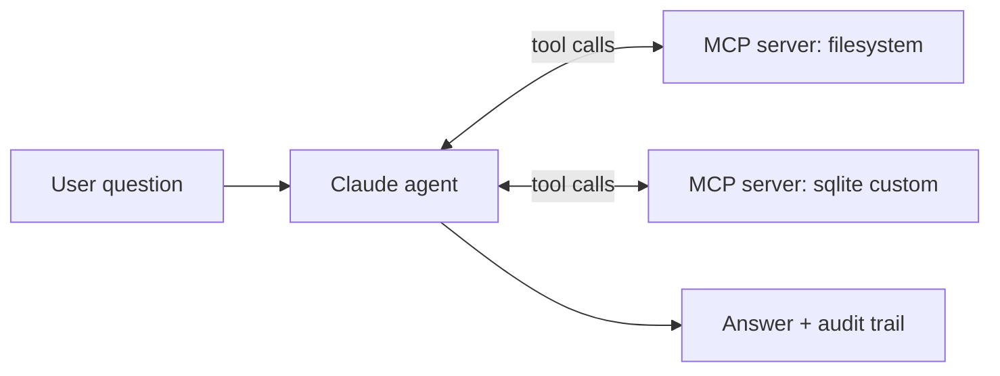

# Build a Claude agent with MCP

Build a small agent that uses the Claude Agent SDK with one custom MCP server. The agent will read files, query a SQLite database, and answer natural-language questions about both. Inline code; should run in ~30 minutes.

For the underlying mechanics see **[Agentic loops](../../learn/concepts/agentic-loops.md)**, **[MCP explained](../../learn/concepts/mcp-explained.md)**, and **[Tool use](../../learn/concepts/tool-use-and-function-calling.md)**.

## Architecture



The agent runs the [Claude Agent SDK](../service-comparison-agent-frameworks.md) loop. The filesystem MCP server is off-the-shelf. The sqlite MCP server is custom and demonstrates how to write your own.

## Prerequisites

- Python 3.11+
- Node.js 20+ (for the official filesystem MCP server)
- An Anthropic API key
- ~30 minutes

## Step 1: Project layout

```bash
mkdir mcp-agent && cd mcp-agent
mkdir data
sqlite3 data/orders.db <<'SQL'
CREATE TABLE orders (id INTEGER PRIMARY KEY, customer TEXT, amount REAL, status TEXT);
INSERT INTO orders VALUES (1, 'alice', 199.50, 'shipped');
INSERT INTO orders VALUES (2, 'bob', 45.00, 'pending');
INSERT INTO orders VALUES (3, 'alice', 89.95, 'shipped');
INSERT INTO orders VALUES (4, 'carol', 320.00, 'cancelled');
SQL
```

## Step 2: Write a custom MCP server (sqlite query tool)

Save as `sqlite_mcp.py`:

```python
"""A minimal MCP server exposing a SQLite query tool over stdio."""

import sqlite3
from mcp.server.fastmcp import FastMCP

mcp = FastMCP("sqlite-orders")

DB_PATH = "data/orders.db"


@mcp.tool()
def list_tables() -> str:
    """List all tables in the orders database."""
    with sqlite3.connect(DB_PATH) as conn:
        rows = conn.execute(
            "SELECT name FROM sqlite_master WHERE type='table'"
        ).fetchall()
    return "\n".join(r[0] for r in rows)


@mcp.tool()
def describe_table(table: str) -> str:
    """Return the schema for a given table."""
    with sqlite3.connect(DB_PATH) as conn:
        rows = conn.execute(f"PRAGMA table_info({table})").fetchall()
    return "\n".join(f"{r[1]} {r[2]}" for r in rows)


@mcp.tool()
def query(sql: str) -> str:
    """Run a read-only SQL query and return up to 50 rows as text.

    Reject anything that isn't a SELECT to keep the model from being
    able to mutate the database.
    """
    if not sql.strip().lower().startswith("select"):
        return "ERROR: only SELECT queries are allowed."
    with sqlite3.connect(DB_PATH) as conn:
        try:
            rows = conn.execute(sql).fetchmany(50)
        except sqlite3.Error as e:
            return f"ERROR: {e}"
        cols = [d[0] for d in conn.execute(sql).description]
    header = " | ".join(cols)
    body = "\n".join(" | ".join(str(c) for c in r) for r in rows)
    return f"{header}\n{body}"


if __name__ == "__main__":
    mcp.run()
```

Install the MCP Python lib:

```bash
pip install "mcp[cli]"
```

Test the server alone:

```bash
mcp dev sqlite_mcp.py
# In the inspector UI, try: list_tables, describe_table('orders'), query('SELECT * FROM orders')
```

## Step 3: Configure the filesystem MCP server

The official filesystem MCP server runs via npx. We'll point it at the `data/` dir:

```bash
# No installation needed - npx will fetch on first use:
npx -y @modelcontextprotocol/server-filesystem ./data
```

You don't need to actually start it now - the agent will spawn it.

## Step 4: Write the agent

Save as `agent.py`:

```python
import os
import asyncio
from anthropic import Anthropic
from mcp import ClientSession, StdioServerParameters
from mcp.client.stdio import stdio_client


SYSTEM = """You are a helpful data assistant.

You have access to two tool servers:
1. sqlite-orders: query a SQLite database of customer orders.
2. filesystem: read files from a sandboxed data directory.

Strategy:
- For questions about orders, use the sqlite tools.
- For questions about files in data/, use the filesystem tools.
- If unsure, list tables / list files first.
- Always cite your evidence.
"""


client = Anthropic(api_key=os.environ["ANTHROPIC_API_KEY"])


async def collect_tools(session: ClientSession):
    tools = await session.list_tools()
    return [{
        "name": t.name,
        "description": t.description or "",
        "input_schema": t.inputSchema,
    } for t in tools.tools]


async def run(question: str, max_steps: int = 10):
    sqlite_params = StdioServerParameters(command="python", args=["sqlite_mcp.py"])
    fs_params = StdioServerParameters(
        command="npx", args=["-y", "@modelcontextprotocol/server-filesystem", "./data"]
    )

    async with stdio_client(sqlite_params) as (sqlite_r, sqlite_w), \
               ClientSession(sqlite_r, sqlite_w) as sqlite_sess, \
               stdio_client(fs_params) as (fs_r, fs_w), \
               ClientSession(fs_r, fs_w) as fs_sess:

        await sqlite_sess.initialize()
        await fs_sess.initialize()

        tools_sqlite = await collect_tools(sqlite_sess)
        tools_fs = await collect_tools(fs_sess)

        # Tag each tool with the server it lives on so we can dispatch later.
        all_tools = (
            [{**t, "_server": "sqlite"} for t in tools_sqlite] +
            [{**t, "_server": "fs"} for t in tools_fs]
        )
        servers = {"sqlite": sqlite_sess, "fs": fs_sess}

        # Strip _server before sending to Claude
        api_tools = [{k: v for k, v in t.items() if not k.startswith("_")} for t in all_tools]

        messages = [{"role": "user", "content": question}]

        for step in range(max_steps):
            resp = client.messages.create(
                model="claude-3-5-sonnet-20241022",
                max_tokens=1024,
                system=SYSTEM,
                tools=api_tools,
                messages=messages,
            )
            messages.append({"role": "assistant", "content": resp.content})

            if resp.stop_reason == "end_turn":
                # Final text answer
                for block in resp.content:
                    if hasattr(block, "text"):
                        print(block.text)
                return

            if resp.stop_reason == "tool_use":
                tool_results = []
                for block in resp.content:
                    if block.type == "tool_use":
                        # Find which server owns this tool
                        owner = next(t["_server"] for t in all_tools if t["name"] == block.name)
                        print(f"[tool] {owner}::{block.name}({block.input})")
                        result = await servers[owner].call_tool(block.name, block.input)
                        text = "\n".join(
                            c.text for c in result.content if hasattr(c, "text")
                        )
                        tool_results.append({
                            "type": "tool_result",
                            "tool_use_id": block.id,
                            "content": text,
                        })
                messages.append({"role": "user", "content": tool_results})
                continue

            print(f"Unexpected stop reason: {resp.stop_reason}")
            return

        print("Hit max_steps without finishing.")


if __name__ == "__main__":
    import sys
    question = " ".join(sys.argv[1:]) or "Who has spent the most across all orders, and what's their total?"
    asyncio.run(run(question))
```

## Step 5: Run it

```bash
export ANTHROPIC_API_KEY=sk-ant-...
python agent.py "Who has spent the most across all orders, and what's their total?"
```

Expected (approximate) output:

```
[tool] sqlite::list_tables({})
[tool] sqlite::describe_table({'table': 'orders'})
[tool] sqlite::query({'sql': 'SELECT customer, SUM(amount) ... GROUP BY customer ORDER BY ...'})
Alice has spent the most, with a total of $289.45 across two shipped orders.
```

The model navigated from "what tables exist" to "what columns" to "the right query" without you hand-coding the path.

## Verification

You know it worked when:

- The agent prints `[tool]` lines showing it called sqlite tools (and possibly filesystem tools)
- A correct natural-language answer comes out at the end
- The final answer can be traced back to the tool calls in the log

## Extensions

- Add **[LLM observability](../service-comparison-llm-observability.md)** for production tracing
- Add a confirmation step before destructive tools (none in this demo, but you'd want it)
- Replace stdio transport with HTTP for a fleet of agents sharing servers
- Wrap your **[RAG pipeline](./build-rag-pipeline.md)** as an MCP server and let this agent use it
- Use the [Claude Agent SDK](https://docs.anthropic.com/en/api/agent-sdk-overview) directly instead of rolling the loop yourself - it brings persistence, hooks, and richer permissioning

## Cross-references

- **Concepts**: [Agentic loops](../../learn/concepts/agentic-loops.md), [MCP explained](../../learn/concepts/mcp-explained.md), [Tool use](../../learn/concepts/tool-use-and-function-calling.md), [Structured outputs](../../learn/concepts/structured-outputs.md)
- **Topic**: [LLMs and GenAI](../../topics/llms-and-genai.md)
- **Comparisons**: [Agent frameworks](../service-comparison-agent-frameworks.md), [GenAI platforms](../service-comparison-genai-platforms.md)
- **Anthropic study tracks**: [Architect Foundations](../../exams/anthropic/claude-certified-architect-foundations/), [Application Developer](../../exams/anthropic/claude-application-developer/)
