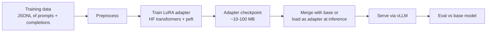

# Fine-tune with LoRA

LoRA-fine-tune a small open-weights model (Llama 3.2 3B) on a tiny dataset, then evaluate it against the base model. The full pipeline: prepare data, train, merge, serve, eval. Inline code; ~1-2 hours including training, depending on hardware.

For the underlying mechanics see **[Fine-tuning vs RAG](../../learn/concepts/fine-tuning-vs-rag.md)** and **[Quantization and distillation](../../learn/concepts/quantization-and-distillation.md)**.

## What LoRA is in one sentence

Instead of updating all of a model's weights during fine-tuning (expensive, big checkpoints), LoRA freezes the base model and trains a small set of low-rank "adapter" matrices that get added to the original weights. Result: a few-MB adapter file that adapts a multi-GB base model.

## When to fine-tune (and when NOT to)

Fine-tune when you need to change *behavior* at scale: tone, format adherence, refusal patterns, domain-specific output style. Don't fine-tune when you need to change *knowledge* - use RAG. See [Fine-tuning vs RAG](../../learn/concepts/fine-tuning-vs-rag.md).

Realistic LoRA wins:
- "Always reply in this exact JSON format with these fields"
- "Adopt this customer-support tone, refuse this category of question"
- "Generate code in this in-house framework that the base model doesn't know"

## Architecture



## Prerequisites

- A GPU with at least 16GB VRAM (24GB recommended). RTX 3090/4090, A10G, L4 work.
- CUDA 12.1+
- Python 3.10+
- A Hugging Face account with access to `meta-llama/Llama-3.2-3B-Instruct`
- ~1-2 hours

## Step 1: Install dependencies

```bash
pip install transformers datasets peft accelerate bitsandbytes trl
pip install --upgrade torch  # ensure GPU build
```

## Step 2: Prepare a tiny dataset

For demonstration, we'll teach the model to always respond in a specific JSON shape. Save as `data.jsonl`:

```jsonl
{"messages":[{"role":"user","content":"Tell me about Tokyo"},{"role":"assistant","content":"{\"name\":\"Tokyo\",\"country\":\"Japan\",\"population\":13929286,\"is_capital\":true}"}]}
{"messages":[{"role":"user","content":"Tell me about Paris"},{"role":"assistant","content":"{\"name\":\"Paris\",\"country\":\"France\",\"population\":2161000,\"is_capital\":true}"}]}
{"messages":[{"role":"user","content":"Tell me about Auckland"},{"role":"assistant","content":"{\"name\":\"Auckland\",\"country\":\"New Zealand\",\"population\":1657000,\"is_capital\":false}"}]}
{"messages":[{"role":"user","content":"Tell me about Cairo"},{"role":"assistant","content":"{\"name\":\"Cairo\",\"country\":\"Egypt\",\"population\":9540000,\"is_capital\":true}"}]}
{"messages":[{"role":"user","content":"Tell me about Mumbai"},{"role":"assistant","content":"{\"name\":\"Mumbai\",\"country\":\"India\",\"population\":12478447,\"is_capital\":false}"}]}
```

Real fine-tunes need 500-5000 examples for noticeable behavior change. 5 is just to verify the pipeline runs.

## Step 3: Training script

Save as `train.py`:

```python
import torch
from datasets import load_dataset
from transformers import AutoModelForCausalLM, AutoTokenizer, BitsAndBytesConfig
from peft import LoraConfig, get_peft_model, prepare_model_for_kbit_training
from trl import SFTConfig, SFTTrainer

BASE_MODEL = "meta-llama/Llama-3.2-3B-Instruct"
OUTPUT_DIR = "./lora-out"

# Load base in 4-bit to fit on small GPUs.
bnb_config = BitsAndBytesConfig(
    load_in_4bit=True,
    bnb_4bit_quant_type="nf4",
    bnb_4bit_compute_dtype=torch.bfloat16,
    bnb_4bit_use_double_quant=True,
)

model = AutoModelForCausalLM.from_pretrained(
    BASE_MODEL,
    quantization_config=bnb_config,
    device_map="auto",
)
model = prepare_model_for_kbit_training(model)

tokenizer = AutoTokenizer.from_pretrained(BASE_MODEL)
tokenizer.pad_token = tokenizer.eos_token

# LoRA config
lora_config = LoraConfig(
    r=16,
    lora_alpha=32,
    target_modules=["q_proj", "k_proj", "v_proj", "o_proj"],
    lora_dropout=0.05,
    bias="none",
    task_type="CAUSAL_LM",
)
model = get_peft_model(model, lora_config)
model.print_trainable_parameters()
# Prints something like: trainable params: 12,189,696 / 3,212,749,824 (0.38%)

# Load data
dataset = load_dataset("json", data_files="data.jsonl", split="train")

# SFT trainer formats the messages automatically using the model's chat template.
training_args = SFTConfig(
    output_dir=OUTPUT_DIR,
    num_train_epochs=3,
    per_device_train_batch_size=1,
    gradient_accumulation_steps=4,
    learning_rate=2e-4,
    warmup_ratio=0.03,
    bf16=True,
    logging_steps=1,
    save_strategy="epoch",
    max_seq_length=512,
)

trainer = SFTTrainer(
    model=model,
    train_dataset=dataset,
    args=training_args,
    tokenizer=tokenizer,
)

trainer.train()
trainer.save_model(OUTPUT_DIR)
print(f"Adapter saved to {OUTPUT_DIR}")
```

Run:

```bash
export HUGGING_FACE_HUB_TOKEN=hf_...
python train.py
```

For 5 examples × 3 epochs on a 4090, training takes a few minutes. For a real dataset of 1000+ examples, expect tens of minutes to a few hours.

## Step 4: Inference with the adapter

Save as `infer.py`:

```python
import torch
from transformers import AutoModelForCausalLM, AutoTokenizer, BitsAndBytesConfig
from peft import PeftModel

BASE_MODEL = "meta-llama/Llama-3.2-3B-Instruct"
ADAPTER_DIR = "./lora-out"

bnb_config = BitsAndBytesConfig(
    load_in_4bit=True,
    bnb_4bit_quant_type="nf4",
    bnb_4bit_compute_dtype=torch.bfloat16,
)

base = AutoModelForCausalLM.from_pretrained(
    BASE_MODEL,
    quantization_config=bnb_config,
    device_map="auto",
)
model = PeftModel.from_pretrained(base, ADAPTER_DIR)
tokenizer = AutoTokenizer.from_pretrained(BASE_MODEL)


def chat(prompt: str) -> str:
    messages = [{"role": "user", "content": prompt}]
    inputs = tokenizer.apply_chat_template(
        messages, return_tensors="pt", add_generation_prompt=True
    ).to(model.device)
    out = model.generate(inputs, max_new_tokens=120, do_sample=False)
    text = tokenizer.decode(out[0][inputs.shape[1]:], skip_special_tokens=True)
    return text


if __name__ == "__main__":
    import sys
    q = " ".join(sys.argv[1:]) or "Tell me about Sydney"
    print(chat(q))
```

Run:

```bash
python infer.py "Tell me about Sydney"
```

You should see something like:

```
{"name":"Sydney","country":"Australia","population":5312163,"is_capital":false}
```

The base model on the same prompt would reply with a paragraph of prose. The fine-tune learned the JSON shape from 5 examples (it overfits, of course - real datasets need to be larger and more diverse).

## Step 5: Eval against the base

Adapt the [eval harness from the previous project](./set-up-eval-harness.md) to compare base-vs-tuned. A simple version:

```python
# eval_compare.py
from infer import chat as chat_tuned
from transformers import AutoModelForCausalLM, AutoTokenizer
import torch, json

base_model = AutoModelForCausalLM.from_pretrained(
    "meta-llama/Llama-3.2-3B-Instruct",
    torch_dtype=torch.bfloat16,
    device_map="auto",
)
base_tok = AutoTokenizer.from_pretrained("meta-llama/Llama-3.2-3B-Instruct")

def chat_base(prompt):
    msgs = [{"role": "user", "content": prompt}]
    inp = base_tok.apply_chat_template(msgs, return_tensors="pt", add_generation_prompt=True).to(base_model.device)
    out = base_model.generate(inp, max_new_tokens=120, do_sample=False)
    return base_tok.decode(out[0][inp.shape[1]:], skip_special_tokens=True)

prompts = [
    "Tell me about Sydney",
    "Tell me about Beijing",
    "Tell me about Madrid",
]

for p in prompts:
    print(f"\nQ: {p}")
    base_ans = chat_base(p)
    tuned_ans = chat_tuned(p)
    base_json = False
    tuned_json = False
    try:
        json.loads(base_ans.strip()); base_json = True
    except Exception:
        pass
    try:
        json.loads(tuned_ans.strip()); tuned_json = True
    except Exception:
        pass
    print(f"  base: {'JSON' if base_json else 'prose'} - {base_ans[:80]}...")
    print(f"  tuned: {'JSON' if tuned_json else 'prose'} - {tuned_ans[:80]}...")
```

The base produces prose. The tuned (even with a tiny dataset) tends to produce JSON.

## Step 6: Optional - merge and serve via vLLM

Adapters can be served alongside vLLM directly, but for max throughput, merge:

```python
# merge.py
from transformers import AutoModelForCausalLM, AutoTokenizer
from peft import PeftModel

base = AutoModelForCausalLM.from_pretrained(
    "meta-llama/Llama-3.2-3B-Instruct",
    device_map="auto",
)
merged = PeftModel.from_pretrained(base, "./lora-out").merge_and_unload()
merged.save_pretrained("./merged")
tok = AutoTokenizer.from_pretrained("meta-llama/Llama-3.2-3B-Instruct")
tok.save_pretrained("./merged")
print("Merged checkpoint saved to ./merged")
```

Now serve with vLLM (see **[Run Llama on a single GPU](./run-llama-on-single-gpu.md)**):

```bash
vllm serve ./merged --port 8000
```

## Verification

You know it worked when:

- Training completes without OOM
- The adapter checkpoint is in `./lora-out` (~50-200MB)
- Inference with the adapter produces JSON-shaped output for new city queries
- The eval shows the tuned model adheres to the format more often than the base

## Extensions

- **Bigger dataset**: synthesize 1000+ examples with a frontier model, fine-tune on those
- **QLoRA at scale**: same code, larger base (Llama 3.3 70B requires more VRAM but the LoRA itself stays small)
- **Multiple adapters**: train per-task adapters, swap at inference (vLLM supports multi-adapter serving)
- **Hosted alternatives**: [Together / Fireworks](../service-comparison-genai-platforms.md) offer LoRA fine-tuning with no infra setup
- **Compare with prompting**: often a good few-shot prompt beats a small-dataset fine-tune. Compare both before committing to fine-tuning ops

## Cleanup

```bash
rm -rf ./lora-out ./merged
```

## Cross-references

- **Concepts**: [Fine-tuning vs RAG](../../learn/concepts/fine-tuning-vs-rag.md), [Quantization and distillation](../../learn/concepts/quantization-and-distillation.md), [Inference servers](../../learn/concepts/inference-servers.md)
- **Topic**: [LLMs and GenAI](../../topics/llms-and-genai.md)
- **Related builds**: [Run Llama on a single GPU](./run-llama-on-single-gpu.md), [Set up an eval harness](./set-up-eval-harness.md), [Build a RAG pipeline](./build-rag-pipeline.md)
- **Certs**: [NVIDIA AI Infrastructure Professional](../../exams/nvidia/ai-infrastructure-professional/), [Databricks ML Professional](../../exams/databricks/ml-professional/)
