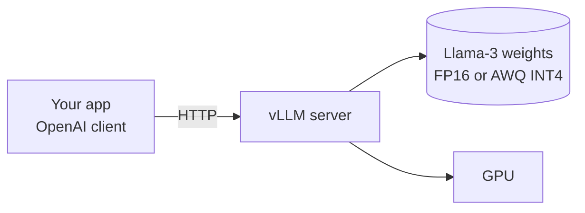

# Run Llama on a single GPU

Stand up a self-hosted, OpenAI-compatible LLM endpoint on a single GPU using vLLM. Useful when you want a hosted-API-style interface for an open-weights model, in your own VPC, without paying per-token.

For the underlying mechanics see **[Inference servers](../../learn/concepts/inference-servers.md)** and **[Quantization and distillation](../../learn/concepts/quantization-and-distillation.md)**.

## Architecture



## Prerequisites

- A single GPU with at least 24GB VRAM (RTX 4090, A10G, L4, A100). For smaller GPUs (16GB), use a smaller model or aggressive quantization.
- CUDA 12.1+ drivers installed
- Python 3.10+
- A Hugging Face account (some models require accepting a license)
- ~45 minutes including model download

## Hardware quick guide

| GPU | VRAM | Sensible model |
|-----|-----:|----------------|
| RTX 4090 / A10G | 24 GB | Llama 3.1 8B FP16, or Llama 3.3 70B AWQ INT4 |
| L4 | 24 GB | Llama 3.1 8B FP16 |
| A100 40 GB | 40 GB | Llama 3.3 70B AWQ INT4 |
| A100 80 GB / H100 | 80 GB | Llama 3.3 70B FP16 |
| RTX 3090 | 24 GB | Llama 3.1 8B FP16 (slower) |

If you don't own a GPU, the cheapest path is renting:
- **Modal, RunPod, Lambda Labs**: hourly GPU rentals, $0.50-$2/hr range for L4/A10/4090
- **AWS g5.xlarge** (A10G 24GB): ~$1/hr on-demand
- **GCP n1 + T4** or **g2-standard with L4**: similar pricing

## Step 1: Install vLLM

```bash
# In a fresh venv with CUDA-enabled PyTorch
pip install vllm
```

If your GPU is older (Ampere or below) you may need to install with specific torch wheels - check the [vLLM installation docs](https://docs.vllm.ai/en/latest/getting_started/installation.html).

## Step 2: Get a Hugging Face token

Some Llama models require accepting Meta's license. Visit the model page on Hugging Face (e.g. `meta-llama/Llama-3.1-8B-Instruct`), click "Agree", then create a read token at [huggingface.co/settings/tokens](https://huggingface.co/settings/tokens).

```bash
export HUGGING_FACE_HUB_TOKEN=hf_...
```

## Step 3: Start vLLM

For an 8B model on a 24GB GPU at FP16:

```bash
vllm serve meta-llama/Llama-3.1-8B-Instruct \
  --port 8000 \
  --max-model-len 8192 \
  --gpu-memory-utilization 0.90
```

For a 70B model on a 24GB GPU at AWQ INT4 (downloads a quantized variant):

```bash
vllm serve TheBloke/Llama-3.3-70B-Instruct-AWQ \
  --port 8000 \
  --quantization awq \
  --max-model-len 4096 \
  --gpu-memory-utilization 0.95
```

First run downloads the model from HF (10-40+ GB depending on choice) - go get coffee.

When you see `Application startup complete`, the OpenAI-compatible API is live at `http://localhost:8000/v1`.

## Step 4: Call it from any OpenAI client

Python:

```python
from openai import OpenAI

client = OpenAI(base_url="http://localhost:8000/v1", api_key="EMPTY")

resp = client.chat.completions.create(
    model="meta-llama/Llama-3.1-8B-Instruct",  # or whatever you served
    messages=[{"role": "user", "content": "What is the capital of France?"}],
    max_tokens=80,
)
print(resp.choices[0].message.content)
```

Curl:

```bash
curl http://localhost:8000/v1/chat/completions \
  -H "Content-Type: application/json" \
  -d '{
    "model": "meta-llama/Llama-3.1-8B-Instruct",
    "messages": [{"role": "user", "content": "Hello"}]
  }'
```

Streaming, function calling, multi-turn - all the OpenAI-compatible endpoints work.

## Step 5: Benchmark throughput

```python
import time
import concurrent.futures
from openai import OpenAI

client = OpenAI(base_url="http://localhost:8000/v1", api_key="EMPTY")

PROMPT = "Write a paragraph about the history of the Roman Empire."

def one_call():
    t0 = time.time()
    resp = client.chat.completions.create(
        model="meta-llama/Llama-3.1-8B-Instruct",
        messages=[{"role": "user", "content": PROMPT}],
        max_tokens=200,
    )
    return time.time() - t0, resp.usage.completion_tokens


with concurrent.futures.ThreadPoolExecutor(max_workers=16) as ex:
    results = list(ex.map(lambda _: one_call(), range(50)))

total_time = max(r[0] for r in results)
total_tokens = sum(r[1] for r in results)
print(f"50 concurrent requests, {total_tokens} output tokens in {total_time:.1f}s")
print(f"Throughput: {total_tokens/total_time:.0f} tokens/sec")
```

A single A10G running an 8B FP16 model with continuous batching should do ~1500-3000 tokens/sec across many concurrent users. INT4 70B on the same hardware does fewer tokens/sec but produces much better answers per token.

## Step 6: Production knobs

When you're ready to deploy this somewhere real:

- **`--max-model-len`** - cap the context window. Lower = more concurrent users.
- **`--gpu-memory-utilization`** - cap memory used. Drop to 0.85 if the GPU is shared.
- **`--tensor-parallel-size`** - split across N GPUs. Only worth it for big models.
- **`--enable-prefix-caching`** - cache attention state for repeated prompt prefixes (e.g. system prompts). Big win.
- [**Authentication**](../../learn/glossary.md#security-identity): vLLM has no auth by default. Put it behind nginx, an API gateway, or a tiny reverse proxy that validates a header.
- **Health endpoint**: `/health`. Wire to your load balancer.
- [**Container**](../../learn/glossary.md#containers-kubernetes): `vllm/vllm-openai:latest` Docker image is the standard production deploy.

## Verification

You know it worked when:

- `nvidia-smi` shows the model loaded (memory usage close to your `--gpu-memory-utilization` cap)
- `curl http://localhost:8000/v1/models` lists your model
- A chat completion returns coherent text in seconds
- The benchmark sustains hundreds-to-thousands of tokens/sec under concurrent load

## Cleanup

If you rented a GPU, **shut it down** when finished. Idle GPUs are the most common cause of cloud-bill surprises.

## Extensions

- Wire this endpoint into your **[RAG pipeline](./build-rag-pipeline.md)** as a self-hosted alternative to Anthropic / OpenAI
- Try **[different quantization formats](../../learn/concepts/quantization-and-distillation.md)** (GGUF via llama.cpp for CPU, EXL2 for fast Nvidia)
- Add **[LLM observability](../service-comparison-llm-observability.md)** to track latency and quality
- Compare against **[hosted GenAI platforms](../service-comparison-genai-platforms.md)** for your specific workload - self-hosting is rarely cheaper at low volume

## Cross-references

- **Concepts**: [Inference servers](../../learn/concepts/inference-servers.md), [Quantization and distillation](../../learn/concepts/quantization-and-distillation.md), [LLM basics](../../learn/concepts/llm-basics.md)
- **Topic**: [LLMs and GenAI](../../topics/llms-and-genai.md)
- **Comparisons**: [GenAI platforms](../service-comparison-genai-platforms.md)
- **Certs**: [NVIDIA AI Infrastructure Professional](../../exams/nvidia/ai-infrastructure-professional/), [NVIDIA AI Operations Professional](../../exams/nvidia/ai-operations-professional/)
