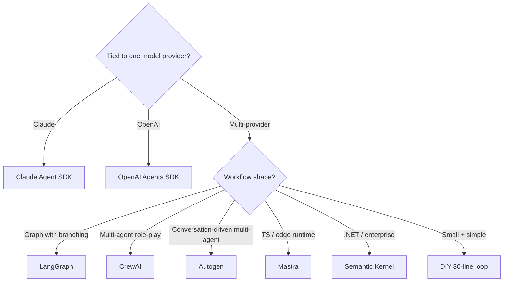

# Service Comparison: Agent Frameworks

Where the loop, the tool routing, the persistence, and the multi-agent orchestration lives. The layer above the model API. For the underlying concepts see **[Agentic loops](../learn/concepts/agentic-loops.md)** and **[Tool use](../learn/concepts/tool-use-and-function-calling.md)**.

This space evolves quickly. Treat the matrix as a snapshot.

## Decision matrix

| Framework | Vendor | Language | Multi-agent | MCP | Persistence | Tracing | Opinionation | Best for |
|-----------|--------|---------|:-:|:-:|:-:|:-:|---|---|
| **Claude Agent SDK** | Anthropic | TS, Python | partial | ✅ first-class | ✅ | ✅ (built-in trace) | Medium | Claude-first agents, MCP-native |
| **LangGraph** | LangChain | TS, Python | ✅ | partial | ✅ (LangGraph Cloud) | ✅ (LangSmith) | High | Branching graphs, multi-step pipelines |
| **CrewAI** | CrewAI | Python | ✅ (role-based) | ✅ | partial | ✅ (CrewAI+) | High | Multi-agent role-play prototypes |
| **Autogen** | Microsoft | Python, .NET | ✅ | partial | partial | partial | Medium | Conversation-style multi-agent research |
| **OpenAI Agents SDK** | OpenAI | Python, TS | ✅ (handoffs) | ✅ | partial | ✅ (OpenAI dashboard) | Low | OpenAI-first agents |
| **Mastra** | Mastra (OSS) | TS | ✅ | ✅ | ✅ | partial | Medium | TypeScript-first agent apps |
| **Semantic Kernel** | Microsoft | C#, Python, Java | ✅ | partial | ✅ | partial | Medium | .NET / enterprise Microsoft stacks |
| **DIY (no framework)** | n/a | any | as built | as built | as built | as built | None | Small loops, max control |

---

## Claude Agent SDK

Anthropic's official agent framework, in TypeScript and Python. Designed for building agents that use Claude as the model and MCP for tools.

- **Languages**: TypeScript / JavaScript (mature), Python (mature).
- **Loop**: native agent loop with built-in retry, tool execution, persistence hooks.
- **MCP**: first-class - the SDK is built around MCP servers as the way to give the agent capabilities.
- **Subagents**: `Agent` tool to spawn child agents (this very Claude Code session uses it).
- **Permissioning**: configurable allowlists for tools and bash commands.
- **Tracing**: every step (model call, tool call, result) is traceable.
- **Hosts**: powers Claude Code (CLI), Claude Desktop's agent features, custom apps.

**Pick Claude Agent SDK when:** you're building on Claude, want MCP-native, and want production-grade defaults (permissioning, tracing, persistence) without rolling your own.

**Skip when:** you're not on Claude, or you need an agnostic framework that works across many model providers without changes.

**[📖 Claude Agent SDK docs](https://docs.anthropic.com/en/api/agent-sdk-overview)** - SDK overview, MCP, tools

---

## LangGraph

The graph-based successor to LangChain's agent abstractions. Production-oriented; the framework most likely to be running in your competitor's stack.

- **Language**: TypeScript and Python.
- **Model**: arbitrary (LangChain ecosystem), so it works across Anthropic, OpenAI, Google, OSS, etc.
- **Graph**: explicit nodes (model calls, tool calls, custom logic) and edges (conditional, loop). State flows through the graph.
- **Persistence**: checkpointing via LangGraph Cloud or your own DB.
- **Tracing**: tight integration with LangSmith.
- **Multi-agent**: supervisor pattern, swarm pattern, hierarchical patterns - all documented.

**Pick LangGraph when:** you want explicit control flow with branching, you're already in the LangChain ecosystem, or you need provider portability.

**Skip when:** you want a thinner layer (Claude Agent SDK or DIY for simple loops). LangGraph adds concepts that earn their keep at moderate complexity but can feel heavy at small scale.

**[📖 LangGraph documentation](https://langchain-ai.github.io/langgraph/)** - graphs, agents, persistence

---

## CrewAI

Multi-agent role-playing framework. "Crews" of agents with roles, goals, and backstories work together on tasks.

- **Language**: Python primarily.
- **Model**: arbitrary via LiteLLM/LangChain integration.
- **Abstractions**: `Agent`, `Task`, `Crew`, `Process` (sequential, hierarchical, etc.).
- **Tools**: custom Python functions or LangChain tools, MCP via plugin.
- **CrewAI+** (paid): hosted observability, deployment, training.

**Pick CrewAI when:** you're prototyping multi-agent workflows quickly and the role/task abstraction maps to your problem.

**Skip when:** you need fine control over the loop, or you'd rather express the same logic as direct code (the role abstraction adds ceremony).

**[📖 CrewAI documentation](https://docs.crewai.com/)** - crews, tasks, processes

---

## Autogen

Microsoft Research's multi-agent framework. Conversation-driven: agents talk to each other; the conversation drives execution.

- **Language**: Python, .NET. v0.4 brought a major redesign (event-driven, async).
- **Model**: arbitrary via the model client abstraction.
- **Patterns**: GroupChat (multi-agent conversation), nested chats, sequential and concurrent agents.
- **Tooling**: code execution agents, function calling.

**Pick Autogen when:** your problem maps naturally to "two or more agents discussing until they agree on an answer" - research, brainstorming, multi-perspective review.

**Skip when:** the conversational metaphor doesn't fit your workflow.

**[📖 Autogen documentation](https://microsoft.github.io/autogen/)** - core, agents, design patterns

---

## OpenAI Agents SDK

OpenAI's official agent framework. Released 2025. Lightweight, OpenAI-first.

- **Language**: Python and TypeScript.
- **Loop**: minimal agent loop with handoffs (one agent transferring control to another).
- **Tools**: native function calling; MCP support added over 2025.
- **Tracing**: hooks into OpenAI dashboard tracing.
- **Guardrails**: hookable input/output guardrail layer.

**Pick OpenAI Agents SDK when:** you're building OpenAI-first and want a thin official layer above the API. Especially good for "spawn a specialist agent to handle this subtask" handoff patterns.

**Skip when:** you want broad provider support (Claude Agent SDK is the analog for Claude; LangGraph is the cross-provider option).

**[📖 OpenAI Agents SDK docs](https://platform.openai.com/docs/agents)** - agents, handoffs

---

## Mastra

Modern TypeScript-native agent framework. Picks up where many older OSS TS efforts left off.

- **Language**: TypeScript only.
- **Model**: arbitrary via Vercel AI SDK or direct.
- **Abstractions**: Agents, workflows (graph-style), memory, RAG, voice.
- **MCP**: supported.
- **Deployment**: serverless-first; deploys to Cloudflare Workers, Vercel, etc.

**Pick Mastra when:** you're TypeScript-native, deploying to edge runtimes, and want the agent + workflow + RAG abstractions in one OSS framework.

**Skip when:** you're a Python shop or need the largest ecosystem (LangGraph wins on community size).

**[📖 Mastra documentation](https://mastra.ai/docs)** - agents, workflows

---

## Semantic Kernel

Microsoft's enterprise-flavored framework. C#, Python, Java.

- **Language**: C# (the leading edge), Python, Java.
- **Abstractions**: kernels, plugins, planners, memory.
- **Microsoft fit**: tight integration with Azure OpenAI, Azure AI Search, Microsoft 365.

**Pick Semantic Kernel when:** you're on .NET / Java in a Microsoft-aligned enterprise.

**Skip when:** you're not. The Pythonic / TS frameworks have richer ecosystems.

**[📖 Semantic Kernel documentation](https://learn.microsoft.com/en-us/semantic-kernel/)** - kernels, plugins

---

## When to skip the framework entirely

Frameworks earn their cost when you need: persistence, branching control flow, tracing UI, multi-agent orchestration, or a large team that would otherwise reinvent the same primitives.

For small agents, the loop is 30 lines (see [Agentic loops](../learn/concepts/agentic-loops.md)). DIY beats most frameworks on:

- Time to first commit
- Debuggability (no framework "magic")
- Memory and runtime overhead
- Resilience to framework churn (these libraries break their own APIs frequently)

Recommendation: prototype DIY. Adopt a framework when you've identified a specific concern (persistence, tracing, multi-agent) that the framework genuinely solves.

---

## Pick by scenario

---

## Cross-references

- **Concepts**: [Agentic loops](../learn/concepts/agentic-loops.md), [Tool use](../learn/concepts/tool-use-and-function-calling.md), [MCP explained](../learn/concepts/mcp-explained.md)
- **Topic**: [LLMs and GenAI](../topics/llms-and-genai.md)
- **Related comparisons**: [GenAI platforms](./service-comparison-genai-platforms.md), [LLM observability](./service-comparison-llm-observability.md)
- **Build**: [Build a Claude agent with MCP](./hands-on-projects/build-claude-agent-with-mcp.md)
- **Certs**: [Anthropic Architect Foundations + Advanced](../exams/anthropic/claude-certified-architect-foundations/), [NVIDIA Agentic AI Professional](../exams/nvidia/agentic-ai-professional/)
