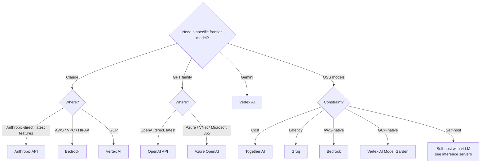

# Service Comparison: GenAI Platforms (Foundation-Model APIs)

Where to call a frontier or open-weights LLM in production. This is the API-and-model-routing layer, not the agent or app framework layer (see **[Agent frameworks comparison](./service-comparison-agent-frameworks.md)** for that).

For underlying concepts: **[LLM basics](../learn/concepts/llm-basics.md)**, **[Tool use](../learn/concepts/tool-use-and-function-calling.md)**, **[Prompt caching](../learn/concepts/prompt-caching.md)**.

## Decision matrix

| Platform | Frontier first-party | Open-weights catalog | Native tool use | Prompt caching | VPC / private | BAA / HIPAA | Best for |
|----------|:-:|:-:|:-:|:-:|:-:|:-:|---|
| **Anthropic API** | Claude Opus/Sonnet/Haiku | ❌ | ✅ | ✅ | (via Bedrock/Vertex) | (via Bedrock) | Frontier Claude with the deepest tool/agent support |
| **OpenAI API** | GPT family, o-series | ❌ | ✅ | ✅ (auto >1024 tok) | Enterprise: yes | Enterprise: yes | Frontier GPT, o-series reasoning |
| **AWS Bedrock** | Claude, Llama, Mistral, etc. | ✅ | ✅ | ✅ (model-dep.) | ✅ (PrivateLink, VPC) | ✅ | AWS-native, multi-model behind one API |
| **Azure OpenAI Service** | GPT family in Azure | partial | ✅ | ✅ | ✅ | ✅ | Azure-native GPT, Microsoft 365 integration |
| **Google Vertex AI** | Gemini, Claude (via partnership), open models | ✅ | ✅ | ✅ (context caching) | ✅ | ✅ | GCP-native, Gemini access, BigQuery proximity |
| **Together AI** | partial (some hosted frontier) | ✅ (huge catalog) | ✅ | ✅ | ❌ | ❌ | OSS model serving at low cost |
| **Fireworks AI** | partial | ✅ | ✅ | ✅ | partial | partial | Low-latency OSS serving |
| **Groq** | ❌ | ✅ (curated) | ✅ | partial | ❌ | ❌ | Lowest-latency inference (LPU hardware) |

"Native tool use" means structured tool/function calling at the API level. "Prompt caching" means a real cache mechanism (not just retries).

---

## Anthropic API

Direct access to Claude (Opus / Sonnet / Haiku families). Anthropic's first-party endpoint.

- **Models**: Claude 3.5/3.7/4 Opus, Sonnet, Haiku tiers; vision; computer use beta on supported models.
- **Tool use**: native, excellent with multi-step agentic workflows. Strong support for parallel tool calls.
- **MCP**: Anthropic created the [Model Context Protocol](../learn/concepts/mcp-explained.md); first-class client support.
- **Prompt caching**: ephemeral cache breakpoints (~5min TTL, ~25% write premium, ~10% read cost) and 1-hour extended cache.
- **Streaming**: SSE-based streaming; events include thinking, tool calls, stop reasons.
- **Regions**: US, EU. Workspaces for org-level isolation.
- **Quotas**: tier-based; enterprise has higher limits.
- **No HIPAA BAA on first-party API directly** - use Bedrock or Vertex for regulated workloads.

**Pick Anthropic API when:** you're building a Claude-first app and want the latest model features fastest (multi-step tool use, computer use, MCP).

**[📖 Anthropic API docs](https://docs.anthropic.com/)** - models, messages API, tool use
**[📖 Claude pricing](https://www.anthropic.com/pricing)** - per-token, per-tier

---

## OpenAI API

The original frontier-model API. GPT-5 family, o-series reasoning models, embeddings, fine-tuning.

- **Models**: GPT family, o-series reasoning models, image and audio modalities (4o), embeddings, Whisper, DALL-E.
- **Tool use**: native function calling; structured outputs with strict JSON schemas.
- **Prompt caching**: automatic on prompts >1024 tokens, cached read at ~50% off; no manual breakpoints.
- **Realtime API**: low-latency voice and audio agents.
- **Assistants API and Responses API**: server-side agent loops with persistent threads.
- **Regions**: global; data residency available on enterprise tiers.
- **Privacy**: enterprise customers get data-not-used-for-training and zero-data-retention options.

**Pick OpenAI API when:** you need GPT-class models, o-series reasoning, voice / realtime, or built-in agent state via Assistants/Responses.

**[📖 OpenAI API docs](https://platform.openai.com/docs)** - chat completions, function calling, streaming
**[📖 OpenAI pricing](https://openai.com/api/pricing/)** - per-model pricing

---

## AWS Bedrock

Single API to many models including Anthropic Claude, Meta Llama, Mistral, AI21, Cohere, Stability, Amazon's own (Titan, Nova), and others.

- **Models**: Claude (full Anthropic family on Bedrock with slight version lag), Llama 3/4, Mistral, Cohere Command, AI21 Jamba, Amazon Titan/Nova.
- **Tool use**: native; per-model availability varies.
- **Prompt caching**: yes for supported models (Claude family).
- **Knowledge Bases**: managed RAG (see [vector DB comparison](./service-comparison-vector-databases.md)).
- **Agents for Bedrock**: managed agentic loop with tool/action groups.
- **Guardrails**: configurable input/output filters, PII detection.
- **Privacy**: VPC endpoints, PrivateLink, customer-managed KMS, HIPAA BAA, no data used for training.
- **Regions**: most major AWS regions; model availability varies.

**Pick Bedrock when:** you're on AWS, want VPC private endpoints, multi-model flexibility behind one API, or HIPAA/regulated workloads. Especially good when you want managed RAG (Knowledge Bases) or managed agents.

**[📖 Bedrock documentation](https://docs.aws.amazon.com/bedrock/)** - models, agents, knowledge bases
**[📖 Bedrock pricing](https://aws.amazon.com/bedrock/pricing/)** - per-token + provisioned throughput

---

## Azure OpenAI Service

OpenAI's GPT family hosted by Microsoft on Azure infrastructure.

- **Models**: GPT family, embeddings, Whisper. Slight lag behind OpenAI direct on newest models.
- **Tool use**: native.
- **Prompt caching**: same as OpenAI semantics.
- **Privacy**: VNet integration, private endpoints, customer-managed keys, HIPAA BAA.
- **Regions**: many Azure regions; model availability varies by region.
- **Microsoft 365 integration**: Copilot APIs, Graph data connectors, Azure AI Search.
- **Content safety**: built-in content filters configurable per deployment.

**Pick Azure OpenAI Service when:** you're on Azure, integrating with Microsoft 365, or need GPT in regulated regions with VNet isolation.

**[📖 Azure OpenAI documentation](https://learn.microsoft.com/en-us/azure/ai-services/openai/)** - service overview
**[📖 Azure OpenAI pricing](https://azure.microsoft.com/en-us/pricing/details/cognitive-services/openai-service/)** - per-token

---

## Google Vertex AI

Google's GenAI platform. Access to Gemini (1.5, 2.x), Anthropic Claude (via partnership), open models (Llama, Mistral, Gemma), and your own custom-deployed models.

- **Models**: Gemini family (text, image, video, code), Claude on Vertex, Llama 3/4, Mistral, Mixtral, Gemma, plus Model Garden for many more.
- **Tool use**: native function calling.
- **Context caching**: explicit cache creation with TTL; useful for large stable contexts (e.g. 1M-token Gemini windows).
- **Grounding**: built-in grounding with Google Search.
- **Privacy**: VPC-SC, CMEK, HIPAA BAA, data not used for training.
- **Regions**: global; model availability varies.
- **BigQuery / Vertex Vector Search proximity**: easy retrieval against GCP data.

**Pick Vertex AI when:** you're on GCP, want Gemini's very long context windows, or want to deploy/serve custom models alongside frontier APIs through one platform.

**[📖 Vertex AI generative AI docs](https://cloud.google.com/vertex-ai/generative-ai/docs)** - Gemini, Claude on Vertex, Model Garden
**[📖 Vertex AI pricing](https://cloud.google.com/vertex-ai/generative-ai/pricing)** - per-token, per-modality

---

## Together AI

Specialist host for open-weights and fine-tuned models. Per-token pricing comparable to or lower than hosted-frontier APIs.

- **Models**: hundreds of OSS models (Llama 3/4, Mixtral, Mistral, Qwen, DeepSeek, etc.).
- **Tool use**: yes for supported models.
- **Fine-tuning**: serverless LoRA fine-tunes.
- **Inference**: optimized vLLM-style infra.
- **Pricing**: per-token, generally lower than hosted frontier.

**Pick Together AI when:** you want OSS models in production at competitive prices without running inference servers yourself.

**[📖 Together AI documentation](https://docs.together.ai/)** - models, inference, fine-tuning

---

## Fireworks AI

Similar shape to Together: managed serving of OSS models with strong performance focus.

- **Models**: Llama, Mixtral, others; some proprietary Fireworks-tuned variants.
- **Tool use**: native function calling on supported models.
- **Performance**: known for low latency, particularly on smaller and quantized models.
- **Fine-tuning**: LoRA and full fine-tunes.

**Pick Fireworks when:** Together-like need but with stronger latency or specific model tunings.

**[📖 Fireworks AI documentation](https://docs.fireworks.ai/)** - models, function calling, tuning

---

## Groq

Custom LPU (Language Processing Unit) hardware specialized for very-low-latency LLM inference.

- **Models**: curated OSS models (Llama family, Mixtral, Qwen, etc.).
- **Latency**: typically the fastest tokens/sec in the industry, often 5-10x faster than GPU-based hosting.
- **Tool use**: native on supported models.
- **Limits**: smaller catalog, no full-frontier models like Claude or GPT.

**Pick Groq when:** latency is the primary constraint - voice agents, interactive UIs, anything where time-to-first-token under 200ms matters.

**[📖 Groq documentation](https://console.groq.com/docs)** - models, API

---

## Pick by scenario

---

## Cost intuition (per 1M input tokens, mid-2026 spot)

Numbers move; this is for relative ordering only. Confirm with vendor calculators.

| Tier | Sample model | Approx input cost | Notes |
|------|--------------|-------------------|-------|
| Frontier | Claude 3.7 Sonnet | $3 | Cached reads ~$0.30 |
| Frontier | GPT-5 (mid-tier) | $2-3 | Cached reads ~50% off |
| Frontier | Gemini 2 Pro | $1.25 | 1M-token context |
| Frontier reasoning | OpenAI o-series | $15+ | Higher for thinking tokens |
| Mid OSS | Llama 70B on Together | $0.90 | OSS, lower cost |
| Mid OSS | Llama 70B on Groq | varies | Latency-optimized |
| Small | Claude Haiku | $0.80 | Fast, cheap |
| Small | GPT-mini | $0.15 | Cheapest frontier-ish |

---

## Cross-references

- **Concepts**: [LLM basics](../learn/concepts/llm-basics.md), [Tool use](../learn/concepts/tool-use-and-function-calling.md), [Prompt caching](../learn/concepts/prompt-caching.md), [Inference servers](../learn/concepts/inference-servers.md)
- **Topic**: [LLMs and GenAI](../topics/llms-and-genai.md)
- **Related comparisons**: [Vector databases](./service-comparison-vector-databases.md), [Agent frameworks](./service-comparison-agent-frameworks.md), [LLM observability](./service-comparison-llm-observability.md)
- **Certs**: [Anthropic Architect Foundations](../exams/anthropic/claude-certified-architect-foundations/), [AWS AI Practitioner](../exams/aws/genai/), [Azure AI-102](../exams/azure/ai-102/), [Databricks GenAI Engineer](../exams/databricks/genai-engineer-associate/)
