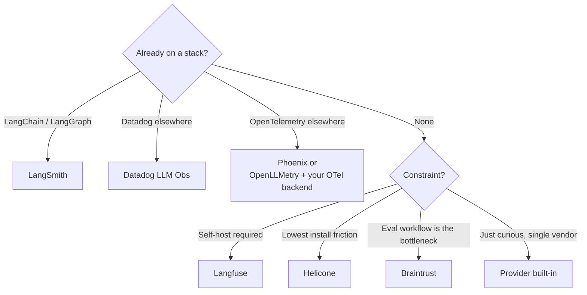

# Service Comparison: LLM Observability

Tracing, evaluating, debugging, and managing prompts in LLM apps. Different category from generic [observability tools](./service-comparison-observability-monitoring.md) - these are tuned for the model-call-and-trace shape that agents and RAG produce.

For the underlying mental model see **[Observability basics](../learn/concepts/observability-basics.md)** and **[Evals for LLMs](../learn/concepts/evals-for-llms.md)**.

## Decision matrix

| Tool | Hosted | Self-host | Tracing | Online evals | Offline evals | Prompt mgmt | Native to | Best for |
|------|:-:|:-:|:-:|:-:|:-:|:-:|---|---|
| **LangSmith** | ✅ | ❌ | ✅ | ✅ | ✅ | ✅ | LangChain / LangGraph | Production LangChain stacks |
| **Langfuse** | ✅ | ✅ (OSS, MIT) | ✅ | ✅ | ✅ | ✅ | OSS | Self-host control + open standard |
| **Helicone** | ✅ | ✅ (OSS) | ✅ (proxy or async) | ✅ | partial | ✅ | OSS | Drop-in via proxy, low friction |
| **Arize Phoenix** | ✅ (Arize AX) | ✅ (Phoenix OSS) | ✅ (OTel) | ✅ | ✅ | partial | OpenTelemetry | OTel-native, ML + LLM unified |
| **Braintrust** | ✅ | ❌ | ✅ | ✅ | ✅ | ✅ | n/a | Eval-first workflow, datasets |
| **OpenLLMetry** | n/a (lib) | n/a (lib) | ✅ (OTel) | ❌ | ❌ | ❌ | OpenTelemetry | OTel emission lib, pair with backend |
| **Datadog LLM Observability** | ✅ | ❌ | ✅ | partial | partial | partial | Datadog | Existing Datadog shops |
| **OpenAI dashboard** | ✅ (built-in) | ❌ | ✅ | ❌ | ❌ | ❌ | OpenAI | Free first-look at OpenAI traces |
| **Anthropic Console** | ✅ (built-in) | ❌ | ✅ | ❌ | ❌ | ❌ | Anthropic | Free first-look at Claude traces |

"Tracing" = nested spans for model calls, tool calls, and retrieval. "Online evals" = evaluators running in production traffic. "Offline evals" = batch-running evaluators against datasets / golden sets.

---

## LangSmith

LangChain's flagship observability product. Tightly integrated with LangChain and LangGraph; works with non-LangChain stacks via SDK.

- **Tracing**: rich nested traces, automatic for LangChain code. Tag-and-filter UI is first-class.
- **Evals**: built-in evaluators (correctness, helpfulness, custom LLM-as-judge), dataset management.
- **Prompt management**: prompt hub with versioning, deployment tags.
- **Online evals**: rule-based and LLM-judge evals applied to production traces.
- **Hosting**: SaaS only.
- **Pricing**: per-trace, with free tier.

**Pick LangSmith when:** you're using LangChain / LangGraph and want zero-config tracing, or you want the most mature eval-and-dataset workflow.

**[📖 LangSmith documentation](https://docs.smith.langchain.com/)** - traces, evals, prompts

---

## Langfuse

OSS-first observability platform. The "self-host or use the hosted offering" model done well.

- **Tracing**: SDKs for Python, TS, Java, .NET, REST. Wraps your LLM SDK calls.
- **Evals**: dataset-based offline evals, LLM-as-judge, online sampling-based evals.
- **Prompt management**: versioned prompts, A/B testing, environment-scoped deployments.
- **Hosting**: managed (Langfuse Cloud) or self-host (MIT-licensed Docker / K8s deployment).
- **Pricing**: free OSS self-host; cloud pricing per-event.

**Pick Langfuse when:** you want OSS portability, want to self-host for data governance reasons, or want a tool that's not tied to a specific framework.

**[📖 Langfuse documentation](https://langfuse.com/docs)** - tracing, evals, prompts

---

## Helicone

Drop-in observability via either a proxy (insert URL change in your client) or async logging.

- **Mode 1 - proxy**: change `api.openai.com` to `oai.helicone.ai`. Helicone records all calls. Zero code changes.
- **Mode 2 - async**: SDK that POSTs traces to Helicone after the call.
- **Caching**: Helicone can serve cached responses for repeat requests, saving money.
- **Eval and prompt features**: yes, growing.
- **Hosting**: SaaS or self-host (open source under Apache 2.0).

**Pick Helicone when:** lowest-friction install matters most. Proxy mode is the easiest "I want to see what my LLM is doing" install in this list.

**Skip when:** you want the deepest framework integration (LangSmith for LangChain) or richest eval workflow (Braintrust).

**[📖 Helicone documentation](https://docs.helicone.ai/)** - proxy, async, features

---

## Arize Phoenix

OSS LLM and ML observability built on OpenTelemetry. Phoenix is the open-source notebook-and-self-host version; Arize AX is the enterprise SaaS.

- **OTel-native**: traces are OTel spans. Backend-portable.
- **Tracing**: nested spans, support for multimodal (image previews in spans).
- **Evals**: built-in evaluator catalog, dataset management, LLM-judge.
- **ML monitoring**: Arize started in classical ML observability; LLM is one of two pillars. If you have both, single tool covers both.
- **Hosting**: Phoenix runs locally (notebook, Docker), hosted Arize AX for production.

**Pick Phoenix / Arize when:** you're OTel-native, want ML + LLM observability in one tool, or want to keep traces in your own infrastructure.

**[📖 Phoenix documentation](https://docs.arize.com/phoenix)** - tracing, evals
**[📖 Arize AX documentation](https://docs.arize.com/arize)** - production platform

---

## Braintrust

Eval-first product. Tracing is solid but the differentiator is the iteration loop on datasets and evaluators.

- **Datasets**: first-class. Version, share, comment.
- **Experiments**: run a prompt variant against a dataset, get pass/fail per row, diff against the baseline.
- **Tracing**: production traces feed into the same eval pipeline.
- **Prompt management**: yes; integrated with the experiment workflow.
- **Hosting**: SaaS only; enterprise self-host on request.

**Pick Braintrust when:** evaluation is your bottleneck. Teams that ship quality improvements driven by hard golden-set numbers tend to pick this.

**Skip when:** you need OSS or self-host as a hard requirement.

**[📖 Braintrust documentation](https://www.braintrust.dev/docs)** - datasets, experiments, traces

---

## OpenLLMetry

A library, not a product. Emits OpenTelemetry-spec spans for LLM calls. Pair with any OTel backend (Phoenix, Datadog, Honeycomb, Grafana Tempo).

- **Languages**: Python, TS.
- **Auto-instrumentation**: covers OpenAI, Anthropic, LangChain, Pinecone, vector DBs, more.
- **Output**: OTLP spans.

**Pick OpenLLMetry when:** you want vendor-neutral instrumentation. Especially good for shops that already standardized on OTel for non-LLM services.

**[📖 OpenLLMetry documentation](https://www.traceloop.com/docs/openllmetry)** - SDK, instrumentation

---

## Datadog LLM Observability

Datadog's LLM-specific tracing. Sits inside the broader Datadog platform.

- **Tracing, monitoring, alerting**: all under the same roof as your other Datadog signals.
- **Evals**: configurable eval rules.
- **Pricing**: Datadog pricing.

**Pick Datadog LLM Observability when:** you're already paying for Datadog and want unified observability without adding another vendor.

**[📖 Datadog LLM Observability docs](https://docs.datadoghq.com/llm_observability/)** - traces, dashboards

---

## Vendor built-ins (OpenAI, Anthropic Console)

OpenAI and Anthropic both ship dashboards that show you traces of your API calls.

- **OpenAI dashboard**: usage, tokens, request log. Improved in 2024-25 with multi-step trace UI.
- **Anthropic Console**: per-organization request log, tool-call breakdown, evaluation tools (Workbench).
- **Both**: free, no setup beyond using the API.

**Pick built-ins when:** you're early, single-provider, and the volume is low. Outgrow them as soon as you need cross-provider, custom evals, prompt versioning, or dataset workflows.

---

## Pick by scenario

---

## Cross-references

- **Concepts**: [Observability basics](../learn/concepts/observability-basics.md), [Evals for LLMs](../learn/concepts/evals-for-llms.md), [Agentic loops](../learn/concepts/agentic-loops.md)
- **Topic**: [LLMs and GenAI](../topics/llms-and-genai.md), [Observability](../topics/observability.md)
- **Related comparisons**: [Observability and monitoring](./service-comparison-observability-monitoring.md), [GenAI platforms](./service-comparison-genai-platforms.md), [Agent frameworks](./service-comparison-agent-frameworks.md)
- **Build**: [Set up an eval harness](./hands-on-projects/set-up-eval-harness.md)
- **Certs**: [NVIDIA AI Operations Professional](../exams/nvidia/ai-operations-professional/), [Anthropic Application Developer](../exams/anthropic/claude-application-developer/)
