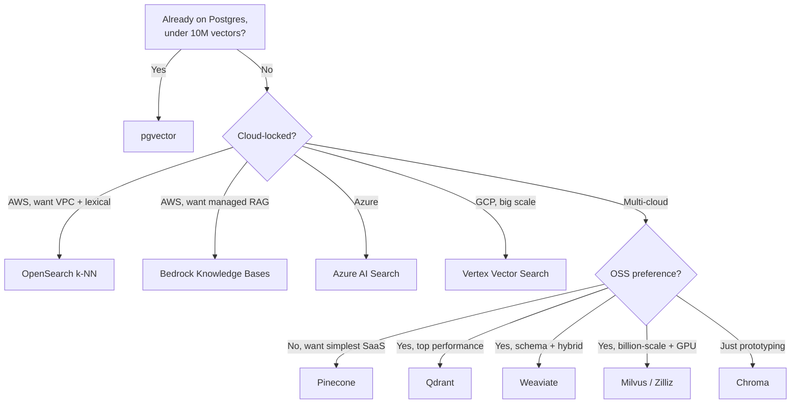

# Service Comparison: Vector Databases

The vector DB landscape changes fast. This page covers the options most teams actually consider in 2026: managed SaaS, OSS-with-managed-tier, and the cloud-provider-native flavors. Pick by workload, not by hype.

For the underlying mechanics see **[Embeddings and vector search](../learn/concepts/embeddings-and-vector-search.md)** and **[RAG explained](../learn/concepts/rag-explained.md)**.

## Decision matrix

| Product | Managed SaaS | Self-host | Hybrid (BM25 + vector) | Metadata filter | Multi-tenancy | Key strength |
|---------|:-:|:-:|:-:|:-:|:-:|---|
| **Pinecone** | ✅ | ❌ | ✅ (sparse-dense) | ✅ | ✅ (namespaces) | Operational simplicity at scale |
| **Weaviate** | ✅ (Cloud) | ✅ (OSS) | ✅ | ✅ | ✅ | Strong hybrid search, schema-driven |
| **Qdrant** | ✅ (Cloud) | ✅ (OSS, Apache 2.0) | ✅ (sparse) | ✅ (rich) | ✅ | Performance, OSS-first |
| **Milvus / Zilliz** | ✅ (Zilliz Cloud) | ✅ (OSS) | ✅ | ✅ | ✅ | Largest scale, GPU acceleration |
| **pgvector (Postgres)** | indirect (RDS, Supabase, etc.) | ✅ | ✅ (with `pg_trgm`/FTS) | ✅ (SQL) | ✅ (schemas) | Use what you already have |
| **AWS OpenSearch k-NN** | ✅ (managed) | ✅ | ✅ | ✅ | partial | AWS-native, full-text + vector |
| **Azure AI Search** | ✅ | ❌ | ✅ | ✅ | ✅ | Tight Azure / Microsoft 365 integration |
| **GCP Vertex Vector Search** | ✅ | ❌ | partial | ✅ | ✅ | Google-scale ANN, ScaNN-based |
| **Bedrock Knowledge Bases** | ✅ (orchestration) | n/a | depends on backing store | ✅ | partial | RAG-as-a-service on AWS |
| **Chroma** | ✅ (Chroma Cloud) | ✅ (OSS) | partial | ✅ | partial | Best DX for prototyping |

---

## Pinecone

Managed-only vector DB with a focus on operational simplicity. The "I don't want to think about it" choice.

- **Hosting**: SaaS only. Available across AWS, GCP, Azure regions. Serverless and pod-based tiers.
- **Indexing**: HNSW under the hood. Serverless tier handles scaling automatically.
- **Filtering**: rich metadata filters with boolean / numeric / string conditions.
- **Hybrid search**: sparse + dense vectors via the same query.
- **Multi-tenancy**: namespaces give per-tenant logical separation in the same index.
- **Pricing**: serverless = pay per read/write/storage; pod = hourly per pod.

**Pick Pinecone when:** you want zero ops, multiple cloud regions, and fast time to production. Especially good for teams shipping their first RAG app.

**Skip Pinecone when:** you want OSS portability, predictable flat-rate pricing, or are running below ~50K vectors where pgvector is simpler.

**[📖 Pinecone documentation](https://docs.pinecone.io/)** - Pinecone API, indexing, namespaces

---

## Weaviate

Schema-driven vector DB, OSS (BSD-3) with a managed cloud option (Weaviate Cloud).

- **Hosting**: OSS self-host, managed (Weaviate Cloud), or BYOC.
- **Indexing**: HNSW. Strong filterable HNSW for hybrid filter+vector queries.
- **Schema**: typed collections with properties; first-class vectorizers (you can let Weaviate generate embeddings on ingest).
- **Hybrid search**: BM25F + vector with tunable alpha; mature, performant.
- **Modules**: built-in modules for OpenAI, Cohere, HuggingFace, Anthropic embeddings.
- **GraphQL + REST APIs.**

**Pick Weaviate when:** you want strong hybrid search, server-side embedding generation, and an OSS path you can self-host.

**Skip Weaviate when:** you don't need a schema and prefer Pinecone's "throw vectors at a black box" simplicity.

**[📖 Weaviate documentation](https://weaviate.io/developers/weaviate)** - schema, modules, hybrid search

---

## Qdrant

OSS-first (Apache 2.0), Rust-based, with Qdrant Cloud as the managed offering.

- **Hosting**: self-host (Docker, K8s) or Qdrant Cloud.
- **Indexing**: HNSW with quantization options (scalar, product, binary).
- **Filtering**: extensive payload-based filters with strong query planner.
- **Hybrid**: sparse + dense via "named vectors" per point.
- **Performance**: consistently strong in independent benchmarks; binary quantization gives 32x compression with small recall loss.

**Pick Qdrant when:** you want OSS without strings attached, top-tier performance, and aggressive quantization options for large datasets.

**Skip Qdrant when:** you need the deepest schema/RAG abstractions (Weaviate is more opinionated) or want zero ops on day one (Pinecone is faster to start).

**[📖 Qdrant documentation](https://qdrant.tech/documentation/)** - filters, payload, quantization

---

## Milvus / Zilliz

OSS Milvus (Apache 2.0) with managed Zilliz Cloud. Largest-scale option in this list.

- **Hosting**: Milvus self-host (single-node or cluster), Zilliz Cloud (managed).
- **Indexing**: many algorithms (HNSW, IVF-PQ, GPU-accelerated GPU_IVF_PQ, GPU_CAGRA).
- **GPU support**: native, including search on GPU - rare in this category.
- **Filtering, partitions, hybrid search** all supported.
- **Scale**: deployed at billion-vector scale at multiple known users.

**Pick Milvus when:** you have very large corpora (100M+ vectors), need GPU search, or want the broadest algorithm choice.

**Skip Milvus when:** scale is modest and operational complexity is unwelcome.

**[📖 Milvus documentation](https://milvus.io/docs)** - Milvus architecture, indexes
**[📖 Zilliz Cloud documentation](https://docs.zilliz.com/)** - managed Milvus

---

## pgvector (Postgres)

A Postgres extension that adds vector types and ANN indexes. The most underrated option in this list.

- **Hosting**: anywhere you run Postgres (RDS, Aurora, Cloud SQL, Azure Database for PostgreSQL, Supabase, Neon, self-host).
- **Indexing**: IVFFlat or HNSW.
- **Filtering**: it's SQL. WHERE clauses, joins, ACID transactions.
- **Hybrid**: combine vector search with `tsvector` full-text or `pg_trgm` trigram search via SQL.
- **Pricing**: just Postgres pricing.

**Pick pgvector when:** your data already lives in Postgres, your scale is under ~10M vectors, and you value the operational simplicity of one database.

**Skip pgvector when:** you're at hundreds of millions of vectors, need horizontal sharding, or your team isn't already operating Postgres at scale. HNSW recall is excellent up to mid-millions of vectors; past that, dedicated stores pull ahead.

**[📖 pgvector documentation](https://github.com/pgvector/pgvector)** - extension, indexes, performance
**[📖 Supabase pgvector guide](https://supabase.com/docs/guides/ai/vector-columns)** - hosted pgvector with managed UI

---

## AWS OpenSearch k-NN

OpenSearch (forked Elasticsearch) with a k-NN plugin. Available as managed AWS OpenSearch Service or OpenSearch Serverless.

- **Hosting**: managed AWS, self-host, or OpenSearch Serverless.
- **Indexing**: HNSW (default), IVF.
- **Hybrid**: full-text + vector in one query, same engine.
- **Filtering, aggregations, pagination** all native via the OpenSearch query DSL.
- **AWS integrations**: KMS, IAM, VPC, CloudWatch.

**Pick OpenSearch k-NN when:** you're already on AWS, want both lexical search and vectors in one engine, and value VPC-native deployment.

**Skip OpenSearch k-NN when:** vector search is the only workload (Pinecone or Qdrant give better DX) or you don't want to operate (or pay for) cluster management.

**[📖 OpenSearch k-NN documentation](https://opensearch.org/docs/latest/search-plugins/knn/index/)** - k-NN search

---

## Azure AI Search

Microsoft's managed search-as-a-service, formerly Azure Cognitive Search, with vector and hybrid search.

- **Hosting**: managed Azure only.
- **Indexing**: HNSW; built-in vectorization via Azure OpenAI embeddings.
- **Filtering**: rich OData filters.
- **Hybrid**: BM25 + vector with reciprocal rank fusion.
- **Integrations**: Microsoft 365 (SharePoint, OneDrive, Teams) data connectors, Azure OpenAI, Microsoft Fabric.
- **Semantic ranking**: a paid post-retrieval reranker.

**Pick Azure AI Search when:** you're on Azure, integrating with Microsoft 365 content, or building on Azure OpenAI Service.

**Skip Azure AI Search when:** you want multi-cloud or OSS portability.

**[📖 Azure AI Search documentation](https://learn.microsoft.com/en-us/azure/search/)** - vector + hybrid

---

## GCP Vertex Vector Search

Google's managed ANN service, formerly Matching Engine, built on the ScaNN algorithm.

- **Hosting**: managed GCP only.
- **Indexing**: ScaNN, with tree-based partitioning - excellent recall/latency curve at scale.
- **Filtering**: numeric filters, namespaces.
- **Integrations**: Vertex AI for embeddings, BigQuery, Document AI.

**Pick Vertex Vector Search when:** you're on GCP, especially with BigQuery-resident data, and you want ScaNN's scale.

**Skip Vertex Vector Search when:** you want hybrid search with rich BM25 (use AI Search or OpenSearch instead) or are not on GCP.

**[📖 Vertex AI Vector Search documentation](https://cloud.google.com/vertex-ai/docs/vector-search/overview)** - ScaNN, deployment

---

## AWS Bedrock Knowledge Bases

Not a vector DB itself - it's a RAG orchestration layer that uses one of: OpenSearch Serverless, Aurora pgvector, Pinecone, Redis Enterprise, MongoDB Atlas.

- **Hosting**: managed AWS, choose your backing store.
- **Pipeline**: ingestion, chunking, embedding, retrieval, optional re-ranking - all managed.
- **Citations**: built-in citation surface.
- **Models**: works with any Bedrock-hosted foundation model.

**Pick Bedrock Knowledge Bases when:** you want managed RAG end-to-end on AWS without writing the chunking + retrieval glue.

**Skip when:** you want fine-grained control over the pipeline, or are not on AWS.

**[📖 Bedrock Knowledge Bases documentation](https://docs.aws.amazon.com/bedrock/latest/userguide/knowledge-base.html)** - RAG orchestration

---

## Chroma

OSS vector DB, originally built for prototyping; Chroma Cloud is the managed offering.

- **Hosting**: in-process (SQLite-backed), client-server self-host, Chroma Cloud.
- **Filtering**: rich metadata filters.
- **DX**: notably good Python API; near-zero setup for prototypes.

**Pick Chroma when:** you're prototyping, building a notebook demo, or running at small scale without infra investment.

**Skip Chroma when:** you're going to production at scale - other options are more battle-tested for high-volume, multi-tenant workloads.

**[📖 Chroma documentation](https://docs.trychroma.com/)** - quickstart, API

---

## Pick by scenario

---

## Cost considerations

A 1M-vector / 1024-dim corpus served at ~10 QPS:

- **pgvector** on a small RDS: tens of dollars/month.
- **Pinecone serverless**: tens to low hundreds (varies with QPS).
- **Qdrant Cloud / Weaviate Cloud / Zilliz**: low hundreds for managed clusters.
- **OpenSearch managed**: hundreds (cluster pricing).
- **Bedrock Knowledge Bases**: backing store cost + small orchestration overhead.

Numbers move fast - confirm with vendor calculators before committing.

---

## Cross-references

- **Concepts**: [Embeddings and vector search](../learn/concepts/embeddings-and-vector-search.md), [RAG explained](../learn/concepts/rag-explained.md), [Context windows](../learn/concepts/context-windows-and-management.md)
- **Topic**: [LLMs and GenAI](../topics/llms-and-genai.md), [Databases](../topics/databases.md)
- **Build**: [Build a RAG pipeline](./hands-on-projects/build-rag-pipeline.md)
- **Certs that touch this**: [AWS AI Practitioner](../exams/aws/genai/), [Anthropic Architect](../exams/anthropic/claude-certified-architect-foundations/), [Databricks GenAI Engineer](../exams/databricks/genai-engineer-associate/), [Azure AI Engineer (AI-102)](../exams/azure/ai-102/)
