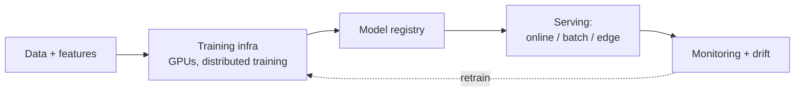

# AI/ML systems

The production-ML side of the AI stack: training infrastructure, model deployment, MLOps, feature stores, and the cloud platforms that orchestrate it. Where [LLMs and GenAI](./llms-and-genai.md) covers language-model specifics, this page covers the broader systems engineering: classical ML, deep learning, GPU infrastructure, ML pipelines, and the certs that test them.

---

## Learn

- [LLM basics](../learn/concepts/llm-basics.md) - the foundation under modern AI systems
- [Inference servers](../learn/concepts/inference-servers.md) - vLLM, TGI, SGLang, llama.cpp, TensorRT-LLM
- [Quantization and distillation](../learn/concepts/quantization-and-distillation.md) - shrinking models for cheaper serving
- [Embeddings and vector search](../learn/concepts/embeddings-and-vector-search.md) - retrieval as a system
- [Evals for LLMs](../learn/concepts/evals-for-llms.md) - the regression test for ML systems
- [Multimodal models](../learn/concepts/multimodal-models.md) - vision, audio, video pipelines

---

## Compare

- [AI/ML services (cloud-native)](../resources/service-comparison-ai-ml.md) - SageMaker vs Vertex AI vs Azure ML across training, deployment, monitoring
- [GenAI platforms](../resources/service-comparison-genai-platforms.md) - hosted LLM APIs (Anthropic, OpenAI, Bedrock, Azure OpenAI, Vertex)
- [Vector databases](../resources/service-comparison-vector-databases.md) - retrieval substrate
- [LLM observability](../resources/service-comparison-llm-observability.md) - LangSmith, Langfuse, Helicone, Phoenix, Braintrust

---

## Reference

- [Architecture pattern: AI/ML pipeline](../resources/architecture-patterns/ai-ml-pipeline.md) - production-shaped ML pipeline from data to serving
- [Architecture pattern: data pipeline / ETL](../resources/architecture-patterns/data-pipeline-etl.md) - the data layer ML systems depend on

---

## Build

- [Deploy an ML model](../resources/hands-on-projects/deploy-ml-model.md) - train, register, deploy, monitor
- [Run Llama on a single GPU](../resources/hands-on-projects/run-llama-on-single-gpu.md) - vLLM, OpenAI-compatible endpoint
- [Fine-tune with LoRA](../resources/hands-on-projects/fine-tune-with-lora.md) - LoRA on a small open model, eval against base
- [Set up an eval harness](../resources/hands-on-projects/set-up-eval-harness.md) - golden set, regression detection, CI integration

---

## Certify

Certs that test ML systems engineering specifically:

**Foundational**
- [AWS AI Practitioner](../exams/aws/genai/) - cross-cert GenAI study track
- [Azure AI Fundamentals (AI-900)](../exams/azure/ai-900/)

**Associate**
- [AWS ML Engineer (MLA-C01)](../exams/aws/associate/ml-engineer-mla-c01/) - the production-ML cert
- [Azure AI Engineer (AI-102)](../exams/azure/ai-102/)
- [GCP Machine Learning Engineer](../exams/gcp/machine-learning-engineer/)
- [Databricks ML Associate](../exams/databricks/ml-associate/) - Databricks-flavored MLOps
- [Databricks GenAI Engineer Associate](../exams/databricks/genai-engineer-associate/)
- [NVIDIA AI Infrastructure & Operations Associate](../exams/nvidia/ai-infrastructure-operations-associate/) - GPU infra
- [NVIDIA GenAI/LLM Associate](../exams/nvidia/genai-llms-associate/)

**Specialty / Professional**
- [AWS Machine Learning Specialty (MLS-C01)](../exams/aws/specialty/machine-learning-mls-c01/)
- [Databricks ML Professional](../exams/databricks/ml-professional/)
- [NVIDIA AI Infrastructure Professional](../exams/nvidia/ai-infrastructure-professional/)
- [NVIDIA AI Operations Professional](../exams/nvidia/ai-operations-professional/)
- [NVIDIA Accelerated Data Science Professional](../exams/nvidia/accelerated-data-science-professional/)

---

## Roadmap

The career-track view: **[AI/ML Engineer roadmap](../resources/certification-roadmap-ai-ml-engineer.md)**.

## Related topics

- [LLMs and GenAI](./llms-and-genai.md) - language model specifics
- [Databases](./databases.md) - feature stores and warehouses
- [Observability](./observability.md) - model monitoring overlaps with general telemetry
