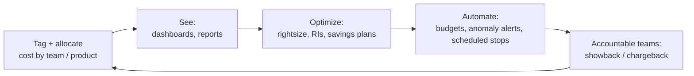

# FinOps

FinOps - the practice of bringing financial accountability to cloud spend. Covers the FinOps Foundation cert family, per-cloud cost-optimization deep-dives, the well-architected cost pillars, and the architectural patterns that compound to lower bills.

---

## Learn

- [What is cloud computing?](../learn/concepts/what-is-cloud-computing.md) - capex → opex is the FinOps premise
- [Serverless explained](../learn/concepts/serverless-explained.md) - pay-per-use lever
- [Regions and availability zones](../learn/concepts/regions-and-availability-zones.md) - region pricing matters

---

## Compare

- [Compute](../resources/service-comparison-compute.md) - the largest single cost line for most workloads
- [Storage](../resources/service-comparison-storage.md) - tiering, lifecycle, egress
- [Databases](../resources/service-comparison-databases.md) - managed DBs are cost-heavy; choosing right matters

---

## Reference

- [Cost optimization: AWS](../resources/cost-optimization/aws-cost-optimization.md) - RIs, Savings Plans, S3 tiering, EBS gp3, Compute Optimizer
- [Cost optimization: Azure](../resources/cost-optimization/azure-cost-optimization.md) - Reserved Instances, Hybrid Benefit, Cost Management
- [Cost optimization: GCP](../resources/cost-optimization/gcp-cost-optimization.md) - committed use, sustained use, Recommender
- [FinOps principles](../resources/cost-optimization/finops-principles.md) - the discipline itself
- [Well-architected: AWS cost pillar](../resources/well-architected/aws-well-architected.md), [Azure](../resources/well-architected/azure-well-architected.md), [GCP](../resources/well-architected/gcp-well-architected.md)
- [Free tier guide](../resources/free-tier-guide.md) - free credits and continuous-free services for study

---

## Build

- [Build infra with Terraform](../resources/hands-on-projects/terraform-infrastructure.md) - tagged-from-day-one IaC is the FinOps default
- [Set up a monitoring stack](../resources/hands-on-projects/setup-monitoring-stack.md) - cost dashboards alongside performance

---

## Certify

The full FinOps Foundation cert family:

**Foundational**
- [FinOps Certified Practitioner](../exams/finops/certified-practitioner/) - the entry cert

**Specialty**
- [FinOps Certified Engineer](../exams/finops/certified-engineer/)
- [FinOps Certified Analyst](../exams/finops/certified-analyst/)
- [FinOps Certified Professional](../exams/finops/certified-professional/)

**Adjacent certs that hit FinOps content:**
- [AWS Cloud Practitioner (CLF-C02)](../exams/aws/foundational/cloud-practitioner-clf-c02/) - AWS pricing fundamentals
- [AWS Solutions Architect Pro (SAP-C02)](../exams/aws/professional/solutions-architect-pro-sap-c02/) - cost-aware architecture
- [Azure Solutions Architect Expert (AZ-305)](../exams/azure/az-305/) - Azure cost design
- [GCP Professional Cloud Architect](../exams/gcp/cloud-architect/) - GCP cost design

---

## Roadmap

The career-track view: **[FinOps roadmap](../resources/certification-roadmap-finops.md)**.

## Related topics

- [SRE and reliability](./sre-and-reliability.md) - cost vs reliability tradeoffs are the daily work
- [Serverless](./serverless.md) - pay-per-execution is FinOps in action
- [Observability](./observability.md) - cost dashboards live alongside ops dashboards
