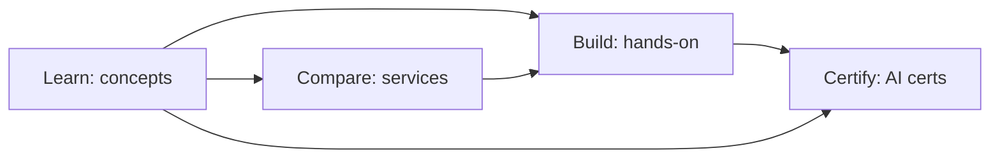

# LLMs and GenAI

Everything in the repo on language models, retrieval, agents, fine-tuning, evaluation, deployment, and the surrounding tooling. Start here whether you're trying to understand transformers, ship a RAG system, pick a vector database, or pass an AI cert.

---

## Learn

Plain-English concept pages, 5-10 minute reads:

**Foundations**
- [LLM basics](../learn/concepts/llm-basics.md) - what an LLM actually is, tokens, context, why it can't count
- [Transformer architecture](../learn/concepts/transformer-architecture.md) - attention, self-attention, what's inside the box
- [Embeddings and vector search](../learn/concepts/embeddings-and-vector-search.md) - dense representations, similarity
- [Context windows and management](../learn/concepts/context-windows-and-management.md) - tokenization, limits, summarization, retrieval as extension
- [Multimodal models](../learn/concepts/multimodal-models.md) - vision, audio, video inputs

**Building with LLMs**
- [Prompt engineering](../learn/concepts/prompt-engineering.md) - the patterns that work, the ones that don't
- [Tool use and function calling](../learn/concepts/tool-use-and-function-calling.md) - giving an LLM hands
- [MCP explained](../learn/concepts/mcp-explained.md) - Model Context Protocol, the standard interface for tools
- [Structured outputs](../learn/concepts/structured-outputs.md) - JSON mode, schemas, constrained decoding
- [RAG explained](../learn/concepts/rag-explained.md) - retrieval-augmented generation, the workhorse pattern
- [Fine-tuning vs RAG](../learn/concepts/fine-tuning-vs-rag.md) - when to use which (mostly RAG)
- [Agents explained](../learn/concepts/agents-explained.md) - tool-using LLMs in a loop
- [Agentic loops](../learn/concepts/agentic-loops.md) - ReAct, planner/executor splits, harnesses, failure modes
- [Prompt caching](../learn/concepts/prompt-caching.md) - cache hits, when caching pays off

**Operations**
- [Evals for LLMs](../learn/concepts/evals-for-llms.md) - how to know if changes helped or hurt
- [Guardrails and safety](../learn/concepts/guardrails-and-safety.md) - input/output filtering, content moderation
- [Inference servers](../learn/concepts/inference-servers.md) - vLLM, TGI, SGLang, llama.cpp
- [Quantization and distillation](../learn/concepts/quantization-and-distillation.md) - smaller models, less memory

---

## Compare

Cross-vendor comparisons:

- [GenAI platforms](../resources/service-comparison-genai-platforms.md) - Anthropic API, OpenAI, AWS Bedrock, Azure OpenAI, Vertex AI, Together, Fireworks, Groq
- [Vector databases](../resources/service-comparison-vector-databases.md) - Pinecone, Weaviate, Qdrant, Milvus, pgvector, OpenSearch, Azure AI Search, Vertex Vector Search, Bedrock Knowledge Bases
- [Agent frameworks](../resources/service-comparison-agent-frameworks.md) - Claude Agent SDK, LangGraph, CrewAI, Autogen, OpenAI Agents SDK
- [LLM observability](../resources/service-comparison-llm-observability.md) - LangSmith, Langfuse, Helicone, Phoenix, Braintrust
- [AI/ML services (cloud-native)](../resources/service-comparison-ai-ml.md) - SageMaker vs Vertex AI vs Azure ML

---

## Reference

- [Architecture pattern: AI/ML pipeline](../resources/architecture-patterns/ai-ml-pipeline.md) - production deployment

---

## Build

Hands-on projects with inline code:

- [Build a RAG pipeline](../resources/hands-on-projects/build-rag-pipeline.md) - load, chunk, embed, retrieve, generate, eval
- [Build a Claude agent with MCP](../resources/hands-on-projects/build-claude-agent-with-mcp.md) - tool-using agent with a custom MCP server
- [Run Llama on a single GPU](../resources/hands-on-projects/run-llama-on-single-gpu.md) - vLLM, OpenAI-compatible endpoint
- [Set up an eval harness](../resources/hands-on-projects/set-up-eval-harness.md) - golden set, regression detection, CI integration
- [Fine-tune with LoRA](../resources/hands-on-projects/fine-tune-with-lora.md) - LoRA on a small open model, eval against base

---

## Certify

Certs and study tracks that cover LLMs and GenAI:

**Vendor study tracks (no formal exam)**
- [Anthropic Claude Architect Foundations](../exams/anthropic/claude-certified-architect-foundations/)
- [Anthropic Claude Architect Advanced](../exams/anthropic/claude-certified-architect-advanced/)
- [Anthropic Claude Application Developer](../exams/anthropic/claude-application-developer/)
- [Anthropic Claude Prompt Engineering Specialist](../exams/anthropic/claude-prompt-engineering-specialist/)

**Foundational**
- [AWS AI Practitioner](../exams/aws/genai/) - cross-cert GenAI study track
- [Azure AI Fundamentals (AI-900)](../exams/azure/ai-900/)

**Associate**
- [AWS ML Engineer (MLA-C01)](../exams/aws/associate/ml-engineer-mla-c01/)
- [Azure AI Engineer (AI-102)](../exams/azure/ai-102/)
- [GCP Machine Learning Engineer](../exams/gcp/machine-learning-engineer/)
- [Databricks Data Engineer Associate](../exams/databricks/data-engineer-associate/) - feeds GenAI work
- [Databricks GenAI Engineer Associate](../exams/databricks/genai-engineer-associate/)
- [Databricks ML Associate](../exams/databricks/ml-associate/)
- [NVIDIA GenAI/LLM Associate](../exams/nvidia/genai-llms-associate/)
- [NVIDIA Multimodal GenAI Associate](../exams/nvidia/multimodal-genai-associate/)
- [NVIDIA AI Infrastructure & Operations Associate](../exams/nvidia/ai-infrastructure-operations-associate/)

**Professional**
- [Databricks ML Professional](../exams/databricks/ml-professional/)
- [NVIDIA GenAI/LLMs Professional](../exams/nvidia/genai-llms-professional/)
- [NVIDIA Agentic AI Professional](../exams/nvidia/agentic-ai-professional/)
- [NVIDIA AI Infrastructure Professional](../exams/nvidia/ai-infrastructure-professional/)
- [NVIDIA AI Operations Professional](../exams/nvidia/ai-operations-professional/)
- [NVIDIA Accelerated Data Science Professional](../exams/nvidia/accelerated-data-science-professional/)

---

## Roadmap

The career-track view of these certs lives in **[AI/ML Engineer roadmap](../resources/certification-roadmap-ai-ml-engineer.md)**.
