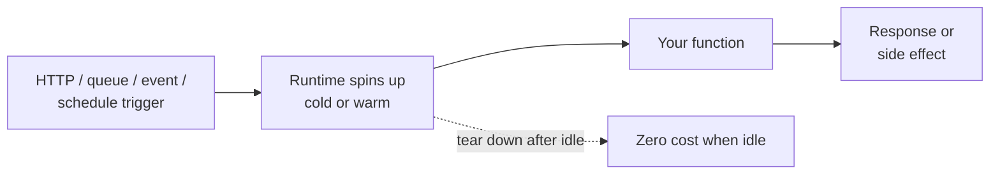

# Serverless

Serverless is the substrate of most modern cloud apps: pay-per-execution functions, container-based serverless, event triggers, scale-to-zero. This index brings together the concept, the architecture pattern, the hands-on build, the cross-cloud comparison, and the certs that hit serverless hardest.

---

## Learn

- [Serverless explained](../learn/concepts/serverless-explained.md) - the model, FaaS vs container-based, cold starts
- [What is cloud computing?](../learn/concepts/what-is-cloud-computing.md) - elastic billing is the foundation
- [IaaS vs PaaS vs SaaS](../learn/concepts/iaas-paas-saas.md) - where serverless sits in the stack
- [Containers vs VMs](../learn/concepts/containers-vs-vms.md) - what runs underneath
- [CI/CD explained](../learn/concepts/cicd-explained.md) - deploys for serverless are usually CI-driven

---

## Compare

- [Serverless services](../resources/service-comparison-serverless.md) - Lambda vs Functions vs Cloud Run vs Cloudflare Workers
- [Compute](../resources/service-comparison-compute.md) - where serverless fits next to VMs and containers
- [Messaging and queues](../resources/service-comparison-messaging-queues.md) - the event sources serverless functions consume

---

## Reference

- [Architecture pattern: serverless API](../resources/architecture-patterns/serverless-api.md) - clients → API gateway → functions → managed DB / queue
- [Architecture pattern: event-driven architecture](../resources/architecture-patterns/event-driven-architecture.md) - producer → broker → consumers, almost always serverless on the consumer side
- [Cost optimization: AWS](../resources/cost-optimization/aws-cost-optimization.md), [Azure](../resources/cost-optimization/azure-cost-optimization.md), [GCP](../resources/cost-optimization/gcp-cost-optimization.md) - serverless is often a cost-optimization lever

---

## Build

- [Build a serverless application](../resources/hands-on-projects/serverless-application.md) - API + queue + function + storage, event-driven
- [Build a CI/CD pipeline](../resources/hands-on-projects/build-ci-cd-pipeline.md) - serverless deploys via GitHub Actions

---

## Certify

Certs that test serverless deeply:

**Foundational**
- [AWS Cloud Practitioner (CLF-C02)](../exams/aws/foundational/cloud-practitioner-clf-c02/) - covers Lambda + serverless concepts
- [Azure Fundamentals (AZ-900)](../exams/azure/az-900/)

**Associate**
- [AWS Developer (DVA-C02)](../exams/aws/associate/developer-dva-c02/) - Lambda, API Gateway, Step Functions are core
- [AWS Solutions Architect Associate (SAA-C03)](../exams/aws/associate/solutions-architect-saa-c03/) - serverless architecture choices
- [Azure Developer Associate (AZ-204)](../exams/azure/az-204/) - Functions, Logic Apps
- [GCP Associate Cloud Engineer](../exams/gcp/cloud-engineer/) - Cloud Run, Cloud Functions

**Professional**
- [AWS DevOps Engineer Pro (DOP-C02)](../exams/aws/professional/devops-engineer-pro-dop-c02/) - serverless CI/CD pipelines
- [AWS Solutions Architect Pro (SAP-C02)](../exams/aws/professional/solutions-architect-pro-sap-c02/) - serverless at scale
- [GCP Professional Cloud Architect](../exams/gcp/cloud-architect/) - Cloud Run + Functions architecture

---

## Related topics

- [LLMs and GenAI](./llms-and-genai.md) - serverless functions are the standard glue for AI agents
- [Observability](./observability.md) - serverless observability has its own gotchas (cold-start tracing)
- [Kubernetes](./kubernetes.md) - the alternative when serverless doesn't fit
