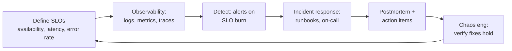

# SRE and reliability

Site reliability engineering, observability, chaos engineering, and disaster recovery - everything in the repo about keeping systems up and knowing when they're not. SRE overlaps with [observability](./observability.md) but pulls in DR patterns, chaos engineering, multi-region design, and the certs that test those.

---

## Learn

- [Observability basics](../learn/concepts/observability-basics.md) - logs, metrics, traces, the three pillars
- [Eventual consistency](../learn/concepts/eventual-consistency.md) - reliability under partial failure
- [Idempotency explained](../learn/concepts/idempotency-explained.md) - retry-safe operations are the foundation of resilience
- [Regions and availability zones](../learn/concepts/regions-and-availability-zones.md) - the geography of resilience
- [Queues vs streams](../learn/concepts/queues-vs-streams.md) - decoupling for reliability

---

## Compare

- [Observability and monitoring](../resources/service-comparison-observability-monitoring.md) - CloudWatch vs Azure Monitor vs Cloud Operations vs Datadog vs New Relic
- [Messaging and queues](../resources/service-comparison-messaging-queues.md) - SQS, Service Bus, Pub/Sub, Kafka - decoupling layer

---

## Reference

- [Architecture pattern: disaster recovery](../resources/architecture-patterns/disaster-recovery-patterns.md) - backup/restore, pilot light, warm standby, multi-site
- [Architecture pattern: multi-region active-active](../resources/architecture-patterns/multi-region-active-active.md) - the always-on shape
- [Architecture pattern: chaos engineering](../resources/architecture-patterns/chaos-engineering-patterns.md) - failure-injection patterns
- [Architecture pattern: cell-based architecture](../resources/architecture-patterns/cell-based-architecture.md) - blast-radius reduction
- [Troubleshooting: AWS](../resources/troubleshooting/aws-troubleshooting.md), [Azure](../resources/troubleshooting/azure-troubleshooting.md), [GCP](../resources/troubleshooting/gcp-troubleshooting.md), [Kubernetes](../resources/troubleshooting/kubernetes-troubleshooting.md)

---

## Build

- [Set up a monitoring stack](../resources/hands-on-projects/setup-monitoring-stack.md) - Prometheus + Grafana + Alertmanager
- [Run a DR drill](../resources/hands-on-projects/disaster-recovery-drill.md) - tested failover, measured RTO / RPO

---

## Certify

Certs that test reliability and ops:

**Associate**
- [AWS SysOps / CloudOps (SOA-C02 / SOA-C03)](../exams/aws/associate/sysops-administrator-soa-c02/) - the AWS reliability cert
- [Azure Administrator (AZ-104)](../exams/azure/az-104/) - day-2 ops on Azure
- [GCP Associate Cloud Engineer](../exams/gcp/cloud-engineer/)
- [Kubernetes CKA](../exams/kubernetes/cka/) - K8s reliability

**Professional**
- [AWS DevOps Engineer Pro (DOP-C02)](../exams/aws/professional/devops-engineer-pro-dop-c02/) - the SRE-flavored AWS cert
- [Azure DevOps Engineer Expert (AZ-400)](../exams/azure/az-400/)
- [GCP Professional Cloud DevOps Engineer](../exams/gcp/cloud-devops-engineer/)
- [GCP Professional Cloud Architect](../exams/gcp/cloud-architect/) - reliability at scale

---

## Roadmap

The career-track view: **[DevOps / SRE roadmap](../resources/certification-roadmap-devops-sre.md)**.

## Related topics

- [Observability](./observability.md) - the telemetry foundation SRE depends on
- [Kubernetes](./kubernetes.md) - K8s ops is the modern SRE day job
- [FinOps](./finops.md) - reliability and cost are sibling concerns
